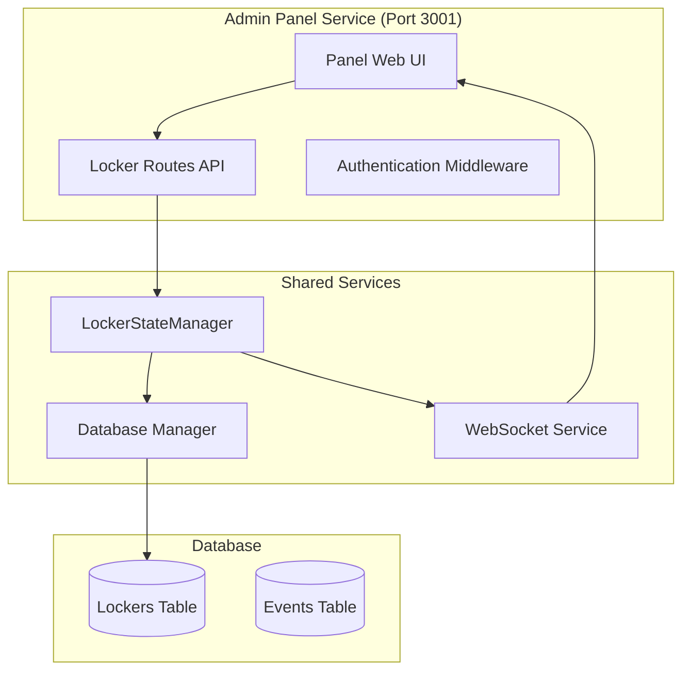
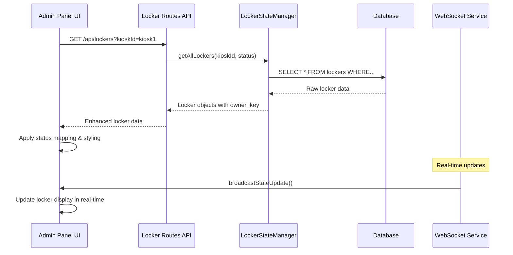

# Design Document

## Overview

The Admin Panel UI Improvements feature enhances the existing eForm Locker System's staff management interface to provide better visibility and usability. The improvements focus on three key areas: displaying complete RFID card information instead of generic text, correcting Turkish status translations, and implementing proper visual indicators for different locker states.

The design leverages the existing real-time WebSocket infrastructure and maintains compatibility with the current database schema while improving the frontend presentation layer.

## Architecture

### Current System Components

The admin panel operates within the existing distributed architecture:



### Data Flow for UI Improvements



## Components and Interfaces

### Frontend Components

#### Status Translation Service
```typescript
interface StatusTranslationService {
  translateStatus(dbStatus: string): string;
  getStatusClass(dbStatus: string): string;
  getStatusColor(dbStatus: string): string;
}

// Implementation
const statusTranslations = {
  'Free': 'Boş',
  'Owned': 'Sahipli',  // Changed from 'Açılıyor'
  'Reserved': 'Rezerve',
  'Opening': 'Açılıyor',
  'Blocked': 'Engelli',
  'Error': 'Hata'
};

const statusClasses = {
  'Free': 'state-bos',
  'Owned': 'state-sahipli',  // New class
  'Reserved': 'state-rezerve',
  'Opening': 'state-aciliyor',
  'Blocked': 'state-engelli',
  'Error': 'state-hata'
};
```

#### RFID Display Component
```typescript
interface RfidDisplayComponent {
  formatRfidNumber(ownerKey: string, ownerType: string): string;
  makeSelectable(element: HTMLElement): void;
  truncateWithTooltip(text: string, maxLength: number): string;
}

// Implementation
function formatRfidNumber(ownerKey: string, ownerType: string): string {
  if (ownerType === 'rfid' && ownerKey) {
    return ownerKey; // Display full RFID number
  }
  if (ownerType === 'device' && ownerKey) {
    return `Cihaz: ${ownerKey.substring(0, 8)}...`; // Truncated device ID
  }
  return 'Yok'; // No owner
}
```

#### Visual Indicator System
```typescript
interface VisualIndicatorSystem {
  applyStatusStyling(element: HTMLElement, status: string): void;
  updateColorScheme(status: string): ColorScheme;
  ensureAccessibility(element: HTMLElement): void;
}

interface ColorScheme {
  backgroundColor: string;
  textColor: string;
  borderColor: string;
  contrastRatio: number;
}
```

### Backend API Enhancements

#### Enhanced Locker Data Response
```typescript
interface EnhancedLockerResponse {
  kiosk_id: string;
  id: number;
  status: string; // Database status (English)
  owner_type?: 'rfid' | 'device' | 'vip';
  owner_key?: string; // Full RFID number or device ID
  display_name?: string;
  last_changed?: Date;
  is_vip: boolean;
}

// API Response Format
interface LockerListResponse {
  lockers: EnhancedLockerResponse[];
  total: number;
  stats: {
    total: number;
    free: number;
    owned: number;
    reserved: number;
    blocked: number;
    error: number;
  };
}
```

## Data Models

### Database Schema (No Changes Required)

The existing database schema already contains all necessary information:

```sql
-- Existing lockers table structure
CREATE TABLE lockers (
  kiosk_id TEXT NOT NULL,
  id INTEGER NOT NULL,
  status TEXT NOT NULL DEFAULT 'Free',  -- English status
  owner_type TEXT,                      -- 'rfid', 'device', 'vip'
  owner_key TEXT,                       -- Full RFID number
  reserved_at DATETIME,
  owned_at DATETIME,
  version INTEGER NOT NULL DEFAULT 1,
  is_vip BOOLEAN NOT NULL DEFAULT 0,
  created_at DATETIME DEFAULT CURRENT_TIMESTAMP,
  updated_at DATETIME DEFAULT CURRENT_TIMESTAMP,
  PRIMARY KEY (kiosk_id, id)
);
```

### Frontend Data Transformation

```typescript
interface LockerDisplayData {
  // Raw database fields
  kioskId: string;
  lockerId: number;
  dbStatus: string;        // English status from database
  ownerType?: string;
  ownerKey?: string;
  
  // Computed display fields
  displayStatus: string;   // Turkish translation
  displayOwner: string;    // Formatted owner information
  statusClass: string;     // CSS class for styling
  colorScheme: ColorScheme;
  isSelectable: boolean;   // For copy functionality
}
```

## Error Handling

### Status Translation Fallbacks
```typescript
function translateStatusSafely(dbStatus: string): string {
  const translation = statusTranslations[dbStatus];
  if (!translation) {
    console.warn(`Unknown status: ${dbStatus}, using fallback`);
    return dbStatus; // Fallback to original status
  }
  return translation;
}
```

### RFID Display Error Handling
```typescript
function formatOwnerSafely(ownerKey: string, ownerType: string): string {
  try {
    if (!ownerKey || !ownerType) {
      return 'Yok';
    }
    
    if (ownerType === 'rfid') {
      // Validate RFID format (basic validation)
      if (!/^\d{10}$/.test(ownerKey)) {
        console.warn(`Invalid RFID format: ${ownerKey}`);
        return `RFID: ${ownerKey}`; // Show anyway with prefix
      }
      return ownerKey;
    }
    
    if (ownerType === 'device') {
      return `Cihaz: ${ownerKey.substring(0, 8)}...`;
    }
    
    return `${ownerType}: ${ownerKey}`;
  } catch (error) {
    console.error('Error formatting owner:', error);
    return 'Hata';
  }
}
```

### Real-time Update Error Handling
```typescript
function handleWebSocketUpdate(message: any): void {
  try {
    if (!message.data || !message.data.kioskId || !message.data.lockerId) {
      console.warn('Invalid WebSocket message format');
      return;
    }
    
    const lockerElement = document.getElementById(`locker-${message.data.kioskId}-${message.data.lockerId}`);
    if (lockerElement) {
      updateLockerDisplay(lockerElement, message.data);
    }
  } catch (error) {
    console.error('Error handling WebSocket update:', error);
    // Fallback: trigger manual refresh
    showToast('Bağlantı Hatası', 'Sayfa yenileniyor...', 'info');
    setTimeout(() => location.reload(), 2000);
  }
}
```

## Testing Strategy

### Unit Testing

#### Status Translation Tests
```typescript
describe('StatusTranslationService', () => {
  test('should translate all database statuses correctly', () => {
    expect(translateStatus('Free')).toBe('Boş');
    expect(translateStatus('Owned')).toBe('Sahipli');
    expect(translateStatus('Opening')).toBe('Açılıyor');
    expect(translateStatus('Blocked')).toBe('Engelli');
    expect(translateStatus('Error')).toBe('Hata');
  });
  
  test('should handle unknown statuses gracefully', () => {
    expect(translateStatus('UnknownStatus')).toBe('UnknownStatus');
  });
});
```

#### RFID Display Tests
```typescript
describe('RfidDisplayComponent', () => {
  test('should format RFID numbers correctly', () => {
    expect(formatRfidNumber('0009652489', 'rfid')).toBe('0009652489');
    expect(formatRfidNumber('', 'rfid')).toBe('Yok');
    expect(formatRfidNumber(null, null)).toBe('Yok');
  });
  
  test('should handle device IDs correctly', () => {
    const deviceId = 'abcd1234efgh5678';
    expect(formatRfidNumber(deviceId, 'device')).toBe('Cihaz: abcd1234...');
  });
});
```

### Integration Testing

#### API Response Validation
```typescript
describe('Locker API Integration', () => {
  test('should return enhanced locker data with owner information', async () => {
    const response = await fetch('/api/lockers?kioskId=test-kiosk');
    const data = await response.json();
    
    expect(data.lockers).toBeDefined();
    expect(data.lockers[0]).toHaveProperty('owner_key');
    expect(data.lockers[0]).toHaveProperty('owner_type');
    expect(data.lockers[0]).toHaveProperty('status');
  });
});
```

### Visual Testing

#### CSS Class Application
```typescript
describe('Visual Indicators', () => {
  test('should apply correct CSS classes for each status', () => {
    const element = document.createElement('div');
    
    applyStatusStyling(element, 'Free');
    expect(element.classList.contains('state-bos')).toBe(true);
    
    applyStatusStyling(element, 'Owned');
    expect(element.classList.contains('state-sahipli')).toBe(true);
  });
  
  test('should maintain accessibility contrast ratios', () => {
    const colorScheme = updateColorScheme('Owned');
    expect(colorScheme.contrastRatio).toBeGreaterThan(4.5);
  });
});
```

### End-to-End Testing

#### User Interaction Flow
```typescript
describe('Admin Panel UI E2E', () => {
  test('should display RFID numbers and allow copying', async () => {
    // Navigate to admin panel
    await page.goto('/lockers');
    
    // Find a locker with RFID owner
    const rfidLocker = await page.locator('[data-owner-type="rfid"]').first();
    
    // Verify RFID number is displayed
    const ownerText = await rfidLocker.locator('.locker-owner').textContent();
    expect(ownerText).toMatch(/^\d{10}$/);
    
    // Test click-to-select functionality
    await rfidLocker.locator('.locker-owner').click();
    const selectedText = await page.evaluate(() => window.getSelection().toString());
    expect(selectedText).toMatch(/^\d{10}$/);
  });
  
  test('should show correct Turkish status translations', async () => {
    await page.goto('/lockers');
    
    // Check various status translations
    const freeLocker = await page.locator('[data-status="Free"]').first();
    expect(await freeLocker.locator('.locker-state-chip').textContent()).toBe('Boş');
    
    const ownedLocker = await page.locator('[data-status="Owned"]').first();
    expect(await ownedLocker.locator('.locker-state-chip').textContent()).toBe('Sahipli');
  });
});
```

## Implementation Plan

### Phase 1: Status Translation Fix
1. Update CSS classes to include new `state-sahipli` class
2. Modify JavaScript status translation mapping
3. Update locker card rendering to use correct translations
4. Test status display across all locker states

### Phase 2: RFID Display Enhancement
1. Modify locker card HTML template to show full `owner_key`
2. Add click-to-select functionality for RFID numbers
3. Implement owner type detection and formatting
4. Add truncation with tooltip for long values

### Phase 3: Visual Indicator System
1. Define color scheme for each status type
2. Update CSS classes with proper background colors
3. Ensure text contrast meets accessibility standards
4. Test color indicators across different screen types

### Phase 4: Real-time Update Integration
1. Verify WebSocket updates trigger UI refresh
2. Test status changes reflect immediately in UI
3. Ensure color changes animate smoothly
4. Validate performance with multiple simultaneous updates

## Security Considerations

### Data Exposure
- RFID numbers are already exposed in the current API
- No additional sensitive data is being displayed
- Owner information is limited to staff with appropriate permissions

### Input Validation
- No new user inputs are introduced
- Existing API validation remains in place
- Client-side formatting is purely presentational

### Access Control
- All improvements respect existing permission system
- No changes to authentication or authorization
- Staff-only access maintained through existing middleware

## Performance Optimization

### Client-Side Rendering
- Status translation performed client-side to reduce server load
- CSS classes cached for repeated use
- Minimal DOM manipulation for real-time updates

### Memory Management
- Event listeners properly cleaned up
- WebSocket connections reused
- No memory leaks from status translation caching

### Network Efficiency
- No additional API calls required
- Existing WebSocket infrastructure leveraged
- Minimal bandwidth impact from UI improvements

## Accessibility Compliance

### Color Contrast
- All status colors meet WCAG AA contrast requirements (4.5:1 minimum)
- Text remains readable on all background colors
- High contrast mode compatibility maintained

### Keyboard Navigation
- RFID numbers remain keyboard accessible
- Tab order preserved for all interactive elements
- Screen reader compatibility for status announcements

### Visual Indicators
- Color is not the only indicator of status
- Text labels accompany all color coding
- Icons or patterns available as color alternatives