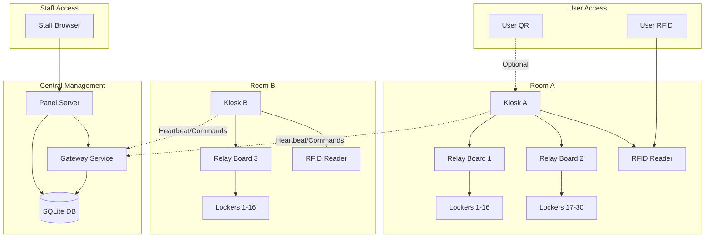
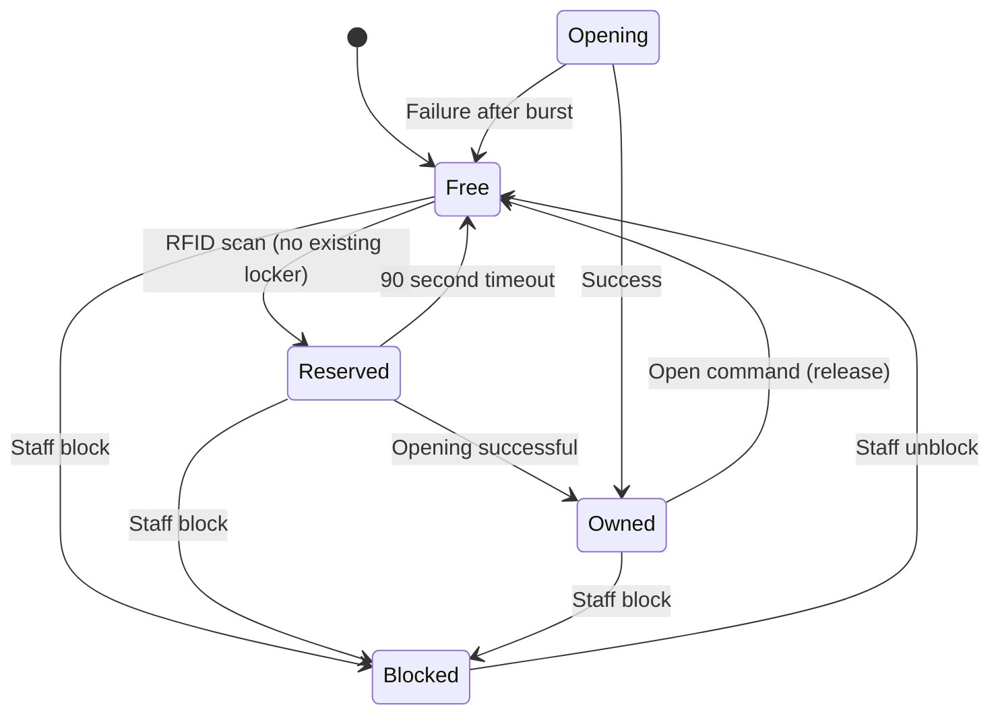

# Design Document

## Overview

The Eform Locker System is a distributed, multi-room locker management solution built on Node.js with TypeScript. The architecture consists of three main components: Kiosks (room-level controllers), a central Management Panel, and a Gateway service that coordinates communication. The system uses RFID as the primary access method with optional QR codes, operates offline-first, and supports VIP locker contracts.

## Architecture

### System Components



### Service Architecture

1. **eform-gateway**: Central coordination service, handles database operations and command queuing
2. **eform-kiosk**: Room-level service managing RFID, QR, Modbus, and user interface
3. **eform-panel**: Web-based staff management interface
4. **eform-agent**: Update and monitoring service

## Components and Interfaces

### Core Data Models

#### Locker Entity
```typescript
interface Locker {
  id: number; // Locker number within kiosk (1-30)
  kiosk_id: string;
  status: 'Free' | 'Reserved' | 'Owned' | 'Opening' | 'Blocked';
  owner_type?: 'rfid' | 'device' | 'vip';
  owner_key?: string;
  reserved_at?: Date;
  owned_at?: Date;
  version: number; // For optimistic locking
  is_vip: boolean;
}
```

#### VIP Contract Entity
```typescript
interface VipContract {
  id: number;
  kiosk_id: string;
  locker_id: number; // Locker number within kiosk
  rfid_card: string;
  backup_card?: string;
  start_date: Date;
  end_date: Date;
  status: 'active' | 'expired' | 'cancelled';
  created_by: string;
}
```

#### Event Log Entity
```typescript
interface Event {
  id: number;
  timestamp: Date;
  kiosk_id: string;
  locker_id?: number;
  event_type: string;
  rfid_card?: string;
  device_id?: string;
  staff_user?: string;
  details: Record<string, any>;
}
```

### Kiosk Service Interface

#### RFID Handler
```typescript
class RfidHandler {
  async onCardScanned(cardId: string): Promise<void>;
  private async handleCardWithNoLocker(cardId: string): Promise<void>;
  private async handleCardWithLocker(cardId: string, locker: Locker): Promise<void>;
  // Enforces "one card, one locker" rule - if card has active Owned locker, don't show Free list
  private async checkExistingOwnership(cardId: string): Promise<Locker | null>;
}
```

#### QR Handler
```typescript
class QrHandler {
  async handleQrRequest(lockerId: number, deviceId: string): Promise<QrResponse>;
  private generateActionToken(lockerId: number, deviceId: string): string;
  private validateActionToken(token: string): boolean;
}
```

#### Modbus Controller
```typescript
class ModbusController {
  private mutex: Mutex; // Ensures only one relay channel operates at a time
  async openLocker(lockerId: number): Promise<boolean>;
  private async sendPulse(channel: number, duration: number = 400): Promise<void>; // Default 400ms pulse
  private async performBurstOpening(channel: number): Promise<boolean>;
  // Serial execution of relay commands to prevent conflicts
  private async executeCommand(command: RelayCommand): Promise<void>;
}
```

### Gateway Service Interface

#### Command Queue Manager
```typescript
class CommandQueue {
  async enqueueCommand(kioskId: string, command: Command): Promise<void>;
  async getCommands(kioskId: string): Promise<Command[]>;
  async markCommandComplete(commandId: string): Promise<void>;
  // Idempotent command handling with retry logic
  async retryFailedCommand(commandId: string): Promise<void>;
  async markCommandFailed(commandId: string, error: string): Promise<void>;
}
```

#### Locker State Manager
```typescript
class LockerStateManager {
  async assignLocker(lockerId: number, ownerType: string, ownerKey: string): Promise<boolean>;
  async releaseLocker(lockerId: number): Promise<boolean>;
  async reserveLocker(lockerId: number, ownerKey: string): Promise<boolean>;
  // Returns only Free status lockers, excludes Blocked and Reserved
  async getAvailableLockers(kioskId: string): Promise<Locker[]>;
}
```

### Panel Service Interface

#### Staff Controller
```typescript
class StaffController {
  async openLocker(lockerId: number, staffUser: string, reason?: string): Promise<void>;
  async bulkOpen(lockerIds: number[], staffUser: string): Promise<BulkResult>;
  async endOfDayOpen(excludeVip: boolean, staffUser: string): Promise<CsvReport>;
  async blockLocker(lockerId: number, staffUser: string, reason: string): Promise<void>;
}
```

#### VIP Management Controller
```typescript
class VipController {
  async createContract(contract: VipContractRequest): Promise<VipContract>;
  async extendContract(contractId: number, newEndDate: Date): Promise<void>;
  async changeCard(contractId: number, newCard: string): Promise<void>;
  async cancelContract(contractId: number, reason: string): Promise<void>;
}
```

## Data Models

### Database Schema

#### Lockers Table
```sql
CREATE TABLE lockers (
  kiosk_id TEXT NOT NULL,
  id INTEGER NOT NULL, -- Locker number within kiosk (1-30)
  status TEXT NOT NULL DEFAULT 'Free',
  owner_type TEXT,
  owner_key TEXT,
  reserved_at DATETIME,
  owned_at DATETIME,
  version INTEGER NOT NULL DEFAULT 1,
  is_vip BOOLEAN NOT NULL DEFAULT 0,
  created_at DATETIME DEFAULT CURRENT_TIMESTAMP,
  updated_at DATETIME DEFAULT CURRENT_TIMESTAMP,
  PRIMARY KEY (kiosk_id, id),
  UNIQUE(kiosk_id, id)
);

-- Indexes for performance
CREATE INDEX idx_lockers_kiosk_status ON lockers(kiosk_id, status);
CREATE INDEX idx_lockers_owner_key ON lockers(owner_key);
```

#### VIP Contracts Table
```sql
CREATE TABLE vip_contracts (
  id INTEGER PRIMARY KEY,
  kiosk_id TEXT NOT NULL,
  locker_id INTEGER NOT NULL,
  rfid_card TEXT NOT NULL,
  backup_card TEXT,
  start_date DATE NOT NULL,
  end_date DATE NOT NULL,
  status TEXT NOT NULL DEFAULT 'active',
  created_by TEXT NOT NULL,
  created_at DATETIME DEFAULT CURRENT_TIMESTAMP,
  FOREIGN KEY (kiosk_id, locker_id) REFERENCES lockers(kiosk_id, id)
);
```

#### Events Table
```sql
CREATE TABLE events (
  id INTEGER PRIMARY KEY,
  timestamp DATETIME DEFAULT CURRENT_TIMESTAMP,
  kiosk_id TEXT NOT NULL,
  locker_id INTEGER,
  event_type TEXT NOT NULL,
  rfid_card TEXT,
  device_id TEXT,
  staff_user TEXT, -- NOT NULL for staff operations
  details TEXT, -- JSON with schema examples below
  CONSTRAINT staff_operations_require_user 
    CHECK (event_type NOT LIKE 'staff_%' OR staff_user IS NOT NULL)
);

-- Indexes for performance
CREATE INDEX idx_events_timestamp ON events(timestamp);
CREATE INDEX idx_events_kiosk_locker ON events(kiosk_id, locker_id);

-- Example JSON schemas for details field:
-- staff_open: {"reason": "user assistance", "override": true}
-- rfid_assign: {"previous_status": "Free", "burst_required": false}
-- qr_access: {"device_hash": "abc123", "action": "assign"}
-- bulk_open: {"total_count": 15, "success_count": 14, "failed_lockers": [5]}
```

#### Command Queue Table
```sql
CREATE TABLE command_queue (
  command_id TEXT PRIMARY KEY, -- UUID for idempotency
  kiosk_id TEXT NOT NULL,
  command_type TEXT NOT NULL,
  payload TEXT NOT NULL, -- JSON
  status TEXT NOT NULL DEFAULT 'pending',
  retry_count INTEGER NOT NULL DEFAULT 0,
  next_attempt_at DATETIME DEFAULT CURRENT_TIMESTAMP,
  last_error TEXT,
  created_at DATETIME DEFAULT CURRENT_TIMESTAMP,
  executed_at DATETIME,
  UNIQUE(command_id)
);
```

#### Kiosk Heartbeat Table
```sql
CREATE TABLE kiosk_heartbeat (
  kiosk_id TEXT PRIMARY KEY,
  last_seen DATETIME NOT NULL,
  zone TEXT NOT NULL,
  status TEXT NOT NULL DEFAULT 'online',
  version TEXT NOT NULL, -- Software version
  last_config_hash TEXT, -- For configuration sync
  offline_threshold_seconds INTEGER DEFAULT 30
);
```

### State Transitions

#### Locker State Machine


## Error Handling

### Modbus Communication Errors
- **Connection Loss**: Retry with exponential backoff, log error events
- **Command Timeout**: Attempt burst opening, mark as failed if unsuccessful
- **Invalid Response**: Log error, retry command once, then fail

### Database Errors
- **Connection Issues**: Use WAL mode, implement connection pooling
- **Lock Conflicts**: Use optimistic locking with version field, retry on conflict
- **Disk Space**: Implement log rotation and cleanup procedures

### Network Errors
- **Kiosk Offline**: Queue commands, execute when reconnected
- **Panel Disconnection**: Continue local operation, sync when restored
- **QR Network Issues**: Display appropriate error messages to users

### Hardware Errors
- **Relay Failure**: Log error, attempt alternative opening methods
- **RFID Reader Issues**: Log error, display maintenance message
- **Power Issues**: Graceful shutdown, restart procedures

## Testing Strategy

### Unit Testing
- **Service Layer**: Mock database and external dependencies
- **State Management**: Test all state transitions and edge cases
- **Security**: Test authentication, authorization, and rate limiting
- **Hardware Interface**: Mock Modbus and RFID interfaces

### Integration Testing
- **Database Operations**: Test with real SQLite database
- **Modbus Communication**: Test with mock relay hardware
- **API Endpoints**: Test all REST endpoints with various scenarios
- **Command Queue**: Test queuing and execution across services

### End-to-End Testing
- **User Flows**: Test complete RFID and QR user journeys
- **Staff Operations**: Test panel operations and bulk commands
- **Multi-Room**: Test cross-room operations and synchronization
- **Failure Scenarios**: Test power loss, network issues, hardware failures
- **Soak Testing**: Daily 1000-cycle open-close test for hardware endurance

### Performance Testing
- **Concurrent Access**: Test multiple simultaneous locker operations
- **Database Load**: Test with realistic data volumes
- **Network Latency**: Test with simulated network delays
- **Memory Usage**: Monitor for memory leaks during extended operation

### Security Testing
- **Authentication**: Test PIN security and session management
- **Rate Limiting**: Test all rate limiting mechanisms
- **Input Validation**: Test all user inputs for injection attacks
- **Access Control**: Test authorization for all operations

### Hardware Testing
- **Relay Operations**: Test all relay channels and timing
- **RFID Reading**: Test various card types and reading distances
- **Power Cycling**: Test graceful shutdown and restart procedures
- **Environmental**: Test operation under various temperature conditions

## Security Considerations

### Authentication and Authorization
- **Master PIN**: Argon2id hashing with salt, 5-attempt lockout
- **Staff Sessions**: HttpOnly cookies with CSRF protection
- **QR Tokens**: HMAC-signed with 5-second TTL

### Rate Limiting
- **IP-based**: 30 requests per minute for QR access (configurable)
- **Card-based**: Prevent rapid successive scans (configurable)
- **Locker-based**: 6 QR requests per minute per locker (configurable)
- **Device-based**: 1 QR request per 20 seconds per device (configurable)
- **Dynamic Configuration**: All rate limits loaded from configuration files

### Data Protection
- **Sensitive Data**: Hash all PINs and sensitive identifiers
- **Audit Logging**: Log all staff actions with timestamps
- **Data Retention**: Implement log rotation and cleanup policies

### Network Security
- **Panel Access**: Restrict to staff VLAN only
- **Kiosk Communication**: Firewall rules limiting outbound access
- **QR Access**: Origin/Referer validation, captive portal isolation
- **Security Headers**: CSP, Referrer-Policy, X-Frame-Options for panel interface

## Performance Optimization

### Database Optimization
- **Indexing**: Index frequently queried columns (kiosk_id, status, owner_key)
- **WAL Mode**: Enable for better concurrent access
- **Connection Pooling**: Reuse database connections efficiently

### Caching Strategy
- **In-Memory Cache**: Cache frequently accessed locker states
- **Rate Limit Cache**: Use memory-based token bucket implementation
- **Configuration Cache**: Cache system configuration to reduce DB queries

### Hardware Optimization
- **Command Queuing**: Serialize relay operations to prevent conflicts
- **Burst Timing**: Optimize pulse timing for reliable opening
- **Heartbeat Optimization**: Minimize network traffic while maintaining responsiveness

## Configuration Management

### System Parameters (Configurable)
```typescript
interface SystemConfig {
  BULK_INTERVAL_MS: number; // Default: 300
  RESERVE_TTL_SECONDS: number; // Default: 90
  OPEN_PULSE_MS: number; // Default: 400
  OPEN_BURST_SECONDS: number; // Default: 10
  OPEN_BURST_INTERVAL_MS: number; // Default: 2000
  MASTER_LOCKOUT_FAILS: number; // Default: 5
  MASTER_LOCKOUT_MINUTES: number; // Default: 5
  HEARTBEAT_SEC: number; // Default: 10
  OFFLINE_SEC: number; // Default: 30
  LOG_RETENTION_DAYS: number; // Default: 30
}
```

### Role-Based Access Control
```typescript
interface UserRole {
  role: 'admin' | 'staff';
  permissions: Permission[];
}

enum Permission {
  VIEW_LOCKERS = 'view_lockers',
  OPEN_LOCKER = 'open_locker',
  BULK_OPEN = 'bulk_open',
  BLOCK_LOCKER = 'block_locker',
  MANAGE_VIP = 'manage_vip',
  MANAGE_MASTER_PIN = 'manage_master_pin',
  VIEW_EVENTS = 'view_events',
  EXPORT_REPORTS = 'export_reports',
  SYSTEM_CONFIG = 'system_config'
}
```

### Permission Matrix
| Operation | Admin | Staff |
|-----------|-------|-------|
| View Lockers | ✓ | ✓ |
| Open Single Locker | ✓ | ✓ |
| Bulk Open | ✓ | ✓ |
| Block/Unblock Locker | ✓ | ✓ |
| Manage VIP Contracts | ✓ | ✗ |
| Manage Master PIN | ✓ | ✗ |
| View Event Logs | ✓ | ✓ |
| Export Reports | ✓ | ✓ |
| System Configuration | ✓ | ✗ |

## System Events and Logging

### Standard Event Types
```typescript
enum EventType {
  // System events
  SYSTEM_RESTARTED = 'restarted', // Fixed name for restart events
  KIOSK_ONLINE = 'kiosk_online',
  KIOSK_OFFLINE = 'kiosk_offline',
  
  // User events
  RFID_ASSIGN = 'rfid_assign',
  RFID_RELEASE = 'rfid_release',
  QR_ASSIGN = 'qr_assign',
  QR_RELEASE = 'qr_release',
  
  // Staff events
  STAFF_OPEN = 'staff_open',
  STAFF_BLOCK = 'staff_block',
  STAFF_UNBLOCK = 'staff_unblock',
  BULK_OPEN = 'bulk_open',
  MASTER_PIN_USED = 'master_pin_used',
  
  // VIP events
  VIP_CONTRACT_CREATED = 'vip_contract_created',
  VIP_CONTRACT_EXTENDED = 'vip_contract_extended',
  VIP_CONTRACT_CANCELLED = 'vip_contract_cancelled'
}
```

### Log Retention Policy
- **Event Logs**: 30 days retention, daily rotation
- **System Logs**: 7 days retention, daily rotation
- **Audit Logs**: 90 days retention (staff actions)
- **Backup Policy**: Nightly backup of database and configuration

## Hardware Specifications

### RS485 Configuration
- **Termination**: 120Ω resistors at both ends of the bus
- **Failsafe Resistors**: 
  - A line: 680Ω pull-up to +5V
  - B line: 680Ω pull-down to GND
- **Topology**: Daisy chain only, no star topology
- **Common Ground**: Required for all devices

### Health Monitoring
```typescript
interface KioskHealth {
  database: {
    status: 'ok' | 'error';
    last_write: Date;
    wal_size: number;
  };
  rs485: {
    status: 'ok' | 'error';
    port: string;
    last_successful_command: Date;
  };
  command_queue: {
    pending_count: number;
    failed_count: number;
    last_processed: Date;
  };
  system: {
    version: string;
    uptime: number;
    memory_usage: number;
  };
}
```

## QR Code Implementation Details

### Device ID and Session Management
- **Device ID**: 128-bit random identifier stored in HttpOnly cookie
- **Cookie Persistence**: 1 year expiration, SameSite=Strict
- **Private/Incognito Mode**: Device ID not persistent, warning displayed:
  - "Gizli tarama modunda QR erişimi sınırlıdır. Kart kullanmanız önerilir."
- **Same-Device Detection**: Required for "open and release" flow

## Internationalization (i18n)

### Supported Languages
- **Turkish (TR)**: Default language
- **English (EN)**: Secondary language

### Message Categories
```typescript
interface Messages {
  kiosk: {
    scan_card: string; // "Kart okutunuz" / "Scan your card"
    no_lockers: string; // "Boş dolap yok" / "No available lockers"
    opening: string; // "Dolap {id} açılıyor" / "Opening locker {id}"
    opened_released: string; // "Dolap {id} açıldı ve bırakıldı" / "Locker {id} opened and released"
    failed_open: string; // "Açılamadı. Personeli çağırın" / "Failed to open. Call staff"
  };
  qr: {
    vip_blocked: string; // "VIP dolap. QR kapalı" / "VIP locker. QR disabled"
    network_required: string; // "Ağ bağlantısı gerekli" / "Network connection required"
    private_mode_warning: string; // "Gizli tarama modunda..." / "In private browsing mode..."
  };
  panel: {
    locker_opened: string; // "Dolap açıldı" / "Locker opened"
    bulk_complete: string; // "Toplu açma tamamlandı" / "Bulk opening completed"
  };
}
```

## Update System

### Update Agent Security
```typescript
interface UpdatePackage {
  version: string;
  url: string;
  sha256: string;
  signature: string; // minisign signature
}

class UpdateAgent {
  async verifyPackage(pkg: UpdatePackage): Promise<boolean> {
    // 1. Download package
    // 2. Verify SHA256 checksum
    // 3. Verify minisign signature
    // 4. Return true only if both checks pass
  }
  
  async applyUpdate(pkg: UpdatePackage): Promise<boolean> {
    // 1. Stop services
    // 2. Backup current installation
    // 3. Apply migrations
    // 4. Start services
    // 5. Verify /health endpoint
    // 6. Rollback on failure
  }
}
```

### Update Verification Flow
1. **Download**: Fetch package from panel server
2. **Checksum**: Verify SHA256 hash matches
3. **Signature**: Verify minisign signature with public key
4. **Application**: Apply update only if both verifications pass
5. **Rollback**: Automatic rollback if health check fails