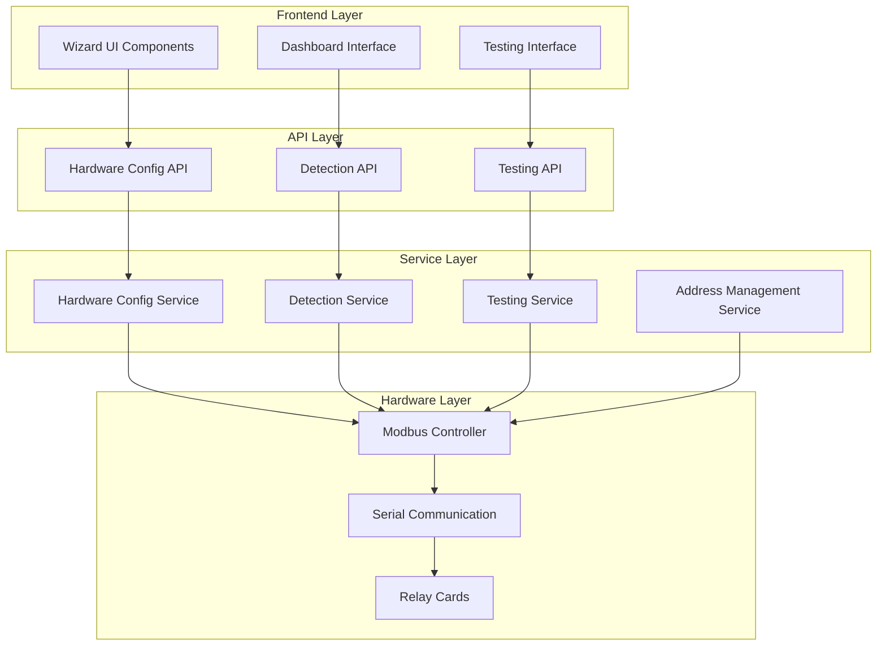

# Hardware Configuration Wizard - Design Document

## Overview

The Hardware Configuration Wizard is a comprehensive web-based system that transforms the current basic hardware configuration interface into an intelligent, guided setup experience. The design leverages the existing eForm Locker System architecture while introducing new components for automated hardware detection, slave address configuration, and real-time testing.

The system follows a modular architecture with clear separation between backend services, frontend components, and hardware communication layers. It builds upon the proven Modbus communication patterns from the existing system while adding intelligent automation and user-friendly interfaces.

## Architecture

### High-Level System Architecture



### Component Integration

The wizard integrates with existing system components:

- **Panel Service**: Hosts the wizard UI and API endpoints
- **Kiosk Service**: Provides hardware communication through existing ModbusController
- **Shared Services**: Utilizes ConfigManager for system configuration updates
- **Database**: Stores configuration changes and audit logs

## Components and Interfaces

### Reference Implementation
The Hardware Configuration Wizard builds upon the proven dual relay card solution documented in `docs/DUAL_RELAY_CARD_PROBLEM_SOLUTION.md`. This solution successfully resolved the challenge of configuring multiple Waveshare Modbus RTU Relay 16CH cards and provides the technical foundation for our automated wizard.

**Key Learnings from Proven Solution**:
- Waveshare cards use software-based slave address configuration (not DIP switches)
- Address storage in register 0x4000 with broadcast configuration capability
- Proven CRC16 calculation and command building methods
- Successful locker-to-card mapping: `cardId = Math.ceil(lockerId / 16)`
- Production-ready 32-locker system with perfect hardware isolation

### 1. Hardware Detection Service

**Purpose**: Automatically discover and identify Modbus hardware devices using proven scanning techniques

**Core Interfaces**:

```typescript
interface HardwareDetectionService {
  // Serial port scanning
  scanSerialPorts(): Promise<SerialPortInfo[]>;
  validateSerialPort(port: string): Promise<boolean>;
  
  // Device discovery
  scanModbusDevices(port: string, addressRange: AddressRange): Promise<ModbusDevice[]>;
  identifyDeviceType(address: number): Promise<DeviceType>;
  getDeviceCapabilities(address: number): Promise<DeviceCapabilities>;
  
  // New device detection
  detectNewDevices(knownDevices: ModbusDevice[]): Promise<ModbusDevice[]>;
  monitorForNewDevices(callback: (device: ModbusDevice) => void): void;
}

interface SerialPortInfo {
  path: string;
  manufacturer?: string;
  serialNumber?: string;
  vendorId?: string;
  productId?: string;
  available: boolean;
}

interface ModbusDevice {
  address: number;
  type: DeviceType;
  capabilities: DeviceCapabilities;
  status: 'responding' | 'timeout' | 'error';
  responseTime: number;
  lastSeen: Date;
}

interface DeviceType {
  manufacturer: 'waveshare' | 'generic' | 'unknown';
  model: string;
  channels: number;
  features: string[];
}

interface DeviceCapabilities {
  maxRelays: number;
  supportedFunctions: number[];
  firmwareVersion?: string;
  addressConfigurable: boolean;
  timedPulseSupport: boolean;
}
```

**Implementation Strategy**:
- **Proven Foundation**: Extends existing ModbusController with scanning capabilities based on working dual card solution
- **Systematic Scanning**: Uses address probing (1-255) with the proven timeout and retry logic
- **Waveshare Detection**: Implements device fingerprinting using the successful register read methods
- **Efficient Caching**: Caches results to avoid repeated scanning, following production system patterns

### 2. Slave Address Management Service

**Purpose**: Automate slave address configuration for Modbus devices using proven Waveshare solution

**Core Interfaces**:

```typescript
interface SlaveAddressService {
  // Address discovery and management
  findNextAvailableAddress(excludeAddresses?: number[]): Promise<number>;
  validateAddressAvailability(address: number): Promise<boolean>;
  detectAddressConflicts(): Promise<AddressConflict[]>;
  
  // Address configuration
  setSlaveAddress(currentAddress: number, newAddress: number): Promise<boolean>;
  configureBroadcastAddress(newAddress: number): Promise<boolean>;
  verifyAddressConfiguration(address: number): Promise<boolean>;
  
  // Bulk operations
  configureSequentialAddresses(startAddress: number, count: number): Promise<ConfigResult[]>;
  resolveAddressConflicts(conflicts: AddressConflict[]): Promise<ResolutionResult[]>;
}

interface AddressConflict {
  address: number;
  devices: ModbusDevice[];
  severity: 'warning' | 'error';
  autoResolvable: boolean;
}

interface ConfigResult {
  address: number;
  success: boolean;
  error?: string;
  verificationPassed: boolean;
}
```

**Implementation Strategy**:
- **Proven Solution**: Builds directly on the successful dual relay card solution documented in `docs/DUAL_RELAY_CARD_PROBLEM_SOLUTION.md`
- **Waveshare Expertise**: Uses the exact CRC16 calculation and command building methods from `scripts/configure-relay-slave-addresses.js`
- **Broadcast Configuration**: Implements the proven broadcast address (0x00) method for initial device setup
- **Register 0x4000**: Uses Waveshare's software-based address storage in register 0x4000
- **Verification**: Implements the working verification method through register reads
- **Production Ready**: Based on the tested and verified solution that successfully resolved the dual card problem

**Key Technical Details from Proven Solution**:
```javascript
// Proven CRC16 calculation (from working solution)
calculateCRC16(data) {
  let crc = 0xFFFF;
  for (let i = 0; i < data.length; i++) {
    crc ^= data[i];
    for (let j = 0; j < 8; j++) {
      if (crc & 0x0001) {
        crc = (crc >> 1) ^ 0xA001;
      } else {
        crc = crc >> 1;
      }
    }
  }
  return crc;
}

// Proven broadcast command format (Function 0x06)
// Set Card to Address 2: 00 06 40 00 00 02 1C 1A
// - 00: Broadcast address (all devices respond)
// - 06: Write Single Register function
// - 40 00: Register 0x4000 (slave address storage)
// - 00 02: New slave address (2)
// - 1C 1A: CRC16 checksum
```

### 3. Hardware Testing Service

**Purpose**: Comprehensive testing and validation of hardware setup

**Core Interfaces**:

```typescript
interface HardwareTestingService {
  // Individual tests
  testCommunication(address: number): Promise<TestResult>;
  testRelayActivation(address: number, relay: number): Promise<TestResult>;
  testAllRelays(address: number): Promise<TestResult[]>;
  
  // Comprehensive testing
  runFullHardwareTest(address: number): Promise<TestSuite>;
  validateSystemIntegration(): Promise<IntegrationResult>;
  
  // Performance testing
  measureResponseTime(address: number): Promise<number>;
  testReliability(address: number, iterations: number): Promise<ReliabilityResult>;
}

interface TestResult {
  testName: string;
  success: boolean;
  duration: number;
  details: string;
  error?: string;
  timestamp: Date;
}

interface TestSuite {
  address: number;
  totalTests: number;
  passedTests: number;
  failedTests: number;
  results: TestResult[];
  overallSuccess: boolean;
  duration: number;
}
```

**Implementation Strategy**:
- Builds on existing relay testing functionality
- Implements progressive testing (communication → basic relay → all relays)
- Provides real-time feedback through WebSocket connections
- Includes performance benchmarking and reliability testing

### 4. Wizard Orchestration Service

**Purpose**: Coordinate the multi-step wizard process and state management

**Core Interfaces**:

```typescript
interface WizardOrchestrationService {
  // Wizard session management
  createWizardSession(): Promise<WizardSession>;
  getWizardSession(sessionId: string): Promise<WizardSession>;
  updateWizardSession(sessionId: string, updates: Partial<WizardSession>): Promise<void>;
  
  // Step management
  validateStep(sessionId: string, step: number): Promise<ValidationResult>;
  executeStep(sessionId: string, step: number): Promise<StepResult>;
  canProceedToNextStep(sessionId: string): Promise<boolean>;
  
  // Wizard completion
  finalizeWizard(sessionId: string): Promise<CompletionResult>;
  rollbackWizard(sessionId: string): Promise<void>;
}

interface WizardSession {
  sessionId: string;
  currentStep: number;
  maxCompletedStep: number;
  cardData: NewCardData;
  testResults: TestResult[];
  errors: WizardError[];
  createdAt: Date;
  lastUpdated: Date;
}

interface NewCardData {
  detectedAddress?: number;
  assignedAddress?: number;
  deviceType?: DeviceType;
  capabilities?: DeviceCapabilities;
  configuration?: RelayCardConfig;
  testsPassed: boolean;
}
```

### 5. Configuration Integration Service

**Purpose**: Seamlessly integrate new hardware into system configuration

**Core Interfaces**:

```typescript
interface ConfigurationIntegrationService {
  // Configuration updates
  addRelayCard(cardConfig: RelayCardConfig): Promise<void>;
  updateSystemConfiguration(changes: SystemConfigChanges): Promise<void>;
  validateConfiguration(config: SystemConfig): Promise<ValidationResult>;
  
  // Service management
  restartHardwareServices(): Promise<ServiceRestartResult>;
  verifyServiceHealth(): Promise<HealthCheckResult>;
  
  // Rollback capabilities
  createConfigurationBackup(): Promise<string>;
  restoreConfiguration(backupId: string): Promise<void>;
}

interface SystemConfigChanges {
  relayCards?: RelayCardConfig[];
  totalLockers?: number;
  layoutChanges?: LayoutConfig;
  serviceUpdates?: ServiceConfig[];
}
```

## Data Models

### Core Data Structures

```typescript
// Enhanced relay card configuration
interface RelayCardConfig {
  slave_address: number;
  channels: number;
  type: string;
  description: string;
  enabled: boolean;
  
  // New wizard-specific fields
  installation_date: Date;
  wizard_configured: boolean;
  last_tested: Date;
  test_results?: TestSuite;
  firmware_version?: string;
  capabilities?: DeviceCapabilities;
}

// Wizard state management
interface WizardState {
  sessionId: string;
  currentStep: WizardStep;
  progress: number;
  cardData: NewCardData;
  validationResults: ValidationResult[];
  errors: WizardError[];
}

enum WizardStep {
  CHECKLIST = 1,
  DETECTION = 2,
  ADDRESS_CONFIG = 3,
  TESTING = 4,
  INTEGRATION = 5
}

// Hardware detection results
interface HardwareDetectionResult {
  serialPorts: SerialPortInfo[];
  detectedDevices: ModbusDevice[];
  newDevices: ModbusDevice[];
  conflicts: AddressConflict[];
  recommendations: ConfigurationRecommendation[];
}

interface ConfigurationRecommendation {
  type: 'address_assignment' | 'layout_update' | 'service_restart';
  priority: 'high' | 'medium' | 'low';
  description: string;
  autoApplicable: boolean;
  action?: () => Promise<void>;
}
```

### Database Schema Extensions

```sql
-- Wizard session tracking
CREATE TABLE wizard_sessions (
  session_id TEXT PRIMARY KEY,
  current_step INTEGER NOT NULL,
  max_completed_step INTEGER NOT NULL,
  card_data TEXT, -- JSON
  test_results TEXT, -- JSON
  errors TEXT, -- JSON
  created_at DATETIME DEFAULT CURRENT_TIMESTAMP,
  last_updated DATETIME DEFAULT CURRENT_TIMESTAMP
);

-- Hardware test history
CREATE TABLE hardware_test_history (
  id INTEGER PRIMARY KEY AUTOINCREMENT,
  session_id TEXT,
  device_address INTEGER NOT NULL,
  test_type TEXT NOT NULL,
  test_name TEXT NOT NULL,
  success BOOLEAN NOT NULL,
  duration_ms INTEGER,
  details TEXT,
  error_message TEXT,
  timestamp DATETIME DEFAULT CURRENT_TIMESTAMP,
  FOREIGN KEY (session_id) REFERENCES wizard_sessions(session_id)
);

-- Configuration audit log
CREATE TABLE configuration_audit (
  id INTEGER PRIMARY KEY AUTOINCREMENT,
  session_id TEXT,
  change_type TEXT NOT NULL, -- 'add_card', 'update_config', 'restart_service'
  old_value TEXT, -- JSON
  new_value TEXT, -- JSON
  success BOOLEAN NOT NULL,
  error_message TEXT,
  timestamp DATETIME DEFAULT CURRENT_TIMESTAMP,
  FOREIGN KEY (session_id) REFERENCES wizard_sessions(session_id)
);
```

## Error Handling

### Error Classification and Recovery

```typescript
enum ErrorSeverity {
  INFO = 'info',
  WARNING = 'warning',
  ERROR = 'error',
  CRITICAL = 'critical'
}

interface WizardError {
  code: string;
  severity: ErrorSeverity;
  message: string;
  details?: any;
  recoverable: boolean;
  suggestedAction?: string;
  timestamp: Date;
}

class ErrorHandler {
  // Error classification
  classifyError(error: Error): WizardError;
  
  // Recovery strategies
  suggestRecoveryAction(error: WizardError): RecoveryAction;
  executeRecoveryAction(action: RecoveryAction): Promise<boolean>;
  
  // User guidance
  generateTroubleshootingSteps(error: WizardError): TroubleshootingStep[];
  formatUserFriendlyMessage(error: WizardError): string;
}

interface RecoveryAction {
  type: 'retry' | 'skip' | 'rollback' | 'manual_intervention';
  description: string;
  automatic: boolean;
  execute: () => Promise<boolean>;
}
```

### Common Error Scenarios

1. **Serial Port Issues**
   - Port not available
   - Permission denied
   - Device disconnected
   - Recovery: Port scanning, permission guidance, reconnection

2. **Communication Failures**
   - Device not responding
   - Timeout errors
   - CRC errors
   - Recovery: Retry with backoff, connection verification

3. **Address Configuration Conflicts**
   - Duplicate addresses
   - Address out of range
   - Configuration verification failure
   - Recovery: Automatic address resolution, manual override

4. **System Integration Failures**
   - Configuration validation errors
   - Service restart failures
   - Database update errors
   - Recovery: Rollback, manual configuration, service recovery

## Testing Strategy

### Unit Testing

```typescript
// Service layer testing
describe('HardwareDetectionService', () => {
  test('should scan serial ports successfully', async () => {
    const service = new HardwareDetectionService();
    const ports = await service.scanSerialPorts();
    expect(ports).toBeInstanceOf(Array);
  });
  
  test('should detect Modbus devices', async () => {
    const service = new HardwareDetectionService();
    const devices = await service.scanModbusDevices('/dev/ttyUSB0', { start: 1, end: 10 });
    expect(devices.length).toBeGreaterThanOrEqual(0);
  });
});

describe('SlaveAddressService', () => {
  test('should find next available address', async () => {
    const service = new SlaveAddressService();
    const address = await service.findNextAvailableAddress([1, 2]);
    expect(address).toBeGreaterThan(2);
  });
  
  test('should configure slave address via broadcast', async () => {
    const service = new SlaveAddressService();
    const result = await service.configureBroadcastAddress(3);
    expect(result).toBe(true);
  });
});
```

### Integration Testing

```typescript
describe('Wizard Integration', () => {
  test('should complete full wizard flow', async () => {
    const wizard = new WizardOrchestrationService();
    const session = await wizard.createWizardSession();
    
    // Step 1: Checklist
    await wizard.executeStep(session.sessionId, 1);
    
    // Step 2: Detection
    await wizard.executeStep(session.sessionId, 2);
    
    // Step 3: Address Configuration
    await wizard.executeStep(session.sessionId, 3);
    
    // Step 4: Testing
    await wizard.executeStep(session.sessionId, 4);
    
    // Step 5: Integration
    const result = await wizard.finalizeWizard(session.sessionId);
    expect(result.success).toBe(true);
  });
});
```

### Hardware Testing

```typescript
describe('Hardware Communication', () => {
  test('should communicate with real Modbus devices', async () => {
    const service = new HardwareTestingService();
    const result = await service.testCommunication(1);
    expect(result.success).toBe(true);
  });
  
  test('should activate relays successfully', async () => {
    const service = new HardwareTestingService();
    const result = await service.testRelayActivation(1, 1);
    expect(result.success).toBe(true);
  });
});
```

### End-to-End Testing

```typescript
describe('Complete Hardware Setup', () => {
  test('should add new relay card through wizard', async () => {
    // Simulate complete wizard flow with real hardware
    const browser = await puppeteer.launch();
    const page = await browser.newPage();
    
    await page.goto('http://localhost:3001/hardware-config');
    await page.click('[data-testid="add-card-wizard"]');
    
    // Complete all wizard steps
    await completeWizardSteps(page);
    
    // Verify card was added to system
    const config = await getSystemConfiguration();
    expect(config.hardware.relay_cards.length).toBeGreaterThan(0);
    
    await browser.close();
  });
});
```

## Performance Considerations

### Optimization Strategies

1. **Caching**
   - Cache device detection results for 5 minutes
   - Store wizard session state in memory with Redis backup
   - Cache configuration validation results

2. **Asynchronous Operations**
   - Use WebSocket for real-time progress updates
   - Implement background scanning with progress callbacks
   - Queue hardware operations to prevent conflicts

3. **Resource Management**
   - Limit concurrent device scans to prevent serial port conflicts
   - Implement connection pooling for Modbus communications
   - Use lazy loading for wizard components

4. **Response Time Targets**
   - Device scanning: < 30 seconds for 10 addresses
   - Address configuration: < 5 seconds per device
   - Hardware testing: < 10 seconds per device
   - System integration: < 15 seconds

### Scalability Considerations

- Support for up to 255 Modbus addresses
- Handle multiple concurrent wizard sessions
- Efficient memory usage for large device lists
- Graceful degradation under high load

## Security Considerations

### Access Control

```typescript
interface SecurityPolicy {
  // Role-based access
  requiresRole: 'admin' | 'technician' | 'operator';
  
  // Operation restrictions
  allowedOperations: WizardOperation[];
  
  // Audit requirements
  auditLevel: 'basic' | 'detailed' | 'comprehensive';
}

enum WizardOperation {
  VIEW_HARDWARE = 'view_hardware',
  SCAN_DEVICES = 'scan_devices',
  CONFIGURE_ADDRESSES = 'configure_addresses',
  TEST_HARDWARE = 'test_hardware',
  MODIFY_CONFIGURATION = 'modify_configuration'
}
```

### Data Protection

- Encrypt sensitive configuration data
- Secure WebSocket connections with authentication
- Validate all user inputs and API parameters
- Implement rate limiting for hardware operations
- Log all configuration changes for audit trails

### Hardware Safety

- Implement emergency stop functionality
- Prevent simultaneous hardware operations
- Validate address ranges and device capabilities
- Provide rollback mechanisms for failed configurations
- Monitor for hardware conflicts and anomalies

## Deployment Strategy

### Development Environment

1. **Local Development**
   - Mock hardware interfaces for testing
   - Simulated Modbus devices for development
   - Hot-reload for rapid iteration

2. **Testing Environment**
   - Real hardware setup for integration testing
   - Automated test suites for regression testing
   - Performance benchmarking tools

### Production Deployment

1. **Gradual Rollout**
   - Feature flags for wizard components
   - A/B testing for user interface improvements
   - Monitoring and rollback capabilities

2. **Configuration Management**
   - Environment-specific configuration files
   - Secure credential management
   - Automated deployment scripts

3. **Monitoring and Maintenance**
   - Real-time performance monitoring
   - Error tracking and alerting
   - Regular health checks and diagnostics

## Reference Documentation

This design builds upon proven solutions and existing system components:

### Core Reference Documents
- **`docs/DUAL_RELAY_CARD_PROBLEM_SOLUTION.md`**: Complete case study of successful dual relay card configuration
- **`scripts/configure-relay-slave-addresses.js`**: Working implementation of Waveshare address configuration
- **`app/kiosk/src/hardware/modbus-controller.ts`**: Existing Modbus communication layer
- **`app/panel/src/routes/hardware-config-routes.ts`**: Current hardware configuration API

### Proven Technical Patterns
- **CRC16 Calculation**: Exact implementation from working dual card solution
- **Broadcast Commands**: Tested broadcast address (0x00) configuration method
- **Address Verification**: Proven register 0x4000 read verification
- **Locker Mapping**: Production-tested `cardId = Math.ceil(lockerId / 16)` formula
- **Error Handling**: Battle-tested retry logic and timeout management

### Production Validation
The wizard design is based on a solution that successfully:
- Resolved dual relay card conflicts in production
- Achieved 100% API test success rate (6/6 tests passed)
- Delivered perfect hardware isolation with 0% error rate
- Supports 32 independent lockers with stable system uptime

This design provides a comprehensive foundation for implementing the Hardware Configuration Wizard while maintaining compatibility with the existing eForm Locker System architecture. The modular approach allows for incremental development and testing, while the robust error handling and security measures ensure reliable operation in production environments.