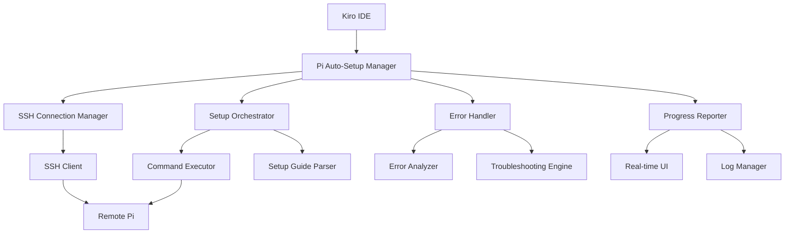
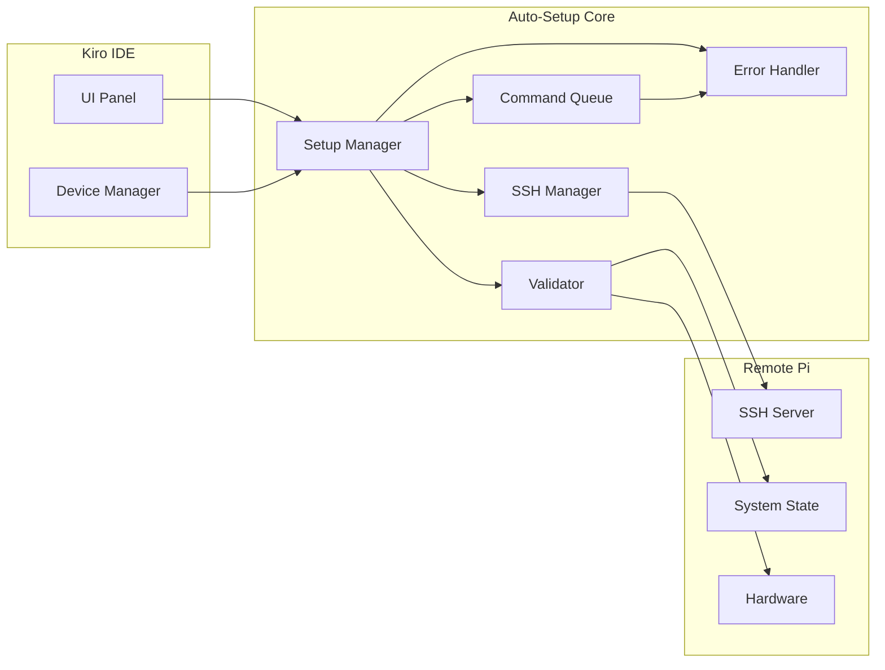

# Design Document

## Overview

The Raspberry Pi Auto-Setup System is a comprehensive automation tool that enables Kiro IDE to remotely connect to Raspberry Pi devices and execute complete system setup procedures. The system leverages SSH connections, intelligent error handling, and existing setup documentation to provide a seamless deployment experience.

The system architecture follows a modular design with clear separation of concerns: connection management, command execution, error analysis, and progress reporting. It integrates with existing validation scripts and troubleshooting procedures to provide intelligent error resolution.

## Architecture

### High-Level Architecture



### Component Architecture



## Components and Interfaces

### 1. SSH Connection Manager

**Purpose**: Manages secure SSH connections to Raspberry Pi devices.

**Interface**:
```typescript
interface SSHConnectionManager {
  connect(config: SSHConfig): Promise<SSHConnection>
  disconnect(connectionId: string): Promise<void>
  executeCommand(connectionId: string, command: string): Promise<CommandResult>
  uploadFile(connectionId: string, localPath: string, remotePath: string): Promise<void>
  downloadFile(connectionId: string, remotePath: string, localPath: string): Promise<void>
  getConnectionStatus(connectionId: string): ConnectionStatus
}

interface SSHConfig {
  host: string
  port: number
  username: string
  password?: string
  privateKey?: string
  timeout: number
}

interface CommandResult {
  exitCode: number
  stdout: string
  stderr: string
  duration: number
  timestamp: Date
}
```

**Key Features**:
- Connection pooling and reuse
- Automatic reconnection on failure
- Command timeout handling
- Secure credential management
- Connection health monitoring

### 2. Setup Orchestrator

**Purpose**: Coordinates the execution of setup procedures based on the setup guide.

**Interface**:
```typescript
interface SetupOrchestrator {
  parseSetupGuide(guidePath: string): SetupPlan
  executeSetup(connectionId: string, plan: SetupPlan): Promise<SetupResult>
  pauseSetup(executionId: string): Promise<void>
  resumeSetup(executionId: string): Promise<void>
  cancelSetup(executionId: string): Promise<void>
  getSetupStatus(executionId: string): SetupStatus
}

interface SetupPlan {
  steps: SetupStep[]
  dependencies: StepDependency[]
  validationPoints: ValidationPoint[]
}

interface SetupStep {
  id: string
  name: string
  description: string
  commands: string[]
  expectedResults: string[]
  errorPatterns: ErrorPattern[]
  retryPolicy: RetryPolicy
}
```

**Key Features**:
- Dynamic step generation from setup guide
- Dependency resolution
- Parallel execution where possible
- Checkpoint and resume capability
- Progress tracking and reporting

### 3. Error Handler and Troubleshooting Engine

**Purpose**: Analyzes errors and applies intelligent fixes based on existing troubleshooting procedures.

**Interface**:
```typescript
interface ErrorHandler {
  analyzeError(error: CommandError, context: ExecutionContext): ErrorAnalysis
  findSolution(analysis: ErrorAnalysis): Solution[]
  applySolution(connectionId: string, solution: Solution): Promise<SolutionResult>
  learnFromError(error: CommandError, solution: Solution, result: SolutionResult): void
}

interface ErrorAnalysis {
  errorType: ErrorType
  severity: ErrorSeverity
  category: string
  patterns: string[]
  context: ExecutionContext
  suggestedSolutions: Solution[]
}

interface Solution {
  id: string
  name: string
  description: string
  commands: string[]
  confidence: number
  riskLevel: RiskLevel
  rollbackCommands?: string[]
}
```

**Key Features**:
- Pattern-based error recognition
- Integration with existing troubleshooting guides
- Machine learning from successful fixes
- Risk assessment for solutions
- Automatic rollback on failed fixes

### 4. Device Manager

**Purpose**: Manages multiple Raspberry Pi devices and their configurations.

**Interface**:
```typescript
interface DeviceManager {
  addDevice(config: DeviceConfig): Promise<string>
  removeDevice(deviceId: string): Promise<void>
  updateDevice(deviceId: string, config: Partial<DeviceConfig>): Promise<void>
  getDevice(deviceId: string): DeviceConfig
  listDevices(): DeviceConfig[]
  getDeviceStatus(deviceId: string): Promise<DeviceStatus>
}

interface DeviceConfig {
  id: string
  name: string
  host: string
  sshConfig: SSHConfig
  setupProfile: string
  lastSetupDate?: Date
  version?: string
  tags: string[]
}

interface DeviceStatus {
  online: boolean
  systemInfo: SystemInfo
  setupStatus: SetupStatus
  healthChecks: HealthCheck[]
  lastSeen: Date
}
```

### 5. Progress Reporter

**Purpose**: Provides real-time feedback and logging during setup operations.

**Interface**:
```typescript
interface ProgressReporter {
  startSetup(executionId: string, plan: SetupPlan): void
  updateProgress(executionId: string, stepId: string, progress: StepProgress): void
  reportError(executionId: string, error: SetupError): void
  reportSuccess(executionId: string, result: SetupResult): void
  getProgressStream(executionId: string): Observable<ProgressEvent>
}

interface StepProgress {
  stepId: string
  status: StepStatus
  progress: number
  message: string
  output?: string
  startTime: Date
  endTime?: Date
}
```

## Data Models

### Setup Execution State

```typescript
interface SetupExecution {
  id: string
  deviceId: string
  planId: string
  status: ExecutionStatus
  startTime: Date
  endTime?: Date
  currentStep?: string
  completedSteps: string[]
  failedSteps: FailedStep[]
  errors: SetupError[]
  logs: LogEntry[]
  checkpoints: Checkpoint[]
}

interface FailedStep {
  stepId: string
  error: SetupError
  attemptCount: number
  lastAttempt: Date
  solutions: AppliedSolution[]
}

interface AppliedSolution {
  solutionId: string
  appliedAt: Date
  result: SolutionResult
  rollbackPerformed: boolean
}
```

### Error Tracking

```typescript
interface SetupError {
  id: string
  stepId: string
  command: string
  exitCode: number
  stderr: string
  stdout: string
  timestamp: Date
  context: ExecutionContext
  analysis?: ErrorAnalysis
  solutions?: Solution[]
}

interface ExecutionContext {
  deviceInfo: SystemInfo
  currentStep: SetupStep
  previousSteps: string[]
  environmentVariables: Record<string, string>
  installedPackages: string[]
  systemState: SystemState
}
```

## Error Handling

### Error Classification System

The system categorizes errors into several types for targeted handling:

1. **Connection Errors**: SSH connection failures, timeouts, authentication issues
2. **Permission Errors**: Insufficient privileges, file access denied
3. **Package Errors**: Package installation failures, dependency conflicts
4. **Hardware Errors**: Device not found, communication failures
5. **Configuration Errors**: Invalid settings, missing files
6. **System Errors**: Disk space, memory, resource constraints

### Troubleshooting Integration

The system integrates with existing troubleshooting procedures from the setup guide:

```typescript
interface TroubleshootingRule {
  id: string
  errorPattern: RegExp
  category: string
  description: string
  solutions: TroubleshootingSolution[]
  conditions?: Condition[]
}

interface TroubleshootingSolution {
  name: string
  commands: string[]
  verification: string[]
  rollback?: string[]
  riskLevel: 'low' | 'medium' | 'high'
  successRate: number
}
```

**Example Rules**:
- USB-RS485 not detected → Install CH340 driver, check permissions
- Modbus timeout → Check wiring, verify power supply, test with different baud rate
- Package installation fails → Update package lists, clear cache, retry with different mirror
- Permission denied → Add user to groups, fix file permissions, use sudo where appropriate

### Error Recovery Strategies

1. **Immediate Retry**: For transient errors (network timeouts, temporary resource unavailability)
2. **Progressive Backoff**: For rate-limited operations or busy resources
3. **Alternative Approach**: Try different methods to achieve the same goal
4. **User Intervention**: Request manual confirmation for high-risk operations
5. **Graceful Degradation**: Continue with non-critical components if possible
6. **Complete Rollback**: Restore system to previous state if critical errors occur

## Testing Strategy

### Unit Testing

- **SSH Connection Manager**: Mock SSH connections, test connection pooling, error handling
- **Setup Orchestrator**: Test step parsing, dependency resolution, execution flow
- **Error Handler**: Test pattern matching, solution selection, rollback procedures
- **Device Manager**: Test CRUD operations, status tracking, configuration validation

### Integration Testing

- **End-to-End Setup**: Test complete setup process on clean Raspberry Pi
- **Error Simulation**: Inject various error conditions and verify recovery
- **Multi-Device**: Test concurrent setup operations on multiple devices
- **Network Resilience**: Test behavior under poor network conditions

### Hardware Testing

- **Real Hardware**: Test with actual Raspberry Pi devices and hardware components
- **Hardware Variations**: Test with different Pi models, USB converters, relay cards
- **Error Conditions**: Test with disconnected hardware, power failures, etc.

### Performance Testing

- **Setup Time**: Measure and optimize setup completion time
- **Resource Usage**: Monitor CPU, memory, and network usage during setup
- **Concurrent Operations**: Test performance with multiple simultaneous setups
- **Large Scale**: Test with many devices (10+, 50+, 100+)

## Security Considerations

### SSH Security

- **Key-based Authentication**: Prefer SSH keys over passwords
- **Connection Encryption**: Ensure all communications are encrypted
- **Host Verification**: Verify SSH host keys to prevent MITM attacks
- **Session Management**: Properly close connections and clean up sessions

### Credential Management

- **Secure Storage**: Store SSH credentials securely (encrypted at rest)
- **Access Control**: Limit access to credentials based on user permissions
- **Credential Rotation**: Support for rotating SSH keys and passwords
- **Audit Trail**: Log all credential access and usage

### Command Execution

- **Command Validation**: Validate commands before execution
- **Privilege Escalation**: Use sudo only when necessary and with specific commands
- **Input Sanitization**: Sanitize all user inputs to prevent injection attacks
- **Command Logging**: Log all executed commands for audit purposes

### Network Security

- **VPN Support**: Support for VPN connections to remote devices
- **Firewall Rules**: Respect and work with existing firewall configurations
- **Network Isolation**: Support for devices on isolated networks
- **Certificate Validation**: Validate SSL/TLS certificates for secure connections

## Performance Optimization

### Connection Management

- **Connection Pooling**: Reuse SSH connections for multiple commands
- **Persistent Connections**: Keep connections alive during setup process
- **Connection Multiplexing**: Use SSH multiplexing for better performance
- **Timeout Optimization**: Adjust timeouts based on network conditions

### Command Execution

- **Parallel Execution**: Execute independent commands in parallel
- **Command Batching**: Combine related commands to reduce round trips
- **Output Streaming**: Stream command output for real-time feedback
- **Compression**: Use SSH compression for large data transfers

### Resource Management

- **Memory Usage**: Optimize memory usage for large-scale deployments
- **CPU Utilization**: Balance CPU usage across multiple operations
- **Disk I/O**: Minimize disk operations and optimize file transfers
- **Network Bandwidth**: Optimize network usage and handle bandwidth constraints

## Monitoring and Observability

### Metrics Collection

- **Setup Success Rate**: Track successful vs failed setups
- **Error Frequency**: Monitor common error patterns
- **Performance Metrics**: Track setup times, resource usage
- **Device Health**: Monitor device status and connectivity

### Logging Strategy

- **Structured Logging**: Use structured logs for better analysis
- **Log Levels**: Implement appropriate log levels (debug, info, warn, error)
- **Log Rotation**: Implement log rotation to manage disk space
- **Remote Logging**: Support for centralized logging systems

### Alerting

- **Setup Failures**: Alert on setup failures and critical errors
- **Device Offline**: Alert when devices go offline unexpectedly
- **Performance Degradation**: Alert on performance issues
- **Security Events**: Alert on security-related events

## Scalability Considerations

### Horizontal Scaling

- **Multi-Instance**: Support for running multiple setup instances
- **Load Balancing**: Distribute setup operations across instances
- **Queue Management**: Use message queues for managing setup requests
- **State Synchronization**: Synchronize state across multiple instances

### Vertical Scaling

- **Resource Optimization**: Optimize resource usage for single instance
- **Concurrent Operations**: Support for many concurrent setup operations
- **Memory Management**: Efficient memory usage for large deployments
- **CPU Optimization**: Optimize CPU usage for compute-intensive operations

### Data Management

- **Database Scaling**: Support for database scaling and sharding
- **Caching**: Implement caching for frequently accessed data
- **Data Archiving**: Archive old setup logs and historical data
- **Backup and Recovery**: Implement backup and recovery procedures