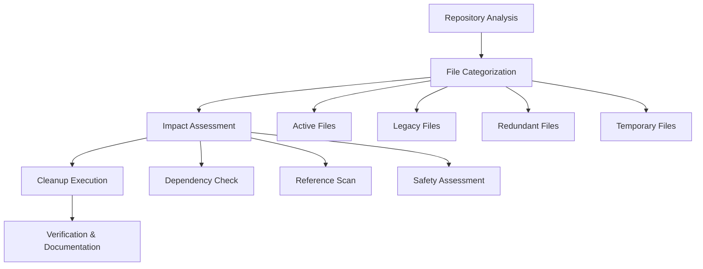

# Design Document

## Overview

This design outlines a systematic approach to cleaning up the eForm Locker System repository by analyzing, categorizing, and organizing files based on their current relevance and purpose. The cleanup will be performed in phases to ensure no critical functionality is lost while achieving a clean, maintainable repository structure.

## Architecture

### Cleanup Process Flow



### File Classification System

**Active Files**: Currently used in production or development
- Core application code
- Essential documentation
- Production scripts
- Active test suites

**Legacy Files**: From previous iterations but potentially valuable
- Historical documentation
- Deprecated but referenced code
- Old configuration examples
- Migration artifacts

**Redundant Files**: Duplicate or superseded content
- Multiple versions of same functionality
- Outdated documentation covering same topics
- Duplicate test files
- Backup copies with unclear purpose

**Temporary Files**: Created for debugging or one-time tasks
- Debug scripts with specific timestamps
- Test files for specific issues
- Temporary HTML files for testing
- Ad-hoc validation scripts

## Components and Interfaces

### 1. File Analysis Engine

**Purpose**: Systematically analyze repository contents and categorize files

**Key Methods**:
- `analyzeFileContent()`: Examine file content and purpose
- `checkReferences()`: Find references to files in codebase
- `assessAge()`: Determine file creation and last modification dates
- `categorizeFile()`: Assign files to appropriate categories

**Input**: Repository file tree
**Output**: Categorized file inventory with metadata

### 2. Dependency Scanner

**Purpose**: Identify file dependencies and references to prevent breaking changes

**Key Methods**:
- `scanCodeReferences()`: Find imports, requires, and file references
- `checkScriptDependencies()`: Analyze script interdependencies
- `validateSafeRemoval()`: Confirm files can be safely removed

**Input**: File list and codebase
**Output**: Dependency map and safety assessment

### 3. Content Consolidator

**Purpose**: Merge related documentation and eliminate redundancy

**Key Methods**:
- `identifyRelatedContent()`: Find files covering similar topics
- `mergeDocumentation()`: Combine related markdown files
- `preserveUniqueContent()`: Ensure no valuable information is lost
- `updateReferences()`: Fix links after consolidation

**Input**: Related file groups
**Output**: Consolidated documentation with updated references

### 4. Cleanup Executor

**Purpose**: Perform actual file operations with safety checks

**Key Methods**:
- `createBackupInventory()`: Document all changes before execution
- `moveFiles()`: Relocate files to appropriate directories
- `removeFiles()`: Delete confirmed unnecessary files
- `updateStructure()`: Create new directory organization

**Input**: Cleanup plan and safety confirmations
**Output**: Updated repository structure

## Data Models

### File Inventory Record

```typescript
interface FileRecord {
  path: string;
  category: 'active' | 'legacy' | 'redundant' | 'temporary';
  size: number;
  lastModified: Date;
  references: string[];
  purpose: string;
  safeToRemove: boolean;
  consolidationTarget?: string;
  newLocation?: string;
}
```

### Cleanup Action

```typescript
interface CleanupAction {
  type: 'remove' | 'move' | 'consolidate' | 'update';
  sourceFiles: string[];
  targetLocation?: string;
  reason: string;
  riskLevel: 'low' | 'medium' | 'high';
  backupRequired: boolean;
}
```

## Error Handling

### Safety Mechanisms

1. **Dry Run Mode**: Execute cleanup plan without making changes
2. **Backup Creation**: Create inventory of all files before removal
3. **Reference Validation**: Confirm no active code references removed files
4. **Rollback Capability**: Maintain ability to restore removed files
5. **Incremental Execution**: Process files in small batches for safety

### Error Recovery

- **Broken References**: Automatically update or flag broken links
- **Missing Dependencies**: Halt cleanup if critical dependencies detected
- **Permission Issues**: Skip files with access restrictions and log
- **Validation Failures**: Revert changes if post-cleanup validation fails

## Testing Strategy

### Pre-Cleanup Validation

1. **Repository State Snapshot**: Capture current state for comparison
2. **Build Verification**: Ensure all services build successfully
3. **Test Suite Execution**: Run existing tests to establish baseline
4. **Reference Mapping**: Create complete map of file references

### Post-Cleanup Validation

1. **Build Integrity**: Verify all services still build after cleanup
2. **Test Execution**: Confirm all tests still pass
3. **Reference Validation**: Check no broken links or imports
4. **Functionality Testing**: Verify core system functionality intact

### Cleanup Process Testing

1. **Dry Run Validation**: Test cleanup logic without file operations
2. **Categorization Accuracy**: Verify files categorized correctly
3. **Safety Check Effectiveness**: Confirm safety mechanisms work
4. **Rollback Testing**: Verify ability to restore if needed

## Implementation Phases

### Phase 1: Analysis and Planning
- Scan repository and categorize all files
- Identify dependencies and references
- Create detailed cleanup plan
- Generate safety assessment report

### Phase 2: Documentation Consolidation
- Merge related markdown files
- Update documentation structure
- Fix broken references
- Create comprehensive guides

### Phase 3: Script Optimization
- Remove obsolete scripts
- Consolidate redundant functionality
- Update script documentation
- Organize by purpose and frequency

### Phase 4: Test Organization
- Separate active tests from debug artifacts
- Organize tests by type and purpose
- Remove temporary test files
- Update test documentation

### Phase 5: Legacy Cleanup
- Remove confirmed obsolete files
- Archive historical content if valuable
- Clean up temporary artifacts
- Finalize directory structure

### Phase 6: Verification and Documentation
- Validate system functionality
- Generate cleanup report
- Update repository documentation
- Create maintenance guidelines

## Directory Structure (Target)

```
eform-locker-system/
├── docs/                          # Essential documentation only
│   ├── README.md                  # Main project documentation
│   ├── deployment-guide.md        # Deployment and setup
│   ├── api-reference.md          # API documentation
│   ├── troubleshooting-guide.md  # Common issues and solutions
│   └── development-guide.md      # Development setup and workflow
├── scripts/                      # Essential operational scripts
│   ├── deployment/               # Deployment-related scripts
│   ├── testing/                  # Test execution scripts
│   ├── maintenance/              # System maintenance scripts
│   └── emergency/                # Emergency response scripts
├── tests/                        # Organized test suites
│   ├── unit/                     # Unit tests
│   ├── integration/              # Integration tests
│   └── e2e/                      # End-to-end tests
├── app/                          # Application code (unchanged)
├── shared/                       # Shared utilities (unchanged)
├── migrations/                   # Database migrations (unchanged)
└── config/                       # Configuration files (unchanged)
```

## Success Metrics

1. **File Reduction**: Reduce total repository files by 40-60%
2. **Documentation Quality**: Consolidate to 5-7 essential docs
3. **Script Efficiency**: Maintain 25-30 essential scripts
4. **Build Performance**: Maintain or improve build times
5. **Developer Experience**: Reduce time to find relevant files by 50%
6. **Maintenance Overhead**: Reduce ongoing maintenance burden