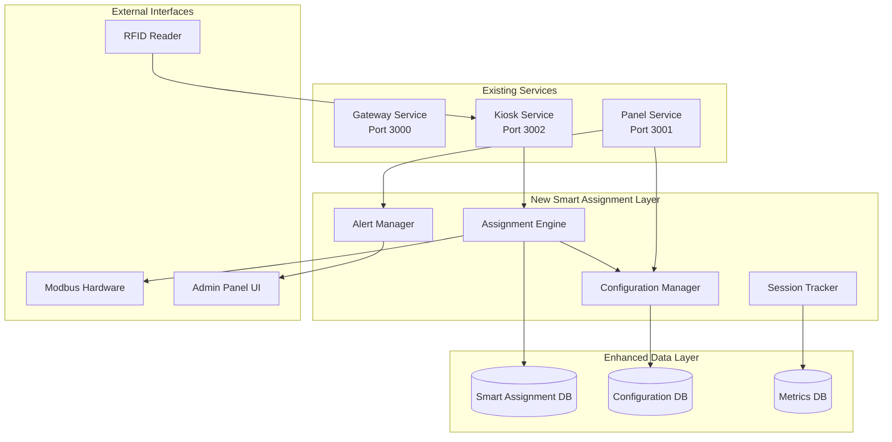

# Design Document

## Overview

The Smart Locker Assignment system transforms the current manual locker selection process into an intelligent, zero-touch automatic assignment system. This design maintains full backward compatibility with existing APIs while introducing sophisticated assignment algorithms, return handling, and administrative controls.

The system operates as an enhancement layer over the existing architecture, introducing new services and data models while preserving all current functionality. A feature flag allows seamless switching between manual and automatic modes without service restarts.

## Architecture

### High-Level Architecture



### Service Integration Points

The smart assignment system integrates with existing services through well-defined interfaces:

- **Kiosk Service**: Enhanced to call assignment engine instead of showing locker list
- **Gateway Service**: Maintains existing admin APIs with new configuration endpoints
- **Panel Service**: Extended with new admin pages for configuration and monitoring
- **Database Layer**: New tables added alongside existing schema

## Components and Interfaces

### 1. Assignment Engine

The core component responsible for intelligent locker selection and assignment.

```typescript
interface AssignmentEngine {
  // Main assignment flow
  assignLocker(request: AssignmentRequest): Promise<AssignmentResult>;
  
  // Scoring and selection
  scoreLockers(kioskId: string, excludeIds: number[]): Promise<LockerScore[]>;
  selectFromCandidates(scores: LockerScore[], config: AssignmentConfig): number;
  
  // Return handling
  handleReturn(cardId: string, kioskId: string): Promise<ReturnResult>;
  checkReturnHold(lockerId: number): Promise<ReturnHold | null>;
  
  // Reclaim logic
  calculateReclaim(cardId: string, kioskId: string): Promise<ReclaimResult>;
  applyExitQuarantine(lockerId: number): Promise<void>;
}

interface AssignmentRequest {
  cardId: string;
  kioskId: string;
  timestamp: Date;
  userReportWindow?: boolean;
}

interface AssignmentResult {
  success: boolean;
  lockerId?: number;
  action: 'assign_new' | 'open_existing' | 'retrieve_overdue' | 'reopen_reclaim';
  message: string;
  errorCode?: string;
  retryAllowed?: boolean;
}

interface LockerScore {
  lockerId: number;
  baseScore: number;
  freeHours: number;
  hoursSinceLastOwner: number;
  wearCount: number;
  quarantineMultiplier: number;
  waitingHours: number;
  finalScore: number;
}
```

### 2. Configuration Manager

Handles global and per-kiosk configuration with hot reload capabilities.

```typescript
interface ConfigurationManager {
  // Configuration retrieval
  getEffectiveConfig(kioskId: string): Promise<EffectiveConfig>;
  getGlobalConfig(): Promise<GlobalConfig>;
  getKioskOverrides(kioskId: string): Promise<KioskOverrides>;
  
  // Configuration updates
  updateGlobalConfig(updates: Partial<GlobalConfig>): Promise<void>;
  setKioskOverride(kioskId: string, key: string, value: any): Promise<void>;
  removeKioskOverride(kioskId: string, key: string): Promise<void>;
  
  // Hot reload
  triggerReload(): Promise<void>;
  subscribeToChanges(callback: (config: EffectiveConfig) => void): void;
}

interface GlobalConfig {
  // Scoring parameters
  base_score: number;
  score_factor_a: number; // free hours multiplier
  score_factor_b: number; // hours since last owner multiplier
  score_factor_g: number; // wear_count divisor
  score_factor_d: number; // waiting hours bonus
  top_k_candidates: number;
  selection_temperature: number;
  
  // Quarantine settings
  quarantine_minutes_base: number; // 5 minutes
  quarantine_minutes_ceiling: number; // 20 minutes
  exit_quarantine_minutes: number; // 20 minutes fixed
  
  // Return hold settings
  return_hold_trigger_seconds: number;
  return_hold_minutes: number;
  
  // Session and timing
  session_limit_minutes: number;
  retrieve_window_minutes: number;
  
  // Capacity management
  reserve_ratio: number; // Percentage of lockers to reserve (e.g., 0.1 = 10%)
  reserve_minimum: number; // Minimum number of lockers to reserve
  
  // Hardware settings
  sensorless_pulse_ms: number;
  open_window_seconds: number;
  retry_count: number;
  retry_backoff_ms: number;
  
  // Rate limits
  card_rate_limit_seconds: number; // 10 seconds
  locker_rate_limit_per_minute: number; // 3 opens
  command_cooldown_seconds: number; // 3 seconds
  user_report_daily_cap: number; // 2 reports
  
  // Feature flags
  smart_assignment_enabled: boolean;
  allow_reclaim_during_quarantine: boolean;
}
```

### 3. Session Tracker

Enhanced session management with smart assignment features.

```typescript
interface SessionTracker {
  // Session lifecycle
  createSmartSession(cardId: string, kioskId: string): Promise<SmartSession>;
  updateSession(sessionId: string, updates: Partial<SmartSession>): Promise<void>;
  completeSession(sessionId: string, outcome: SessionOutcome): Promise<void>;
  
  // Session queries
  getActiveSession(cardId: string): Promise<SmartSession | null>;
  getKioskSession(kioskId: string): Promise<SmartSession | null>;
  getOverdueSessions(): Promise<SmartSession[]>;
  
  // Extension and management
  extendSession(sessionId: string, adminUser: string, reason: string): Promise<boolean>;
  markOverdue(sessionId: string): Promise<void>;
}

interface SmartSession {
  id: string;
  cardId: string;
  kioskId: string;
  lockerId?: number;
  startTime: Date;
  limitTime: Date;
  extendedTime?: Date;
  expiresTime: Date;
  status: 'active' | 'overdue' | 'completed' | 'cancelled';
  lastSeen: Date;
  extensionCount: number;
  maxExtensions: number; // Maximum 4 extensions (4 × 60min = 240min total)
}
```

### 4. Alert Manager

Monitoring and alerting system for operational issues.

```typescript
interface AlertManager {
  // Alert generation
  checkAlerts(kioskId: string): Promise<Alert[]>;
  triggerAlert(type: AlertType, data: AlertData): Promise<void>;
  clearAlert(alertId: string): Promise<void>;
  
  // Threshold monitoring
  monitorNoStock(kioskId: string): Promise<void>;
  monitorConflictRate(kioskId: string): Promise<void>;
  monitorOpenFailRate(kioskId: string): Promise<void>;
  monitorRetryRate(kioskId: string): Promise<void>;
  monitorOverdueShare(kioskId: string): Promise<void>;
}

interface Alert {
  id: string;
  type: AlertType;
  kioskId: string;
  severity: 'low' | 'medium' | 'high' | 'critical';
  message: string;
  data: AlertData;
  triggeredAt: Date;
  clearedAt?: Date;
  autoClearCondition?: string;
}

type AlertType = 'no_stock' | 'conflict_rate' | 'open_fail_rate' | 'retry_rate' | 'overdue_share';

// Alert threshold configuration
const ALERT_THRESHOLDS = {
  no_stock: {
    trigger: { count: 3, windowMinutes: 10 }, // >3 no-stock events in 10 minutes
    clear: { count: 2, windowMinutes: 10, waitMinutes: 20 } // <2 events in 10 min, wait 20 min
  },
  conflict_rate: {
    trigger: { rate: 0.02, windowMinutes: 5 }, // >2% conflict rate in 5 minutes
    clear: { rate: 0.01, windowMinutes: 10 } // <1% rate in 10 minutes
  },
  open_fail_rate: {
    trigger: { rate: 0.01, windowMinutes: 10 }, // >1% failure rate in 10 minutes
    clear: { rate: 0.005, windowMinutes: 20 } // <0.5% rate in 20 minutes
  },
  retry_rate: {
    trigger: { rate: 0.05, windowMinutes: 5 }, // >5% retry rate in 5 minutes
    clear: { rate: 0.03, windowMinutes: 10 } // <3% rate in 10 minutes
  },
  overdue_share: {
    trigger: { rate: 0.20, windowMinutes: 10 }, // ≥20% overdue in 10 minutes
    clear: { rate: 0.10, windowMinutes: 20 } // <10% overdue in 20 minutes
  }
};
```

## Data Models

### Enhanced Locker Model

```sql
-- Extend existing lockers table with smart assignment fields
ALTER TABLE lockers ADD COLUMN free_since DATETIME;
ALTER TABLE lockers ADD COLUMN recent_owner TEXT;
ALTER TABLE lockers ADD COLUMN recent_owner_time DATETIME;
ALTER TABLE lockers ADD COLUMN quarantine_until DATETIME;
ALTER TABLE lockers ADD COLUMN wear_count INTEGER DEFAULT 0;
ALTER TABLE lockers ADD COLUMN overdue_from DATETIME;
ALTER TABLE lockers ADD COLUMN overdue_reason TEXT;
ALTER TABLE lockers ADD COLUMN suspected_occupied BOOLEAN DEFAULT 0;
ALTER TABLE lockers ADD COLUMN cleared_by TEXT;
ALTER TABLE lockers ADD COLUMN cleared_at DATETIME;
ALTER TABLE lockers ADD COLUMN return_hold_until DATETIME;
ALTER TABLE lockers ADD COLUMN owner_hot_until DATETIME;
```

### Quarantine Calculation Logic

```typescript
// Dynamic quarantine duration calculation
function calculateQuarantineDuration(freeRatio: number): number {
  const floor = 5; // minutes
  const ceiling = 20; // minutes
  const exitQuarantine = 20; // minutes (fixed)
  
  if (freeRatio >= 0.5) return ceiling; // 20 minutes
  if (freeRatio <= 0.1) return floor;   // 5 minutes
  
  // Linear interpolation between 0.1 and 0.5
  return floor + ((freeRatio - 0.1) / 0.4) * (ceiling - floor);
}

// Reclaim window calculation
function calculateReclaimWindow(freeRatio: number): number {
  const reclaimLowMin = 30;   // minutes
  const reclaimHighMin = 180; // minutes
  const freeRatioLow = 0.1;
  const freeRatioHigh = 0.5;
  
  if (freeRatio >= freeRatioHigh) return reclaimHighMin; // 180 minutes
  if (freeRatio <= freeRatioLow) return reclaimLowMin;   // 30 minutes
  
  // Linear interpolation
  return reclaimLowMin + ((freeRatio - freeRatioLow) / (freeRatioHigh - freeRatioLow)) * 
         (reclaimHighMin - reclaimLowMin);
}

// Owner hot window calculation
function calculateOwnerHotWindow(freeRatio: number): number {
  if (freeRatio <= 0.1) return 0; // Disabled when very low stock
  if (freeRatio >= 0.5) return 30; // 30 minutes
  
  // Linear interpolation between 0.1 and 0.5
  return 10 + ((freeRatio - 0.1) / 0.4) * 20; // 10-30 minutes
}

// Reserve capacity management
function applyReserveCapacity(availableLockers: Locker[], config: GlobalConfig): Locker[] {
  const totalAvailable = availableLockers.length;
  
  // Calculate reserve requirement
  const reserveByRatio = Math.ceil(totalAvailable * config.reserve_ratio);
  const reserveRequired = Math.max(reserveByRatio, config.reserve_minimum);
  
  // If low stock, disable reserve to maximize availability
  if (totalAvailable <= reserveRequired * 2) {
    return availableLockers; // Use all available lockers
  }
  
  // Reserve lockers from the pool (keep last N lockers as reserve)
  const assignableCount = totalAvailable - reserveRequired;
  return availableLockers.slice(0, assignableCount);
}
```

### Smart Sessions Table

```sql
CREATE TABLE smart_sessions (
  id TEXT PRIMARY KEY,
  card_id TEXT NOT NULL,
  kiosk_id TEXT NOT NULL,
  locker_id INTEGER,
  start_time DATETIME NOT NULL,
  limit_time DATETIME NOT NULL,
  extended_time DATETIME,
  expires_time DATETIME NOT NULL,
  status TEXT NOT NULL DEFAULT 'active',
  last_seen DATETIME NOT NULL,
  extension_count INTEGER DEFAULT 0,
  max_extensions INTEGER DEFAULT 4,
  created_at DATETIME DEFAULT CURRENT_TIMESTAMP,
  updated_at DATETIME DEFAULT CURRENT_TIMESTAMP,
  CHECK (status IN ('active', 'overdue', 'completed', 'cancelled'))
);
```

### Configuration Tables

```sql
-- Global configuration
CREATE TABLE global_config (
  key TEXT PRIMARY KEY,
  value TEXT NOT NULL,
  data_type TEXT NOT NULL DEFAULT 'string',
  updated_by TEXT,
  updated_at DATETIME DEFAULT CURRENT_TIMESTAMP,
  CHECK (data_type IN ('string', 'number', 'boolean', 'json'))
);

-- Per-kiosk overrides
CREATE TABLE kiosk_config_overrides (
  kiosk_id TEXT NOT NULL,
  key TEXT NOT NULL,
  value TEXT NOT NULL,
  data_type TEXT NOT NULL DEFAULT 'string',
  updated_by TEXT,
  updated_at DATETIME DEFAULT CURRENT_TIMESTAMP,
  PRIMARY KEY (kiosk_id, key),
  CHECK (data_type IN ('string', 'number', 'boolean', 'json'))
);

-- Configuration version for hot reload
CREATE TABLE config_version (
  id INTEGER PRIMARY KEY DEFAULT 1,
  version INTEGER NOT NULL DEFAULT 1,
  updated_at DATETIME DEFAULT CURRENT_TIMESTAMP,
  CHECK (id = 1)
);

-- Configuration audit history
CREATE TABLE config_history (
  id INTEGER PRIMARY KEY AUTOINCREMENT,
  kiosk_id TEXT, -- NULL for global config
  key TEXT NOT NULL,
  old_value TEXT,
  new_value TEXT,
  changed_by TEXT NOT NULL,
  changed_at DATETIME DEFAULT CURRENT_TIMESTAMP
);

-- Default configuration seeding
INSERT OR IGNORE INTO global_config (key, value, data_type) VALUES
  ('base_score', '100', 'number'),
  ('score_factor_a', '2.0', 'number'),
  ('score_factor_b', '1.0', 'number'),
  ('score_factor_g', '0.1', 'number'),
  ('score_factor_d', '0.5', 'number'),
  ('top_k_candidates', '5', 'number'),
  ('selection_temperature', '1.0', 'number'),
  ('quarantine_minutes_base', '5', 'number'),
  ('quarantine_minutes_ceiling', '20', 'number'),
  ('exit_quarantine_minutes', '20', 'number'),
  ('return_hold_trigger_seconds', '120', 'number'),
  ('return_hold_minutes', '15', 'number'),
  ('session_limit_minutes', '180', 'number'),
  ('retrieve_window_minutes', '10', 'number'),
  ('reserve_ratio', '0.1', 'number'),
  ('reserve_minimum', '2', 'number'),
  ('sensorless_pulse_ms', '800', 'number'),
  ('open_window_seconds', '10', 'number'),
  ('retry_count', '1', 'number'),
  ('retry_backoff_ms', '500', 'number'),
  ('card_rate_limit_seconds', '10', 'number'),
  ('locker_rate_limit_per_minute', '3', 'number'),
  ('command_cooldown_seconds', '3', 'number'),
  ('user_report_daily_cap', '2', 'number'),
  ('smart_assignment_enabled', 'false', 'boolean'),
  ('allow_reclaim_during_quarantine', 'false', 'boolean');
```

### Metrics and Alerts Tables

```sql
-- Assignment metrics
CREATE TABLE assignment_metrics (
  id INTEGER PRIMARY KEY AUTOINCREMENT,
  kiosk_id TEXT NOT NULL,
  card_id TEXT NOT NULL,
  assignment_time DATETIME NOT NULL,
  locker_id INTEGER,
  action_type TEXT NOT NULL,
  score_data TEXT, -- JSON with scoring details
  success BOOLEAN NOT NULL,
  error_code TEXT,
  duration_ms INTEGER,
  created_at DATETIME DEFAULT CURRENT_TIMESTAMP,
  CHECK (action_type IN ('assign_new', 'open_existing', 'retrieve_overdue', 'reopen_reclaim'))
);

-- Alert tracking
CREATE TABLE alerts (
  id TEXT PRIMARY KEY,
  type TEXT NOT NULL,
  kiosk_id TEXT NOT NULL,
  severity TEXT NOT NULL,
  message TEXT NOT NULL,
  data TEXT, -- JSON alert data
  triggered_at DATETIME NOT NULL,
  cleared_at DATETIME,
  auto_clear_condition TEXT,
  created_at DATETIME DEFAULT CURRENT_TIMESTAMP,
  CHECK (type IN ('no_stock', 'conflict_rate', 'open_fail_rate', 'retry_rate', 'overdue_share')),
  CHECK (severity IN ('low', 'medium', 'high', 'critical'))
);
```

## Error Handling

### Assignment Failures

The system handles various failure scenarios with appropriate fallbacks:

1. **No Available Lockers**: Return clear Turkish message "Boş dolap yok. Görevliye başvurun"
2. **Hardware Failures**: Implement sensorless retry logic with backoff
3. **Concurrency Conflicts**: Single transaction with one retry on conflict
4. **Configuration Errors**: Fall back to hardcoded defaults
5. **Database Errors**: Graceful degradation to manual mode

### Retry Logic Implementation

```typescript
class SensorlessRetryHandler {
  async openWithRetry(lockerId: number, config: RetryConfig): Promise<RetryResult> {
    const startTime = Date.now();
    
    // First attempt
    let success = await this.pulseRelay(lockerId, config.pulse_ms);
    
    if (!success) {
      // Wait for open window
      await this.sleep(config.open_window_seconds * 1000);
      
      // Check for card scan during window (indicates retry needed)
      if (this.cardScannedDuringWindow()) {
        // Show "Tekrar deneniyor" message ONLY during retry window
        this.showMessage("Tekrar deneniyor");
        
        // Wait for backoff
        await this.sleep(config.retry_backoff_ms);
        
        // Retry once
        success = await this.pulseRelay(lockerId, config.pulse_ms);
      }
    }
    
    const totalDuration = Date.now() - startTime;
    const maxDuration = config.pulse_ms + (config.open_window_seconds * 1000) + 
                       config.retry_backoff_ms + config.pulse_ms;
    
    // Ensure total duration constraint: final message ≤ budget
    if (totalDuration <= maxDuration) {
      const message = success ? 
        "Dolabınız açıldı. Eşyalarınızı yerleştirin" : 
        "Şu an işlem yapılamıyor";
      
      this.showMessage(message);
    }
    
    return { success, duration: totalDuration };
  }
}

// Concurrency handling with single transaction
class AssignmentConcurrencyHandler {
  async assignWithConcurrencyControl(request: AssignmentRequest): Promise<AssignmentResult> {
    return await this.db.transaction(async (tx) => {
      // Select and claim in single transaction
      const candidates = await this.scoreAndSelectCandidates(request.kioskId, tx);
      
      if (candidates.length === 0) {
        return { success: false, error: 'no_stock', message: 'Boş dolap yok. Görevliye başvurun' };
      }
      
      // Attempt to claim first candidate
      const claimed = await this.claimLocker(candidates[0].lockerId, request.cardId, tx);
      
      if (!claimed) {
        // Conflict detected - refresh state once and retry
        const freshCandidates = await this.scoreAndSelectCandidates(request.kioskId, tx);
        
        if (freshCandidates.length > 0) {
          const retryClaimed = await this.claimLocker(freshCandidates[0].lockerId, request.cardId, tx);
          
          if (retryClaimed) {
            return { success: true, lockerId: freshCandidates[0].lockerId };
          }
        }
        
        // Retry failed - return error
        throw new Error('Assignment conflict - retry failed');
      }
      
      return { success: true, lockerId: candidates[0].lockerId };
    });
  }
}
```

## Testing Strategy

### Unit Testing

- **Assignment Engine**: Test scoring algorithms with various locker states
- **Configuration Manager**: Test hot reload and override merging
- **Session Tracker**: Test session lifecycle and extension logic
- **Alert Manager**: Test threshold monitoring and auto-clear conditions

### Integration Testing

- **End-to-End Assignment Flow**: Card scan to locker opening
- **Concurrency Testing**: Multiple simultaneous assignments
- **Hardware Failure Simulation**: Test retry and fallback logic
- **Configuration Hot Reload**: Test real-time configuration updates

### Performance Testing

- **Assignment Latency**: Target <500ms for assignment decision
- **Configuration Reload**: Target <3 seconds for propagation
- **Database Performance**: Test with high concurrency loads
- **Memory Usage**: Monitor for memory leaks in long-running processes

### Acceptance Testing

- **Feature Flag Testing**: Verify seamless switching between modes
- **Turkish Language**: Validate all user messages
- **Admin Interface**: Test all configuration and monitoring features
- **Rollback Scenarios**: Test fallback to manual mode

## API Design

### Enhanced Kiosk API

```typescript
// Enhanced card handling endpoint
POST /api/rfid/handle-card
{
  "card_id": "0009652489",
  "kiosk_id": "kiosk-1",
  "timestamp": "2025-01-09T10:30:00Z"
}

// Response for smart assignment mode
{
  "success": true,
  "action": "assign_new",
  "locker_id": 15,
  "message": "Dolabınız açıldı. Eşyalarınızı yerleştirin",
  "session_id": "smart-session-123"
}

// Response for no stock
{
  "success": false,
  "error": "no_stock",
  "message": "Boş dolap yok. Görevliye başvurun"
}

// All Turkish UI messages (approved set only)
const UI_MESSAGES = {
  idle: "Kartınızı okutun",
  success_new: "Dolabınız açıldı. Eşyalarınızı yerleştirin",
  success_existing: "Önceki dolabınız açıldı",
  retrieve_overdue: "Süreniz doldu. Almanız için açılıyor",
  reported_occupied: "Dolap dolu bildirildi. Yeni dolap açılıyor",
  retry: "Tekrar deneniyor",
  throttled: "Lütfen birkaç saniye sonra deneyin",
  no_stock: "Boş dolap yok. Görevliye başvurun",
  error: "Şu an işlem yapılamıyor"
};
```

### Configuration API

```typescript
// Get effective configuration
GET /admin/config/effective/{kioskId}
{
  "global": { /* global config */ },
  "overrides": { /* kiosk overrides */ },
  "effective": { /* merged config */ },
  "version": 42
}

// Update global configuration
PUT /admin/config/global
{
  "base_score": 100,
  "score_factor_a": 2.0,
  "smart_assignment_enabled": true
}

// Set kiosk override
PUT /admin/config/override/{kioskId}
{
  "key": "session_limit_minutes",
  "value": 180,
  "updated_by": "admin"
}
```

### Admin Panel API

```typescript
// Live sessions endpoint
GET /admin/sessions/live
{
  "sessions": [
    {
      "id": "session-123",
      "card_id": "0009652489",
      "kiosk_id": "kiosk-1",
      "locker_id": 15,
      "remaining_minutes": 45,
      "can_extend": true
    }
  ]
}

// Extend session
POST /admin/sessions/{sessionId}/extend
{
  "admin_user": "admin",
  "reason": "User requested more time"
}

// Overdue lockers
GET /admin/lockers/overdue
{
  "lockers": [
    {
      "kiosk_id": "kiosk-1",
      "locker_id": 8,
      "overdue_since": "2025-01-09T08:00:00Z",
      "reason": "session_expired",
      "can_force_open": true
    }
  ]
}
```

## Deployment Strategy

### Phase 1: Infrastructure Setup
1. Deploy new database migrations
2. Seed default configuration values
3. Deploy enhanced services with feature flag OFF

### Phase 2: Staging Validation
1. Enable smart assignment on staging environment
2. Run 48-hour validation tests
3. Verify all acceptance criteria
4. Test rollback procedures

### Phase 3: Production Rollout
1. Enable on single kiosk for monitoring
2. Monitor key metrics: no_stock, retries, open_success, reclaim_rate, wear_variance
3. Tune configuration via admin panel
4. Gradually expand to all kiosks
5. Keep manual mode as fallback option

### Rollback Plan
- Immediate: Set feature flag to false via admin panel
- Database: Rollback migrations if needed (data preserved)
- Services: Revert to previous version if critical issues
- Configuration: Reset to known good configuration

The design ensures zero-downtime deployment and maintains full backward compatibility while providing a robust foundation for intelligent locker assignment.