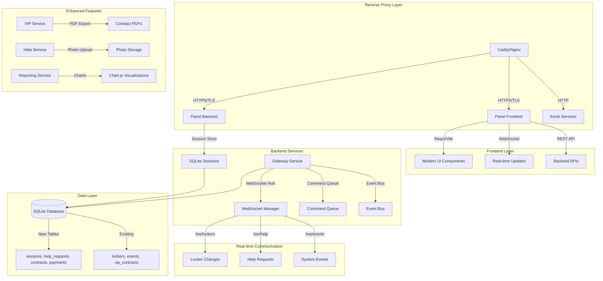

# Design Document

## Overview

The System Modernization design transforms the existing eform locker system into a simple, reliable platform suitable for small gym operations. The architecture introduces a React-based frontend for staff, basic help request system for lock failures, simple VIP contract management, and essential reporting. **This design prioritizes simplicity and reliability over enterprise features - designed for 2-3 kiosks and 1-2 staff members, not large-scale operations.**

## Architecture

### Modernized System Architecture



### Service Integration Strategy

The modernization follows a **strangler fig pattern** where new functionality is gradually introduced alongside existing services:

1. **Phase 0**: Secure authentication and session management
2. **Phase 1**: React frontend platform (parallel to existing HTML)
3. **Phase 2**: WebSocket real-time core
4. **Phase 3**: Help workflow implementation
5. **Phase 4**: VIP contract wizard
6. **Phase 5**: Reporting and analytics
7. **Phase 6**: Kiosk UX upgrades
8. **Phase 7**: Remote control and diagnostics
9. **Phase 8**: PWA and offline support

## Components and Interfaces

### Enhanced Authentication System

**Design Rationale**: The authentication system is redesigned to use SQLite-based session storage instead of in-memory storage to ensure session persistence across server restarts and enable proper session management with sliding renewal. HTTPS is enforced through reverse proxy configuration to meet security requirements.

#### Session Management Service

```typescript
interface SessionManager {
  // SQLite-based session storage with sliding renewal
  createSession(
    userId: string,
    userAgent: string,
    ip: string
  ): Promise<Session>;
  validateSession(sessionId: string): Promise<Session | null>;
  renewSession(sessionId: string): Promise<Session>; // Sliding renewal mechanism
  destroySession(sessionId: string): Promise<void>;
  cleanupExpiredSessions(): Promise<void>;

  // Authentication event logging
  logAuthEvent(
    event: "login" | "logout" | "renew" | "failed_attempt",
    userId?: string,
    ip?: string,
    userAgent?: string
  ): Promise<void>;
}

interface Session {
  id: string;
  user_id: string;
  user_agent: string;
  ip_address: string;
  created_at: Date;
  expires_at: Date;
  csrf_token: string;
  last_activity: Date; // For sliding renewal
}
```
###
# HTTPS and Reverse Proxy Configuration

**Design Rationale**: HTTPS is mandatory for production deployment on Raspberry Pi, with Caddy or Nginx providing TLS termination. Cookie security flags are conditionally set based on HTTPS availability to prevent issues in development environments.

```typescript
interface TLSConfig {
  enabled: boolean;
  cert_path: string;
  key_path: string;
  auto_renew: boolean; // Let's Encrypt integration
  reverse_proxy: {
    enabled: boolean;
    trust_proxy: boolean; // Enable trustProxy in Fastify
    secure_cookies: boolean; // secure: true only when HTTPS
  };
}

interface CookieConfig {
  httpOnly: true; // Prevent XSS access
  sameSite: "strict"; // CSRF protection
  path: "/"; // Specific path restrictions
  secure: boolean; // Only when served over HTTPS
}
```

#### Authentication Flow Design

```typescript
interface AuthenticationFlow {
  login: {
    endpoint: 'POST /auth/login';
    rate_limiting: '5 attempts per minute per IP';
    password_hashing: 'Argon2id with automatic rehashing';
    session_creation: 'SQLite storage with CSRF token';
    redirect_prevention: 'Eliminate redirect loops';
  };

  session_validation: {
    endpoint: 'GET /auth/me';
    response: '200 status in browser and curl';
    middleware: 'Same session check as protected routes';
    csrf_protection: 'Token validation on mutating routes';
  };

  logout: {
    endpoint: 'POST /auth/logout';
    session_cleanup: 'Remove from SQLite and clear cookies';
    audit_logging: 'Log logout events';
  };
}
```

### React Frontend Architecture

**Design Rationale**: The frontend uses React + Vite + TypeScript + Tailwind CSS stack for modern development experience and optimal performance. shadcn/ui provides consistent, accessible base components. The architecture supports full responsiveness and dark mode while maintaining compatibility with legacy HTML during transition.

#### Technology Stack

```typescript
interface FrontendStack {
  framework: 'React 18+';
  build_tool: 'Vite';
  language: 'TypeScript';
  styling: 'Tailwind CSS';
  ui_components: 'shadcn/ui';
  routing: 'React Router';
  state_management: 'React Context + useReducer';
  testing: 'Vitest + React Testing Library';
}
```

#### Component Structure

```typescript
interface AppStructure {
  components: {
    layout: "Header" | "Sidebar" | "Footer";
    pages: [
      "Dashboard",
      "Lockers",
      "Help",
      "VIP",
      "Reports",
      "Settings",
      "Users"
    ];
    shared: [
      "LoadingSpinner",
      "ErrorBoundary",
      "Modal",
      "Toast",
      "ConfirmDialog",
      "DataTable"
    ];
  };
  hooks: {
    useWebSocket: "Real-time data connection with reconnection";
    useAuth: "Authentication state and session management";
    useI18n: "Simple JSON dictionary internationalization";
    useTheme: "Dark/light mode with system preference";
    useApi: "REST API client with error handling";
  };
  services: {
    api: "Axios-based REST API client";
    websocket: "Native WebSocket with reconnection logic";
    storage: "LocalStorage wrapper with type safety";
    i18n: "JSON dictionary loader with fallbacks";
  };
}
```

### WebSocket Real-time System

**Design Rationale**: WebSocket implementation uses @fastify/websocket for server-side handling with namespaced connections for different event types. The system provides sub-300ms update latency on LAN and includes robust reconnection logic with message replay capabilities.

#### WebSocket Manager

```typescript
class WebSocketManager {
  private namespaces: Map<string, WebSocketNamespace>;
  private connectionPool: Map<string, WebSocketConnection>;

  // Namespace management - /ws/lockers, /ws/help, /ws/events
  createNamespace(path: string): WebSocketNamespace;
  broadcast(namespace: string, event: string, data: any): void;
  broadcastToRoom(
    namespace: string,
    room: string,
    event: string,
    data: any
  ): void;

  // Connection management with authentication
  handleConnection(socket: WebSocket, namespace: string): void;
  handleDisconnection(socket: WebSocket): void;
  authenticateConnection(socket: WebSocket, sessionId: string): Promise<boolean>;

  // Performance monitoring
  getConnectionCount(namespace?: string): number;
  getLatencyMetrics(): LatencyMetrics;

  // Event emission with schema validation
  emitLockerStateChanged(
    lockerId: string,
    oldState: string,
    newState: string,
    kioskId: string
  ): void;
  emitHelpRequested(helpRequest: HelpRequest): void;
  emitCommandApplied(command: Command, result: CommandResult): void;
}

interface LatencyMetrics {
  median: number; // Target: <150ms
  p95: number;
  p99: number;
  connection_count: number;
}
```

### Simple Help Request System

**Design Rationale**: The help system provides basic assistance when lockers fail to open. Simple interface shows help requests to staff who can resolve them with a click.

#### Help Service Architecture (Simplified)

```typescript
class HelpService {
  // Basic help request management
  async createHelpRequest(request: CreateHelpRequest): Promise<HelpRequest>;
  async resolveHelpRequest(id: number, resolution?: string): Promise<void>;
  async getHelpRequests(status?: 'open' | 'resolved'): Promise<HelpRequest[]>;

  // Simple notification (optional WebSocket or manual refresh)
  private notifyHelpRequested(request: HelpRequest): void;
}

interface CreateHelpRequest {
  kiosk_id: string;
  locker_no?: number;
  category: "lock_problem" | "other";
  note?: string;
}

interface HelpRequest {
  id: number;
  kiosk_id: string;
  locker_no?: number;
  category: string;
  note?: string;
  status: "open" | "resolved";
  created_at: Date;
  resolved_at?: Date;
}
```

### VIP Contract Management with Payments

**Design Rationale**: The VIP system is enhanced with comprehensive payment tracking and a wizard-based interface that completes in under 2 minutes. PDF generation uses @fastify/multipart with pdfkit or puppeteer for professional contract documents. The database schema separates contracts and payments for better financial tracking.

#### VIP Service Architecture

```typescript
class VipService {
  // Contract management with enhanced tracking
  async createContract(contract: CreateVipContract): Promise<VipContract>;
  async renewContract(contractId: number, newEndDate: Date): Promise<void>;
  async cancelContract(contractId: number, reason: string): Promise<void>;
  async getActiveContracts(): Promise<VipContract[]>;
  async getExpiringContracts(days: number): Promise<VipContract[]>;

  // Payment management and tracking
  async recordPayment(payment: CreatePayment): Promise<Payment>;
  async getContractPayments(contractId: number): Promise<Payment[]>;
  async calculateContractValue(plan: VipPlan, duration: number): Promise<number>;
  async getPaymentHistory(contractId?: number): Promise<Payment[]>;

  // PDF generation with professional templates
  async generateContractPDF(contractId: number): Promise<Buffer>;
  private buildPDFContent(contract: VipContract): PDFContent;
  private addCompanyBranding(pdf: PDFDocument): void;
  private addContractTerms(pdf: PDFDocument, contract: VipContract): void;
}
```

## Data Models

### Enhanced Database Schema

#### Sessions Table

```sql
CREATE TABLE sessions (
  id TEXT PRIMARY KEY,
  user_id TEXT NOT NULL,
  user_agent TEXT NOT NULL,
  ip_address TEXT NOT NULL,
  created_at DATETIME DEFAULT CURRENT_TIMESTAMP,
  expires_at DATETIME NOT NULL,
  csrf_token TEXT NOT NULL,
  last_activity DATETIME DEFAULT CURRENT_TIMESTAMP,
  FOREIGN KEY (user_id) REFERENCES staff_users(id)
);

CREATE INDEX idx_sessions_expires_at ON sessions(expires_at);
CREATE INDEX idx_sessions_user_id ON sessions(user_id);
```

#### Help Requests Table (Simplified)

```sql
CREATE TABLE help_requests (
  id INTEGER PRIMARY KEY,
  kiosk_id TEXT NOT NULL,
  locker_no INTEGER,
  category TEXT NOT NULL,
  note TEXT,
  status TEXT NOT NULL DEFAULT 'open',
  created_at DATETIME DEFAULT CURRENT_TIMESTAMP,
  resolved_at DATETIME,
  CHECK (status IN ('open', 'resolved')),
  CHECK (category IN ('lock_problem', 'other'))
);

CREATE INDEX idx_help_requests_status ON help_requests(status);
```

#### Enhanced VIP Contracts Table

```sql
CREATE TABLE contracts (
  id INTEGER PRIMARY KEY,
  member_name TEXT NOT NULL,
  phone TEXT NOT NULL,
  email TEXT,
  plan TEXT NOT NULL,
  price DECIMAL(10,2) NOT NULL,
  start_at DATE NOT NULL,
  end_at DATE NOT NULL,
  status TEXT NOT NULL DEFAULT 'active',
  created_at DATETIME DEFAULT CURRENT_TIMESTAMP,
  created_by TEXT NOT NULL,
  kiosk_id TEXT NOT NULL,
  locker_id INTEGER NOT NULL,
  rfid_card TEXT NOT NULL,
  notes TEXT,
  FOREIGN KEY (created_by) REFERENCES staff_users(id),
  FOREIGN KEY (kiosk_id, locker_id) REFERENCES lockers(kiosk_id, id),
  CHECK (status IN ('active', 'expired', 'cancelled')),
  CHECK (plan IN ('basic', 'premium', 'executive'))
);
```

#### Payments Table

```sql
CREATE TABLE payments (
  id INTEGER PRIMARY KEY,
  contract_id INTEGER NOT NULL,
  amount DECIMAL(10,2) NOT NULL,
  method TEXT NOT NULL,
  paid_at DATETIME DEFAULT CURRENT_TIMESTAMP,
  reference TEXT,
  notes TEXT,
  created_by TEXT NOT NULL,
  FOREIGN KEY (contract_id) REFERENCES contracts(id),
  FOREIGN KEY (created_by) REFERENCES staff_users(id),
  CHECK (method IN ('cash', 'card', 'transfer', 'other'))
);

CREATE INDEX idx_payments_contract ON payments(contract_id);
CREATE INDEX idx_payments_paid_at ON payments(paid_at);
```

## Error Handling

### WebSocket Error Handling

- **Connection Loss**: Automatic reconnection with exponential backoff
- **Message Delivery**: Queue messages during disconnection, replay on reconnect
- **Namespace Errors**: Graceful degradation, fallback to polling
- **Authentication Errors**: Force re-authentication, clear invalid sessions

### Frontend Error Handling

- **API Errors**: Toast notifications with retry options
- **Network Errors**: Offline mode indicators, queue actions
- **Component Errors**: Error boundaries with fallback UI
- **State Errors**: Redux error handling with recovery actions

### Payment Processing Errors

- **Validation Errors**: Field-level validation with clear messages
- **PDF Generation Errors**: Fallback to simple text receipt
- **Database Errors**: Transaction rollback with user notification
- **File Upload Errors**: Progress indicators with retry mechanism

## Basic Testing Strategy (Simplified)

### Simple Testing Approach

```typescript
interface BasicTestingStrategy {
  unit_tests: {
    core_functionality: "Test auth, sessions, help creation/resolution";
    business_logic: "Test basic VIP contract creation and locker operations";
    error_handling: "Test common error scenarios";
  };

  integration_tests: {
    api_endpoints: "Test basic API functionality";
    database_operations: "Test CRUD operations work correctly";
    kiosk_communication: "Test panel can communicate with kiosks";
  };

  manual_testing: {
    user_workflows: "Test login, help request, VIP creation manually";
    kiosk_operations: "Test locker open/close, help button";
    edge_cases: "Test common failure scenarios";
  };
}
```

## Basic Performance Considerations

**Design Rationale**: System should be responsive for small gym operations with 2-3 kiosks and 1-2 staff members. No need for enterprise-grade performance optimization.

### Simple Performance Guidelines

- Panel should load reasonably fast on local network
- Locker commands should execute within a few seconds  
- Database should handle small data volumes efficiently
- System should be responsive for typical gym usage patterns

## Simple Deployment

### Basic Deployment Strategy

- Simple systemd service restart for updates
- Brief maintenance window acceptable for small gym
- Database migrations run before service restart
- Basic backup before updates
- Manual rollback if needed

This design provides a practical modernization plan focused on essential functionality for small gym operations. The approach prioritizes simplicity and reliability over enterprise features.