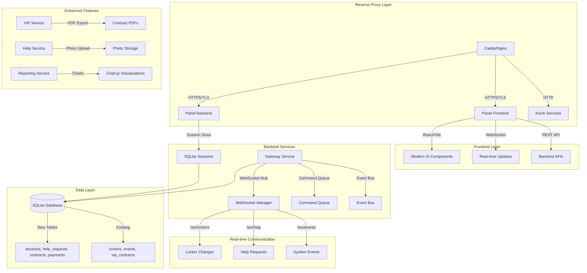

# Design Document

## Overview

The System Modernization design transforms the existing eform locker system into a modern, real-time platform while maintaining backward compatibility and ensuring zero downtime deployment. The architecture introduces a React-based frontend with TypeScript and Tailwind CSS, WebSocket real-time communication, enhanced security with HTTPS and SQLite session management, comprehensive VIP contract workflows with payment tracking, and robust monitoring and observability systems. The design follows a phased approach that allows incremental deployment without disrupting the current working system, with specific performance targets and comprehensive testing strategies.

## Architecture

### Modernized System Architecture



### Service Integration Strategy

The modernization follows a **strangler fig pattern** where new functionality is gradually introduced alongside existing services:

1. **Phase 0**: Secure authentication and session management
2. **Phase 1**: React frontend platform (parallel to existing HTML)
3. **Phase 2**: WebSocket real-time core
4. **Phase 3**: Help workflow implementation
5. **Phase 4**: VIP contract wizard
6. **Phase 5**: Reporting and analytics
7. **Phase 6**: Kiosk UX upgrades
8. **Phase 7**: Remote control and diagnostics
9. **Phase 8**: PWA and offline support

## Components and Interfaces

### Enhanced Authentication System

**Design Rationale**: The authentication system is redesigned to use SQLite-based session storage instead of in-memory storage to ensure session persistence across server restarts and enable proper session management with sliding renewal. HTTPS is enforced through reverse proxy configuration to meet security requirements.

#### Session Management Service

```typescript
interface SessionManager {
  // SQLite-based session storage with sliding renewal
  createSession(
    userId: string,
    userAgent: string,
    ip: string
  ): Promise<Session>;
  validateSession(sessionId: string): Promise<Session | null>;
  renewSession(sessionId: string): Promise<Session>; // Sliding renewal mechanism
  destroySession(sessionId: string): Promise<void>;
  cleanupExpiredSessions(): Promise<void>;

  // Authentication event logging
  logAuthEvent(
    event: "login" | "logout" | "renew" | "failed_attempt",
    userId?: string,
    ip?: string,
    userAgent?: string
  ): Promise<void>;
}

interface Session {
  id: string;
  user_id: string;
  user_agent: string;
  ip_address: string;
  created_at: Date;
  expires_at: Date;
  csrf_token: string;
  last_activity: Date; // For sliding renewal
}
```

#### HTTPS and Reverse Proxy Configuration

**Design Rationale**: HTTPS is mandatory for production deployment on Raspberry Pi, with Caddy or Nginx providing TLS termination. Cookie security flags are conditionally set based on HTTPS availability to prevent issues in development environments.

```typescript
interface TLSConfig {
  enabled: boolean;
  cert_path: string;
  key_path: string;
  auto_renew: boolean; // Let's Encrypt integration
  reverse_proxy: {
    enabled: boolean;
    trust_proxy: boolean; // Enable trustProxy in Fastify
    secure_cookies: boolean; // secure: true only when HTTPS
  };
}

interface CookieConfig {
  httpOnly: true; // Prevent XSS access
  sameSite: "strict"; // CSRF protection
  path: "/"; // Specific path restrictions
  secure: boolean; // Only when served over HTTPS
}
```

#### Authentication Flow Design

````typescript
interface AuthenticationFlow {
  login: {
    endpoint: 'POST /auth/login';
    rate_limiting: '5 attempts per minute per IP';
    password_hashing: 'Argon2id with automatic rehashing';
    session_creation: 'SQLite storage with CSRF token';
    redirect_prevention: 'Eliminate redirect loops';
  };

  session_validation: {
    endpoint: 'GET /auth/me';
    response: '200 status in browser and curl';
    middleware: 'Same session check as protected routes';
    csrf_protection: 'Token validation on mutating routes';
  };

  logout: {
    endpoint: 'POST /auth/logout';
    session_cleanup: 'Remove from SQLite and clear cookies';
    audit_logging: 'Log logout events';
  };
}

### React Frontend Architecture

**Design Rationale**: The frontend uses React + Vite + TypeScript + Tailwind CSS stack for modern development experience and optimal performance. shadcn/ui provides consistent, accessible base components. The architecture supports full responsiveness and dark mode while maintaining compatibility with legacy HTML during transition.

#### Technology Stack

```typescript
interface FrontendStack {
  framework: 'React 18+';
  build_tool: 'Vite';
  language: 'TypeScript';
  styling: 'Tailwind CSS';
  ui_components: 'shadcn/ui';
  routing: 'React Router';
  state_management: 'React Context + useReducer';
  testing: 'Vitest + React Testing Library';
}
````

#### Component Structure

```typescript
interface AppStructure {
  components: {
    layout: "Header" | "Sidebar" | "Footer";
    pages: [
      "Dashboard",
      "Lockers",
      "Help",
      "VIP",
      "Reports",
      "Settings",
      "Users"
    ];
    shared: [
      "LoadingSpinner",
      "ErrorBoundary",
      "Modal",
      "Toast",
      "ConfirmDialog",
      "DataTable"
    ];
  };
  hooks: {
    useWebSocket: "Real-time data connection with reconnection";
    useAuth: "Authentication state and session management";
    useI18n: "Simple JSON dictionary internationalization";
    useTheme: "Dark/light mode with system preference";
    useApi: "REST API client with error handling";
  };
  services: {
    api: "Axios-based REST API client";
    websocket: "Native WebSocket with reconnection logic";
    storage: "LocalStorage wrapper with type safety";
    i18n: "JSON dictionary loader with fallbacks";
  };
}
```

#### Build Configuration and Deployment

**Design Rationale**: Vite provides fast development and optimized production builds. The build outputs to app/panel/public/ to be served by Fastify static file serving, replacing legacy HTML files.

```typescript
interface BuildConfig {
  entry: "src/main.tsx";
  output: "app/panel/public/";

  assets: {
    fonts: "Cached for offline PWA use";
    images: "Optimized and compressed with WebP support";
    styles: "Tailwind CSS with purging and dark mode";
    icons: "SVG sprite generation";
  };

  optimization: {
    code_splitting: "Route-based lazy loading";
    tree_shaking: "Remove unused code and dependencies";
    minification: "Terser for production builds";
    bundle_analysis: "Bundle size monitoring";
  };

  development: {
    hot_reload: "Fast refresh for React components";
    proxy: "API proxy to backend services";
    source_maps: "Full source map support";
  };

  legacy_migration: {
    html_replacement: "Remove all legacy HTML files";
    static_serving: "Fastify serves React build";
    fallback_routing: "SPA routing with history API";
  };
}
```

#### Responsive Design and Accessibility

````typescript
interface ResponsiveDesign {
  breakpoints: {
    mobile: "320px - 768px";
    tablet: "768px - 1024px";
    desktop: "1024px+";
  };

  components: {
    navigation: "Collapsible sidebar on mobile";
    tables: "Horizontal scroll with sticky columns";
    modals: "Full screen on mobile, centered on desktop";
    forms: "Single column on mobile, multi-column on desktop";
  };

  accessibility: {
    wcag_compliance: "WCAG AA standards";
    keyboard_navigation: "Full keyboard support";
    screen_readers: "Proper ARIA labels and roles";
    color_contrast: "4.5:1 minimum contrast ratio";
    focus_management: "Visible focus indicators";
  };

  dark_mode: {
    system_preference: "Respect user's system setting";
    manual_toggle: "User can override system preference";
    persistence: "Store preference in localStorage";
    components: "All components support dark mode";
  };
}

### WebSocket Real-time System

**Design Rationale**: WebSocket implementation uses @fastify/websocket for server-side handling with namespaced connections for different event types. The system provides sub-300ms update latency on LAN and includes robust reconnection logic with message replay capabilities.

#### WebSocket Manager

```typescript
class WebSocketManager {
  private namespaces: Map<string, WebSocketNamespace>;
  private connectionPool: Map<string, WebSocketConnection>;

  // Namespace management - /ws/lockers, /ws/help, /ws/events
  createNamespace(path: string): WebSocketNamespace;
  broadcast(namespace: string, event: string, data: any): void;
  broadcastToRoom(
    namespace: string,
    room: string,
    event: string,
    data: any
  ): void;

  // Connection management with authentication
  handleConnection(socket: WebSocket, namespace: string): void;
  handleDisconnection(socket: WebSocket): void;
  authenticateConnection(socket: WebSocket, sessionId: string): Promise<boolean>;

  // Performance monitoring
  getConnectionCount(namespace?: string): number;
  getLatencyMetrics(): LatencyMetrics;

  // Event emission with schema validation
  emitLockerStateChanged(
    lockerId: string,
    oldState: string,
    newState: string,
    kioskId: string
  ): void;
  emitHelpRequested(helpRequest: HelpRequest): void;
  emitCommandApplied(command: Command, result: CommandResult): void;
}

interface LatencyMetrics {
  median: number; // Target: <150ms
  p95: number;
  p99: number;
  connection_count: number;
}
````

#### Event Schemas and Real-time Flow

**Design Rationale**: Shared event schemas ensure consistency between kiosk state changes and panel updates. The differential update system minimizes bandwidth and provides sub-300ms update latency on LAN networks.

```typescript
interface LockerStateChanged {
  type: "locker_state_changed";
  payload: {
    kiosk_id: string;
    locker_id: number;
    old_state: LockerStatus;
    new_state: LockerStatus;
    timestamp: Date;
    user_context?: {
      rfid_card?: string;
      device_id?: string;
      staff_user?: string;
    };
  };
}

interface HelpRequested {
  type: "help_requested";
  payload: {
    id: number;
    kiosk_id: string;
    locker_no?: number;
    category: "access_issue" | "hardware_problem" | "payment_issue" | "other";
    note?: string;
    photo_url?: string;
    status: "open" | "assigned" | "resolved";
    created_at: Date;
    agent_id?: string;
  };
}

interface CommandApplied {
  type: "command_applied";
  payload: {
    command_id: string;
    kiosk_id: string;
    command_type: "open" | "close" | "reset" | "buzzer";
    result: "success" | "failure";
    error_message?: string;
    timestamp: Date;
    audit_trail: boolean; // Ensure full audit logging
  };
}
```

#### Real-time Update Flow

````typescript
interface RealTimeFlow {
  kiosk_to_gateway: {
    method: "POST to gateway endpoints";
    events: ["locker state changes", "help requests", "heartbeat"];
    latency_target: "<100ms on LAN";
  };

  gateway_to_panel: {
    method: "WebSocket broadcast";
    namespaces: ["/ws/lockers", "/ws/help", "/ws/events"];
    differential_updates: "Only changed data sent";
    latency_target: "<300ms total (kiosk to panel)";
  };

  panel_rendering: {
    method: "React state updates";
    optimization: "Differential grid updates";
    ui_feedback: "Immediate optimistic updates";
    rollback: "On WebSocket confirmation failure";
  };

  reconnection_logic: {
    backoff_strategy: "Exponential backoff with jitter";
    message_replay: "Queue and replay missed messages";
    connection_health: "Ping-pong heartbeat every 30s";
    fallback: "Polling mode if WebSocket fails";
  };
}

### Help Request System

**Design Rationale**: The help system provides immediate assistance workflow from kiosk to staff panel with real-time notifications. The database schema supports full audit trails and the interface accommodates optional photo uploads when cameras are available.

#### Help Service Architecture

```typescript
class HelpService {
  // Help request management with full audit trail
  async createHelpRequest(request: CreateHelpRequest): Promise<HelpRequest>;
  async assignHelpRequest(id: number, agentId: string): Promise<void>;
  async resolveHelpRequest(id: number, resolution: string): Promise<void>;
  async uploadPhoto(file: File): Promise<string>; // Returns photo URL
  async getHelpHistory(kioskId?: string): Promise<HelpRequest[]>;

  // Real-time notifications via WebSocket
  private notifyHelpRequested(request: HelpRequest): void;
  private notifyHelpStatusChanged(id: number, status: string, agentId?: string): void;
  private notifyHelpResolved(id: number, resolution: string): void;
}

interface CreateHelpRequest {
  kiosk_id: string;
  locker_no?: number;
  category: "access_issue" | "hardware_problem" | "payment_issue" | "other";
  note?: string;
  photo?: File; // Optional camera capture
}

interface HelpRequest {
  id: number;
  kiosk_id: string;
  locker_no?: number;
  category: string;
  note?: string;
  photo_url?: string;
  status: "open" | "assigned" | "resolved";
  created_at: Date;
  resolved_at?: Date;
  agent_id?: string;
  resolution_notes?: string; // Added for audit trail
}
````

#### Kiosk Help Interface Design

**Design Rationale**: The help button is persistent across all kiosk screens for immediate access. Category selection guides users to provide relevant information, and optional photo capture helps with visual problem reporting.

```typescript
class KioskHelpController {
  // Persistent help button on all screens
  showHelpDialog(): void;
  selectCategory(
    category: "access_issue" | "hardware_problem" | "payment_issue" | "other"
  ): void;
  addNote(note: string): void;
  capturePhoto(): Promise<File | null>; // If camera available
  submitHelpRequest(): Promise<void>;

  // Camera integration (optional)
  private checkCameraAvailability(): boolean;
  private capturePhotoFromCamera(): Promise<File>;
  private showCameraPreview(): void;
  private retakePhoto(): void;
}

interface KioskHelpUI {
  help_button: {
    position: "Persistent on all screens";
    accessibility: "Large touch target, high contrast";
    text: "Yardım / Help";
  };

  category_selection: {
    options: [
      "Dolap açılmıyor / Locker won't open",
      "Kart/QR sorunu / Card/QR issue",
      "Ödeme sorunu / Payment issue",
      "Diğer / Other"
    ];
    ui: "Large buttons with icons";
  };

  note_input: {
    placeholder: "Sorununuzu açıklayın / Describe your issue";
    max_length: 500;
    optional: true;
  };

  photo_capture: {
    availability_check: "Check for camera before showing option";
    preview: "Show captured photo before submission";
    retry: "Allow retaking photo";
    optional: true;
  };

  submission: {
    confirmation: "Show success message with request ID";
    error_handling: "Clear error messages with retry option";
    offline_queue: "Queue request if network unavailable";
  };
}
```

#### Panel Help Center Interface

````typescript
interface PanelHelpCenter {
  list_view: {
    real_time_updates: "WebSocket updates for new requests";
    filtering: ["status", "category", "kiosk_id", "date_range"];
    sorting: ["created_at", "status", "category"];
    pagination: "Handle large number of requests";
  };

  detail_modal: {
    request_info: "Full request details with photo viewing";
    assignment: "Assign to staff member with dropdown";
    resolution: "Text area for resolution notes";
    audit_trail: "Show full history of status changes";
  };

  actions: {
    assign: "Assign request to logged-in user or other staff";
    resolve: "Mark resolved with required resolution notes";
    view_photo: "Full-size photo viewing with download";
    export: "Export help request data for reporting";
  };

  notifications: {
    new_requests: "Real-time toast notifications";
    assignments: "Notification when assigned to user";
    resolutions: "Confirmation when resolved";
    sound_alerts: "Optional audio alerts for urgent requests";
  };
}

### VIP Contract Management with Payments

**Design Rationale**: The VIP system is enhanced with comprehensive payment tracking and a wizard-based interface that completes in under 2 minutes. PDF generation uses @fastify/multipart with pdfkit or puppeteer for professional contract documents. The database schema separates contracts and payments for better financial tracking.

#### VIP Service Architecture

```typescript
class VipService {
  // Contract management with enhanced tracking
  async createContract(contract: CreateVipContract): Promise<VipContract>;
  async renewContract(contractId: number, newEndDate: Date): Promise<void>;
  async cancelContract(contractId: number, reason: string): Promise<void>;
  async getActiveContracts(): Promise<VipContract[]>;
  async getExpiringContracts(days: number): Promise<VipContract[]>;

  // Payment management and tracking
  async recordPayment(payment: CreatePayment): Promise<Payment>;
  async getContractPayments(contractId: number): Promise<Payment[]>;
  async calculateContractValue(plan: VipPlan, duration: number): Promise<number>;
  async getPaymentHistory(contractId?: number): Promise<Payment[]>;

  // PDF generation with professional templates
  async generateContractPDF(contractId: number): Promise<Buffer>;
  private buildPDFContent(contract: VipContract): PDFContent;
  private addCompanyBranding(pdf: PDFDocument): void;
  private addContractTerms(pdf: PDFDocument, contract: VipContract): void;
}

interface CreateVipContract {
  member_name: string;
  phone: string;
  email?: string; // Optional for enhanced communication
  plan: "basic" | "premium" | "executive";
  price: number;
  start_at: Date;
  end_at: Date;
  locker_assignment: {
    kiosk_id: string;
    locker_id: number;
  };
  rfid_card: string;
  created_by: string; // Staff member creating contract
}

interface VipContract {
  id: number;
  member_name: string;
  phone: string;
  email?: string;
  plan: string;
  price: number;
  start_at: Date;
  end_at: Date;
  status: "active" | "expired" | "cancelled";
  created_at: Date;
  created_by: string;
  kiosk_id: string;
  locker_id: number;
  rfid_card: string;
  notes?: string;
  payments: Payment[];
}

interface Payment {
  id: number;
  contract_id: number;
  amount: number;
  method: "cash" | "card" | "transfer" | "other";
  paid_at: Date;
  reference?: string;
  notes?: string;
  created_by: string; // Staff member recording payment
}
````

#### VIP Contract Wizard Design

**Design Rationale**: The wizard interface guides staff through contract creation with validation at each step. The workflow is optimized to complete in under 2 minutes with automatic price calculation and locker availability checking.

```typescript
interface VipWizardSteps {
  step_1_member_info: {
    fields: ["member_name", "phone", "email?"];
    validation: "Phone format validation, duplicate checking";
    duration: "30 seconds";
  };

  step_2_plan_selection: {
    plans: {
      basic: { features: ["Standard locker access"]; price_base: 100 };
      premium: {
        features: ["Priority support", "Extended hours"];
        price_base: 200;
      };
      executive: {
        features: ["Premium lockers", "Concierge service"];
        price_base: 300;
      };
    };
    duration_options: [1, 3, 6, 12]; // months
    price_calculation: "Automatic with discounts for longer terms";
    duration: "45 seconds";
  };

  step_3_dates_pricing: {
    start_date: "Default to today, allow future dates";
    end_date: "Auto-calculated based on duration";
    price_display: "Clear breakdown with any discounts";
    confirmation: "Review calculated totals";
    duration: "15 seconds";
  };

  step_4_locker_assignment: {
    kiosk_selection: "Dropdown of available kiosks";
    locker_availability: "Real-time availability checking";
    preferred_assignment: "Allow specific locker requests";
    automatic_assignment: "Auto-assign if no preference";
    duration: "30 seconds";
  };

  step_5_payment_confirmation: {
    payment_methods: ["cash", "card", "transfer", "other"];
    amount_display: "Clear total with breakdown";
    reference_field: "Optional transaction reference";
    payment_recording: "Immediate payment record creation";
    duration: "15 seconds";
  };

  step_6_contract_completion: {
    pdf_generation: "Generate professional contract PDF";
    download_option: "Download PDF for records";
    print_option: "Direct printing if printer available";
    success_confirmation: "Contract ID and summary";
    duration: "5 seconds";
  };

  total_target_time: "Under 2 minutes";
  progress_indicator: "Step progress bar with time estimates";
  validation: "Real-time validation with clear error messages";
  navigation: "Back/Next buttons with save draft capability";
}
```

#### PDF Generation System

````typescript
interface PDFGenerationSystem {
  library_choice: "@fastify/multipart + pdfkit or puppeteer";

  template_design: {
    header: "Company logo and contact information";
    contract_details: "Member info, plan details, dates, pricing";
    terms_conditions: "Standard contract terms and conditions";
    signatures: "Signature blocks for member and staff";
    footer: "Contract ID, generation date, validity";
  };

  generation_process: {
    data_collection: "Gather contract and payment data";
    template_rendering: "Apply data to PDF template";
    file_creation: "Generate PDF buffer";
    storage: "Optional file storage for records";
    delivery: "Return PDF for download/print";
  };

  performance: {
    generation_time: "Under 3 seconds";
    file_size: "Optimized for quick download";
    quality: "Professional appearance with proper formatting";
  };
}

#### VIP Contract Wizard

```typescript
interface VipWizardSteps {
  member_info: {
    name: string;
    phone: string;
    email?: string;
  };
  plan_selection: {
    plan: VipPlan;
    duration_months: number;
    features: string[];
  };
  dates_pricing: {
    start_date: Date;
    end_date: Date;
    calculated_price: number;
    discount?: number;
  };
  locker_assignment: {
    preferred_kiosk?: string;
    preferred_locker?: number;
    assigned_kiosk: string;
    assigned_locker: number;
  };
  payment_confirmation: {
    payment_method: string;
    amount_paid: number;
    reference?: string;
  };
  contract_completion: {
    contract_id: number;
    pdf_generated: boolean;
    print_ready: boolean;
  };
}
````

### Reporting and Analytics System

#### Reporting Service

```typescript
class ReportingService {
  // Usage analytics
  async getUsageReport(
    from: Date,
    to: Date,
    kioskId?: string
  ): Promise<UsageReport>;
  async getRevenueReport(from: Date, to: Date): Promise<RevenueReport>;
  async getFailureReport(from: Date, to: Date): Promise<FailureReport>;
  async getPeakHoursAnalysis(from: Date, to: Date): Promise<PeakHoursReport>;

  // Export functionality
  async exportToCSV(report: Report): Promise<Buffer>;
  async exportToPDF(report: Report): Promise<Buffer>;

  // Real-time metrics
  async getCurrentMetrics(): Promise<RealTimeMetrics>;
  private calculateActiveLockers(): Promise<number>;
  private calculateDailyRevenue(): Promise<number>;
}

interface UsageReport {
  period: { from: Date; to: Date };
  total_operations: number;
  successful_operations: number;
  failed_operations: number;
  unique_users: number;
  peak_usage_hour: number;
  locker_utilization: LockerUtilization[];
  daily_breakdown: DailyUsage[];
}

interface RevenueReport {
  period: { from: Date; to: Date };
  total_revenue: number;
  vip_revenue: number;
  payment_methods: PaymentMethodBreakdown[];
  monthly_recurring: number;
  new_contracts: number;
  cancelled_contracts: number;
}
```

#### Chart.js Integration

```typescript
interface ChartConfiguration {
  usage_charts: {
    daily_usage: "Line chart showing daily locker operations";
    locker_utilization: "Bar chart showing locker usage by location";
    peak_hours: "Heatmap showing usage patterns by hour";
  };
  revenue_charts: {
    monthly_revenue: "Line chart showing revenue trends";
    payment_methods: "Pie chart showing payment method distribution";
    contract_status: "Donut chart showing active vs expired contracts";
  };
  performance_charts: {
    response_times: "Line chart showing system response times";
    error_rates: "Area chart showing error rates over time";
    uptime: "Gauge chart showing system uptime percentage";
  };
}
```

## Data Models

### Enhanced Database Schema

#### Sessions Table

```sql
CREATE TABLE sessions (
  id TEXT PRIMARY KEY,
  user_id TEXT NOT NULL,
  user_agent TEXT NOT NULL,
  ip_address TEXT NOT NULL,
  created_at DATETIME DEFAULT CURRENT_TIMESTAMP,
  expires_at DATETIME NOT NULL,
  csrf_token TEXT NOT NULL,
  last_activity DATETIME DEFAULT CURRENT_TIMESTAMP,
  FOREIGN KEY (user_id) REFERENCES staff_users(id)
);

CREATE INDEX idx_sessions_expires_at ON sessions(expires_at);
CREATE INDEX idx_sessions_user_id ON sessions(user_id);
```

#### Help Requests Table

```sql
CREATE TABLE help_requests (
  id INTEGER PRIMARY KEY,
  kiosk_id TEXT NOT NULL,
  locker_no INTEGER,
  category TEXT NOT NULL,
  note TEXT,
  photo_url TEXT,
  status TEXT NOT NULL DEFAULT 'open',
  created_at DATETIME DEFAULT CURRENT_TIMESTAMP,
  resolved_at DATETIME,
  agent_id TEXT,
  resolution_notes TEXT,
  FOREIGN KEY (agent_id) REFERENCES staff_users(id),
  CHECK (status IN ('open', 'assigned', 'resolved'))
);

CREATE INDEX idx_help_requests_status ON help_requests(status);
CREATE INDEX idx_help_requests_kiosk ON help_requests(kiosk_id);
CREATE INDEX idx_help_requests_created ON help_requests(created_at);
```

#### Enhanced VIP Contracts Table

```sql
CREATE TABLE contracts (
  id INTEGER PRIMARY KEY,
  member_name TEXT NOT NULL,
  phone TEXT NOT NULL,
  email TEXT,
  plan TEXT NOT NULL,
  price DECIMAL(10,2) NOT NULL,
  start_at DATE NOT NULL,
  end_at DATE NOT NULL,
  status TEXT NOT NULL DEFAULT 'active',
  created_at DATETIME DEFAULT CURRENT_TIMESTAMP,
  created_by TEXT NOT NULL,
  kiosk_id TEXT NOT NULL,
  locker_id INTEGER NOT NULL,
  rfid_card TEXT NOT NULL,
  notes TEXT,
  FOREIGN KEY (created_by) REFERENCES staff_users(id),
  FOREIGN KEY (kiosk_id, locker_id) REFERENCES lockers(kiosk_id, id),
  CHECK (status IN ('active', 'expired', 'cancelled')),
  CHECK (plan IN ('basic', 'premium', 'executive'))
);
```

#### Payments Table

```sql
CREATE TABLE payments (
  id INTEGER PRIMARY KEY,
  contract_id INTEGER NOT NULL,
  amount DECIMAL(10,2) NOT NULL,
  method TEXT NOT NULL,
  paid_at DATETIME DEFAULT CURRENT_TIMESTAMP,
  reference TEXT,
  notes TEXT,
  created_by TEXT NOT NULL,
  FOREIGN KEY (contract_id) REFERENCES contracts(id),
  FOREIGN KEY (created_by) REFERENCES staff_users(id),
  CHECK (method IN ('cash', 'card', 'transfer', 'other'))
);

CREATE INDEX idx_payments_contract ON payments(contract_id);
CREATE INDEX idx_payments_paid_at ON payments(paid_at);
```

### WebSocket Connection Management

#### Connection State

```typescript
interface WebSocketConnection {
  id: string;
  socket: WebSocket;
  namespace: string;
  rooms: Set<string>;
  user_id?: string;
  connected_at: Date;
  last_ping: Date;
  metadata: {
    user_agent: string;
    ip_address: string;
    session_id?: string;
  };
}

interface WebSocketNamespace {
  path: string;
  connections: Map<string, WebSocketConnection>;
  rooms: Map<string, Set<string>>; // room -> connection_ids
  middleware: WebSocketMiddleware[];
  event_handlers: Map<string, EventHandler>;
}
```

## Error Handling

### WebSocket Error Handling

- **Connection Loss**: Automatic reconnection with exponential backoff
- **Message Delivery**: Queue messages during disconnection, replay on reconnect
- **Namespace Errors**: Graceful degradation, fallback to polling
- **Authentication Errors**: Force re-authentication, clear invalid sessions

### Frontend Error Handling

- **API Errors**: Toast notifications with retry options
- **Network Errors**: Offline mode indicators, queue actions
- **Component Errors**: Error boundaries with fallback UI
- **State Errors**: Redux error handling with recovery actions

### Payment Processing Errors

- **Validation Errors**: Field-level validation with clear messages
- **PDF Generation Errors**: Fallback to simple text receipt
- **Database Errors**: Transaction rollback with user notification
- **File Upload Errors**: Progress indicators with retry mechanism

## Comprehensive Testing Strategy

**Design Rationale**: Testing strategy covers all system components with unit tests for business logic, contract tests for service communication, WebSocket tests for real-time functionality, and end-to-end tests using Playwright. Load testing simulates 100 kiosks to validate performance targets.

### Unit Testing Strategy

```typescript
interface UnitTestingStrategy {
  coverage_targets: {
    overall_coverage: "85% minimum code coverage";
    critical_paths: "100% coverage for auth, sessions, VIP rules";
    business_logic: "100% coverage for core business rules";
    error_handling: "Complete error scenario coverage";
  };

  authentication_testing: {
    session_management: "Test session creation, validation, renewal, cleanup";
    password_hashing: "Test Argon2id hashing and rehashing";
    csrf_protection: "Test CSRF token generation and validation";
    rate_limiting: "Test login rate limiting and lockout";
  };

  vip_system_testing: {
    contract_creation: "Test contract validation and creation";
    payment_processing: "Test payment recording and validation";
    pdf_generation: "Test PDF generation with various scenarios";
    business_rules: "Test pricing, discounts, and expiration logic";
  };

  help_system_testing: {
    request_creation: "Test help request creation and validation";
    status_transitions: "Test status changes and notifications";
    photo_handling: "Test photo upload and storage";
    assignment_logic: "Test help request assignment workflows";
  };

  websocket_testing: {
    connection_management: "Test connection lifecycle and cleanup";
    event_broadcasting: "Test event emission and delivery";
    namespace_isolation: "Test namespace separation and security";
    reconnection_logic: "Test automatic reconnection and message replay";
  };
}
```

### Contract and Integration Testing

```typescript
interface ContractTestingStrategy {
  service_contracts: {
    panel_to_gateway: "Test all panel API calls to gateway service";
    gateway_to_kiosk: "Test gateway communication with kiosk stub";
    database_contracts: "Test repository interfaces and data contracts";
    websocket_contracts: "Test WebSocket event schemas and delivery";
  };

  integration_scenarios: {
    complete_workflows: "Test end-to-end business workflows";
    multi_service_coordination: "Test coordination between services";
    database_integration: "Test with real database operations";
    external_dependencies: "Test integration with external systems";
  };

  contract_validation: {
    api_schemas: "Validate API request/response schemas";
    event_schemas: "Validate WebSocket event schemas";
    database_schemas: "Validate database schema contracts";
    configuration_contracts: "Test configuration interface contracts";
  };
}
```

### WebSocket Testing Comprehensive

```typescript
interface WebSocketTestingComprehensive {
  connection_lifecycle: {
    connect_disconnect: "Test normal connection lifecycle";
    authentication: "Test session-based WebSocket authentication";
    authorization: "Test namespace and room access permissions";
    connection_limits: "Test connection limiting and cleanup";
  };

  message_delivery: {
    broadcast_fanout: "Test message delivery to all connected clients";
    room_targeting: "Test targeted message delivery to specific rooms";
    event_filtering: "Test event filtering based on user permissions";
    message_ordering: "Test message delivery order preservation";
  };

  performance_testing: {
    concurrent_connections: "Test 100+ simultaneous WebSocket connections";
    message_throughput: "Test high-frequency message delivery";
    memory_usage: "Test for memory leaks in long-running connections";
    latency_measurement: "Measure and validate <150ms median latency";
  };

  resilience_testing: {
    reconnection_logic: "Test automatic reconnection with exponential backoff";
    message_replay: "Test queued message replay on reconnection";
    network_interruption: "Test behavior during network interruptions";
    server_restart: "Test client behavior during server restarts";
  };

  load_testing: {
    kiosk_simulation: "Simulate 100 kiosks with realistic message patterns";
    panel_simulation: "Simulate multiple panel users with real-time updates";
    stress_testing: "Test system behavior under extreme load";
    endurance_testing: "Long-running tests for stability validation";
  };
}
```

### End-to-End Testing with Playwright

```typescript
interface E2ETestingStrategy {
  critical_user_flows: {
    authentication: "Complete login/logout flow testing";
    locker_operations: "Open locker, view status, bulk operations";
    help_workflow: "Create help request on kiosk, resolve on panel";
    vip_creation: "Complete VIP contract creation wizard";
    report_export: "Generate and export reports in CSV/PDF";
  };

  cross_browser_testing: {
    browsers: ["Chromium", "Firefox", "WebKit"];
    responsive_testing: "Test on mobile, tablet, desktop viewports";
    accessibility_testing: "WCAG compliance validation";
    performance_testing: "Core Web Vitals measurement";
  };

  real_time_testing: {
    websocket_updates: "Test real-time locker grid updates";
    help_notifications: "Test real-time help request notifications";
    multi_user_scenarios: "Test concurrent user interactions";
    offline_scenarios: "Test PWA offline functionality";
  };

  integration_scenarios: {
    kiosk_to_panel: "Test complete kiosk-to-panel workflows";
    multi_room_operations: "Test operations across multiple kiosks";
    error_scenarios: "Test error handling and recovery";
    edge_cases: "Test boundary conditions and edge cases";
  };
}
```

### Load and Performance Testing

````typescript
interface LoadTestingComprehensive {
  websocket_load_testing: {
    connection_simulation: "100 concurrent kiosk connections";
    message_patterns: "Realistic message frequency and patterns";
    duration: "30-minute sustained load tests";
    success_criteria: "Maintain <200ms update latency under load";
    monitoring: "Real-time performance monitoring during tests";
  };

  api_load_testing: {
    concurrent_users: "50 concurrent panel users";
    request_patterns: "Realistic API usage patterns";
    endpoints: ["authentication", "lockers", "help", "vip", "reports"];
    success_criteria: "p95 response time < 500ms";
    error_rate: "Error rate < 0.1% under normal load";
  };

  database_load_testing: {
    concurrent_operations: "200 concurrent database operations";
    operation_mix: "70% read operations, 30% write operations";
    duration: "1-hour endurance testing";
    success_criteria: "p95 query time < 50ms, no deadlocks";
    data_volume: "Test with realistic data volumes (10k+ records)";
  };

  system_integration_load: {
    complete_workflows: "End-to-end workflow load testing";
    mixed_operations: "Combination of all system operations";
    peak_load_simulation: "Simulate peak usage scenarios";
    degradation_testing: "Test graceful degradation under overload";
    recovery_testing: "Test system recovery after load spikes";
  };

  performance_validation: {
    panel_performance: "Validate 1.5s first paint on Pi LAN";
    websocket_latency: "Validate <150ms median broadcast latency";
    database_performance: "Validate <50ms p95 query performance";
    kiosk_startup: "Validate <3s cold start time";
    consistency_testing: "Ensure consistent performance over time";
  };
}

### Enhanced Kiosk User Experience

**Design Rationale**: The kiosk interface is redesigned for accessibility and usability with persistent help access, text size options, high contrast mode, and multi-language support. Master PIN security includes lockout mechanisms to prevent brute force attacks.

#### Accessibility and Usability Features

```typescript
interface KioskUXEnhancements {
  persistent_help: {
    button_placement: "Always visible on all screens";
    size: "Large touch target (minimum 44px)";
    contrast: "High contrast for visibility";
    multilingual: "Yardım / Help text";
  };

  text_size_control: {
    options: ["small", "medium", "large"];
    toggle_button: "Accessible text size switcher";
    persistence: "Store preference in localStorage";
    offline_support: "Works without network connection";
  };

  accessibility_features: {
    high_contrast_mode: "Toggle for better visibility";
    wcag_compliance: "WCAG AA standards compliance";
    keyboard_navigation: "Full keyboard support where applicable";
    screen_reader_support: "Proper ARIA labels and roles";
    color_contrast: "4.5:1 minimum contrast ratio";
  };

  navigation_improvements: {
    back_button: "Present on every screen";
    cancel_button: "Clear exit path from any operation";
    breadcrumbs: "Show current step in multi-step processes";
    timeout_warnings: "Clear warnings before session timeout";
  };
}
````

#### Multi-language Support

```typescript
interface KioskLanguageSupport {
  languages: ["Turkish (TR)", "English (EN)"];

  language_menu: {
    placement: "Prominent on main screen";
    switching: "Immediate UI updates on selection";
    persistence: "Remember language preference";
    fallback: "Default to Turkish if preference unavailable";
  };

  localization: {
    ui_text: "All interface text translated";
    error_messages: "Localized error messages";
    help_categories: "Translated help categories";
    instructions: "Step-by-step instructions in both languages";
  };

  cultural_considerations: {
    date_format: "DD.MM.YYYY for Turkish locale";
    number_format: "Turkish decimal separator (comma)";
    currency: "Turkish Lira formatting";
    reading_direction: "Left-to-right for both languages";
  };
}
```

#### Master PIN Security Enhancement

```typescript
interface MasterPINSecurity {
  lockout_mechanism: {
    failed_attempts: "5 attempts maximum";
    lockout_duration: "Progressive: 1min, 5min, 15min, 1hour";
    lockout_display: "Clear countdown timer";
    automatic_unlock: "Automatic unlock after timeout";
  };

  security_features: {
    attempt_logging: "Log all PIN attempts with timestamps";
    ip_tracking: "Track attempts by device/location";
    alert_system: "Notify staff of repeated failures";
    emergency_override: "Admin override capability";
  };

  interface_design: {
    masked_input: "Hide PIN digits during entry";
    secure_keypad: "On-screen numeric keypad";
    clear_button: "Easy correction of mistakes";
    timeout: "Auto-clear after inactivity";
  };
}
```

### Remote Control and Diagnostics System

**Design Rationale**: Remote control capabilities use a command bus architecture for reliable command execution with full audit trails. Telemetry data collection enables proactive maintenance and troubleshooting.

#### Command Bus Architecture

```typescript
interface CommandBusSystem {
  command_types: ["open", "close", "reset", "buzzer"];

  command_execution: {
    validation: "Validate command parameters and permissions";
    queuing: "Queue commands for reliable delivery";
    execution: "Execute commands on target kiosk";
    confirmation: "Receive execution confirmation";
    audit_logging: "Log all commands to events table";
  };

  command_interface: {
    authorization: "Role-based command permissions";
    confirmation_dialog: "Require confirmation for destructive commands";
    batch_operations: "Support multiple locker operations";
    scheduling: "Optional command scheduling";
  };
}

class CommandBusManager {
  async executeCommand(
    kioskId: string,
    command: Command,
    executedBy: string
  ): Promise<CommandResult>;

  async queueCommand(command: Command): Promise<string>; // Returns command ID
  async getCommandStatus(commandId: string): Promise<CommandStatus>;
  async getCommandHistory(kioskId?: string): Promise<CommandHistory[]>;

  // Audit and logging
  private logCommand(command: Command, result: CommandResult): Promise<void>;
  private notifyCommandResult(commandId: string, result: CommandResult): void;
}
```

#### Telemetry and Diagnostics

```typescript
interface TelemetrySystem {
  heartbeat_enhancement: {
    endpoint: "POST /api/kiosk/heartbeat";
    frequency: "Every 30 seconds";
    data_points: [
      "system_status",
      "voltage_levels",
      "temperature",
      "firmware_version",
      "last_error",
      "uptime",
      "memory_usage",
      "disk_space"
    ];
  };

  diagnostic_data: {
    hardware_status: "RFID reader, relay status, door sensors";
    network_metrics: "Connection quality, latency, packet loss";
    performance_metrics: "Response times, error rates, throughput";
    environmental: "Temperature, humidity if sensors available";
  };

  panel_interface: {
    live_telemetry: "Real-time display of kiosk status";
    historical_data: "Trend analysis and historical charts";
    alert_thresholds: "Configurable alerts for anomalies";
    diagnostic_tools: "Remote diagnostic commands";
  };
}
```

### Progressive Web App and Offline Support

**Design Rationale**: PWA capabilities ensure system availability during network outages. Service workers cache critical resources and queue operations for synchronization when connectivity is restored.

#### PWA Implementation

```typescript
interface PWAConfiguration {
  manifest: {
    name: "eForm Locker Management";
    short_name: "eForm";
    description: "Modern locker management system";
    start_url: "/";
    display: "standalone";
    theme_color: "#1f2937";
    background_color: "#ffffff";
    icons: "Multiple sizes for different devices";
  };

  service_worker: {
    caching_strategy: "Cache-first for static assets, network-first for API";
    cache_targets: [
      "Application shell",
      "Last known state",
      "i18n dictionaries",
      "Fonts and icons",
      "Critical API responses"
    ];
    update_mechanism: "Automatic updates with user notification";
  };

  offline_capabilities: {
    panel: "View last known state, queue actions";
    kiosk: "Core locker operations with sync on reconnect";
    data_sync: "Automatic synchronization when online";
    conflict_resolution: "Handle conflicts from offline operations";
  };
}
```

#### Offline Operation Strategy

```typescript
interface OfflineStrategy {
  kiosk_offline_mode: {
    core_operations: "RFID access, basic locker operations";
    action_queuing: "Queue operations for later sync";
    local_storage: "Maintain critical state locally";
    user_feedback: "Clear offline status indicators";
    sync_on_reconnect: "Automatic sync when connection restored";
  };

  panel_offline_mode: {
    read_only_access: "View cached data and last known state";
    action_queuing: "Queue administrative actions";
    offline_indicators: "Clear network status display";
    data_freshness: "Show data age and last update time";
  };

  synchronization: {
    conflict_detection: "Identify conflicts from offline operations";
    conflict_resolution: "User-guided or automatic resolution";
    data_integrity: "Ensure data consistency after sync";
    error_handling: "Handle sync failures gracefully";
  };
}
```

### Enhanced Security and Role Management

**Design Rationale**: Comprehensive security includes role-based access control, CSRF protection, rate limiting, and Argon2id password hashing. Security testing ensures no high-severity vulnerabilities.

#### Role-Based Access Control System

```typescript
interface RoleBasedAccessControl {
  roles: {
    admin: {
      permissions: [
        "lockers:view",
        "lockers:open",
        "lockers:block",
        "lockers:bulk_open",
        "help:view",
        "help:assign",
        "help:resolve",
        "vip:create",
        "vip:modify",
        "vip:cancel",
        "vip:view_payments",
        "reports:view",
        "reports:export",
        "reports:configure",
        "system:configure",
        "system:manage_users",
        "system:view_logs"
      ];
    };
    staff: {
      permissions: [
        "lockers:view",
        "lockers:open",
        "lockers:bulk_open",
        "help:view",
        "help:assign",
        "help:resolve",
        "vip:view",
        "reports:view",
        "reports:export"
      ];
    };
    auditor: {
      permissions: [
        "lockers:view",
        "help:view",
        "vip:view",
        "reports:view",
        "reports:export",
        "system:view_logs"
      ];
    };
  };

  authorization_service: {
    permission_checking: "authorization-service.ts with permission matrix";
    route_guards: "Protect all API endpoints and UI components";
    ui_rendering: "Role-based component visibility";
    audit_logging: "Log all authorization decisions";
  };
}
```

#### Security Enhancements

```typescript
interface SecurityEnhancements {
  csrf_protection: {
    token_generation: "Generate CSRF tokens for all sessions";
    validation: "Validate tokens on all mutating routes";
    header_support: "Support both header and form-based tokens";
    spa_integration: "Seamless integration with React frontend";
  };

  rate_limiting: {
    login_endpoint: "5 attempts per minute per IP for POST /auth/login";
    api_endpoints: "General rate limiting for API abuse prevention";
    websocket_connections: "Limit concurrent connections per user";
    command_execution: "Rate limit remote commands";
  };

  password_security: {
    hashing: "Argon2id with automatic rehashing on login";
    strength_validation: "Enforce strong password policies";
    rehashing: "Automatic rehashing if parameters outdated";
    breach_detection: "Optional integration with breach databases";
  };

  security_headers: {
    csp: "Content-Security-Policy with strict directives";
    hsts: "Strict-Transport-Security for HTTPS enforcement";
    referrer_policy: "strict-origin-when-cross-origin";
    x_frame_options: "DENY to prevent clickjacking";
    x_content_type_options: "nosniff to prevent MIME sniffing";
  };

  security_testing: {
    zap_baseline: "OWASP ZAP baseline scan with no high severity issues";
    penetration_testing: "Regular security assessments";
    vulnerability_scanning: "Automated dependency vulnerability checks";
    security_audit: "Code review for security best practices";
  };
}
```

### Observability and Monitoring System

**Design Rationale**: Comprehensive monitoring uses structured logging with pino, health endpoints for all services, and Prometheus-style metrics. Database maintenance includes automated backups and performance optimization.

#### Structured Logging and Monitoring

```typescript
interface ObservabilitySystem {
  structured_logging: {
    library: "pino for high-performance structured logging";
    log_levels: ["error", "warn", "info", "debug", "trace"];
    correlation_ids: "Request tracing across services";
    log_formatting: "JSON format for log aggregation";
    log_rotation: "Automatic log rotation and retention";
  };

  health_monitoring: {
    endpoints: "Health endpoints for all services";
    checks: [
      "Database connectivity",
      "WebSocket server status",
      "External dependencies",
      "System resources (CPU, memory, disk)",
      "Service-specific health indicators"
    ];
    response_format: "Standardized health check response";
    monitoring_integration: "Integration with monitoring systems";
  };

  metrics_collection: {
    style: "Prometheus-style metrics";
    metrics: [
      "HTTP request counters and histograms",
      "WebSocket connection counts",
      "Database query performance",
      "Business metrics (locker operations, help requests)",
      "Error rates and types",
      "System resource utilization"
    ];
    export_endpoint: "/metrics for Prometheus scraping";
    custom_dashboards: "Grafana dashboards for visualization";
  };

  database_maintenance: {
    vacuum: "Daily SQLite VACUUM for optimization";
    backup: "Automated daily backups with retention policy";
    integrity_checks: "Regular database integrity verification";
    performance_monitoring: "Query performance tracking";
    space_monitoring: "Database size and growth tracking";
  };

  error_budget_monitoring: {
    sli_tracking: "Service Level Indicator tracking";
    services: ["Authentication system", "WebSocket system", "Help system"];
    dashboards: "Error budget dashboards with alerts";
    alerting: "Proactive alerting on SLI violations";
  };
}
```

### Zero Downtime Deployment Strategy

**Design Rationale**: Blue-green deployment with reverse proxy switching ensures zero downtime. CI/CD pipeline includes comprehensive testing, and database migrations run safely during deployment.

#### Deployment Architecture

````typescript
interface ZeroDowntimeDeployment {
  reverse_proxy: {
    technology: "Caddy or Nginx";
    tls_termination: "HTTPS with auto-renewing certificates";
    load_balancing: "Health check-based routing";
    configuration: "Dynamic configuration updates";
  };

  ci_cd_pipeline: {
    stages: [
      "Code checkout and dependency installation",
      "TypeScript compilation and type checking",
      "Unit test execution",
      "Integration test execution",
      "End-to-end test execution with Playwright",
      "Security scanning and vulnerability checks",
      "Build optimization and bundling",
      "Deployment artifact creation"
    ];
    quality_gates: "Fail deployment on test failures or security issues";
    automated_rollback: "Automatic rollback on deployment failure";
  };

  blue_green_strategy: {
    services: "Two systemd services (blue/green)";
    symlink_switching: "Atomic symlink updates for zero downtime";
    health_verification: "Comprehensive health checks before traffic switch";
    rollback_capability: "Instant rollback by symlink reversion";
    database_handling: "Safe migration execution before traffic switch";
  };

  migration_system: {
    runner: "Single migration runner in gateway service";
    execution_timing: "Run migrations on boot before accepting traffic";
    ordering: "Dependency-aware migration ordering";
    rollback_support: "Migration rollback capabilities";
    monitoring: "Migration execution monitoring and alerting";
  };
}

## Performance Optimization

**Design Rationale**: Performance targets are specifically defined: panel first paint under 1.5 seconds on Pi LAN, WebSocket median latency under 150ms, database p95 under 50ms, and kiosk cold start under 3 seconds. All optimizations are designed to meet these targets consistently.

### Frontend Performance Optimization

```typescript
interface FrontendOptimization {
  performance_targets: {
    first_paint: "Under 1.5 seconds on Pi LAN";
    time_to_interactive: "Under 2 seconds";
    largest_contentful_paint: "Under 2.5 seconds";
    cumulative_layout_shift: "Under 0.1";
  };

  code_splitting: {
    route_based: "Lazy load pages on navigation";
    component_based: "Lazy load heavy components (charts, modals)";
    vendor_splitting: "Separate vendor bundles for better caching";
    dynamic_imports: "Dynamic imports for non-critical features";
  };

  caching_strategy: {
    service_worker: "Cache static assets and critical API responses";
    browser_cache: "Leverage browser caching with proper headers";
    memory_cache: "In-memory caching for frequently accessed data";
    cdn_integration: "CDN for static assets if available";
  };

  rendering_optimization: {
    virtual_scrolling: "For large locker grids and data tables";
    memoization: "React.memo for expensive components";
    debouncing: "Debounce search and filter inputs (300ms)";
    lazy_loading: "Lazy load images and non-critical content";
    differential_updates: "Only re-render changed components";
  };

  bundle_optimization: {
    tree_shaking: "Remove unused code and dependencies";
    minification: "Terser for JavaScript, cssnano for CSS";
    compression: "Gzip/Brotli compression for assets";
    asset_optimization: "Optimize images, fonts, and icons";
  };
}
````

### WebSocket Performance Optimization

```typescript
interface WebSocketOptimization {
  performance_targets: {
    median_latency: "Under 150ms for broadcasts";
    connection_establishment: "Under 100ms";
    message_throughput: "1000+ messages per second";
    concurrent_connections: "Support 100+ simultaneous connections";
  };

  connection_management: {
    connection_pooling: "Efficient connection pool management";
    idle_timeout: "5 minutes with configurable timeout";
    heartbeat_interval: "30 seconds ping-pong";
    connection_limits: "Per-user and global connection limits";
  };

  message_optimization: {
    compression: "Enable WebSocket per-message compression";
    batching: "Batch multiple events into single message";
    filtering: "Send only relevant events to each client";
    serialization: "Efficient JSON serialization/deserialization";
    message_queuing: "Queue messages during high load";
  };

  memory_management: {
    connection_cleanup: "Immediate cleanup of disconnected clients";
    message_queue_limits: "Limit queued messages per client (100 max)";
    garbage_collection: "Regular cleanup of stale data";
    memory_monitoring: "Monitor memory usage and detect leaks";
  };

  scalability: {
    horizontal_scaling: "Support for multiple WebSocket servers";
    load_balancing: "Sticky sessions for WebSocket connections";
    clustering: "Node.js cluster support for multi-core";
    monitoring: "Real-time performance monitoring";
  };
}
```

### Database Performance Optimization

```typescript
interface DatabaseOptimization {
  performance_targets: {
    p95_query_time: "Under 50ms for all queries";
    connection_establishment: "Under 10ms";
    transaction_throughput: "500+ transactions per second";
    concurrent_connections: "Support 50+ concurrent connections";
  };

  indexing_strategy: {
    sessions: "Index on expires_at, user_id for cleanup and lookup";
    help_requests: "Index on status, created_at, kiosk_id for filtering";
    contracts: "Index on status, end_at, member_name for searches";
    payments: "Index on contract_id, paid_at for reporting";
    events: "Index on timestamp, kiosk_id for audit queries";
    lockers: "Composite index on kiosk_id, id for fast lookups";
  };

  query_optimization: {
    prepared_statements: "Use prepared statements for all repeated queries";
    connection_pooling: "Reuse database connections efficiently";
    batch_operations: "Batch inserts and updates where possible";
    query_analysis: "Regular EXPLAIN QUERY PLAN analysis";
    n_plus_one_prevention: "Avoid N+1 query patterns";
  };

  sqlite_optimization: {
    wal_mode: "Write-Ahead Logging for better concurrency";
    pragma_settings: "Optimize PRAGMA settings for performance";
    vacuum: "Daily VACUUM for space reclamation";
    analyze: "Regular ANALYZE for query planner statistics";
    checkpoint: "Regular WAL checkpointing";
    cache_size: "Optimize cache size for available memory";
  };

  monitoring: {
    slow_query_logging: "Log queries exceeding performance targets";
    connection_monitoring: "Monitor connection pool usage";
    lock_monitoring: "Detect and alert on database locks";
    performance_metrics: "Collect and analyze query performance";
  };
}
```

### Kiosk Performance Optimization

```typescript
interface KioskOptimization {
  performance_targets: {
    cold_start: "Under 3 seconds from power-on to ready";
    response_time: "Under 200ms for user interactions";
    rfid_read_time: "Under 500ms for RFID card detection";
    network_requests: "Under 1 second for API calls on LAN";
  };

  startup_optimization: {
    service_startup: "Optimize service initialization order";
    dependency_loading: "Lazy load non-critical dependencies";
    hardware_initialization: "Parallel hardware initialization";
    cache_warming: "Pre-load critical data and assets";
  };

  runtime_optimization: {
    memory_management: "Efficient memory usage and cleanup";
    cpu_optimization: "Optimize CPU-intensive operations";
    hardware_communication: "Efficient RFID and relay communication";
    network_optimization: "Connection pooling and request batching";
  };

  resource_management: {
    memory_limits: "Monitor and limit memory usage";
    cpu_throttling: "Prevent CPU overload";
    disk_usage: "Manage log files and temporary data";
    network_bandwidth: "Optimize network usage";
  };
}
```

### Comprehensive Performance Testing

````typescript
interface PerformanceTestingStrategy {
  load_testing: {
    websocket_load: "100 concurrent kiosks with real-time updates";
    api_load: "50 concurrent panel users with typical usage patterns";
    database_load: "Simulate realistic database load patterns";
    end_to_end_load: "Complete system load testing";
  };

  performance_monitoring: {
    real_time_metrics: "Live performance monitoring dashboard";
    alerting: "Alerts when performance targets are exceeded";
    trend_analysis: "Long-term performance trend tracking";
    capacity_planning: "Predict scaling requirements";
  };

  benchmarking: {
    baseline_establishment: "Establish performance baselines";
    regression_testing: "Detect performance regressions";
    optimization_validation: "Validate optimization effectiveness";
    comparative_analysis: "Compare performance across versions";
  };

  continuous_optimization: {
    performance_budgets: "Set and enforce performance budgets";
    automated_testing: "Automated performance testing in CI/CD";
    profiling: "Regular application profiling";
    optimization_cycles: "Continuous performance improvement";
  };
}

## Deployment Strategy

### Blue-Green Deployment

```typescript
interface DeploymentStrategy {
  services: {
    blue: "eform-gateway-blue.service";
    green: "eform-gateway-green.service";
    active_symlink: "/opt/eform/current -> /opt/eform/releases/v1.2.3";
  };
  process: {
    preparation: "Deploy new version to inactive environment";
    testing: "Run health checks and smoke tests";
    switch: "Update symlink to new version";
    verification: "Verify all services are healthy";
    rollback: "Automatic rollback if health checks fail";
  };
  zero_downtime: {
    load_balancer: "Caddy/Nginx handles traffic switching";
    graceful_shutdown: "Drain connections before stopping";
    database_migrations: "Run migrations before traffic switch";
  };
}
````

### Configuration Management

```typescript
interface ConfigManagement {
  environment_configs: {
    development: "Local development settings";
    staging: "Pre-production testing";
    production: "Production optimized settings";
  };
  secrets_management: {
    database_credentials: "Encrypted at rest";
    api_keys: "Environment variables only";
    tls_certificates: "Auto-renewal and rotation";
  };
  feature_flags: {
    websocket_enabled: "Toggle real-time features";
    help_system_enabled: "Toggle help request system";
    vip_payments_enabled: "Toggle payment processing";
  };
}
```

## Migration Strategy

### Phased Migration Approach

```typescript
interface MigrationPhases {
  phase_0: {
    description: "Secure authentication and session management";
    changes: ["HTTPS setup", "SQLite sessions", "Enhanced security"];
    rollback_plan: "Revert to in-memory sessions";
    success_criteria: "No authentication issues for 24 hours";
  };
  phase_1: {
    description: "React frontend deployment";
    changes: ["React app build", "Static file serving", "Legacy HTML removal"];
    rollback_plan: "Restore legacy HTML files";
    success_criteria: "All pages load correctly in React";
  };
  phase_2: {
    description: "WebSocket real-time system";
    changes: [
      "WebSocket server",
      "Real-time locker updates",
      "Event broadcasting"
    ];
    rollback_plan: "Disable WebSocket, use polling";
    success_criteria: "Real-time updates work reliably";
  };
  // ... additional phases
}
```

### Data Migration

```typescript
interface DataMigration {
  existing_data: {
    preservation: "All existing locker and VIP data preserved";
    compatibility: "New schema extends existing schema";
    validation: "Data integrity checks after migration";
  };
  new_tables: {
    sessions: "Migrate from in-memory to SQLite";
    help_requests: "New table, no migration needed";
    contracts: "Enhanced VIP contracts with payments";
    payments: "New payment tracking system";
  };
  rollback_strategy: {
    schema_versioning: "Track schema version for rollbacks";
    data_backup: "Full backup before each migration";
    rollback_scripts: "Automated rollback procedures";
  };
}
```

This design provides a comprehensive modernization plan that maintains backward compatibility while introducing powerful new features. The phased approach ensures minimal risk and allows for gradual adoption of new capabilities.
