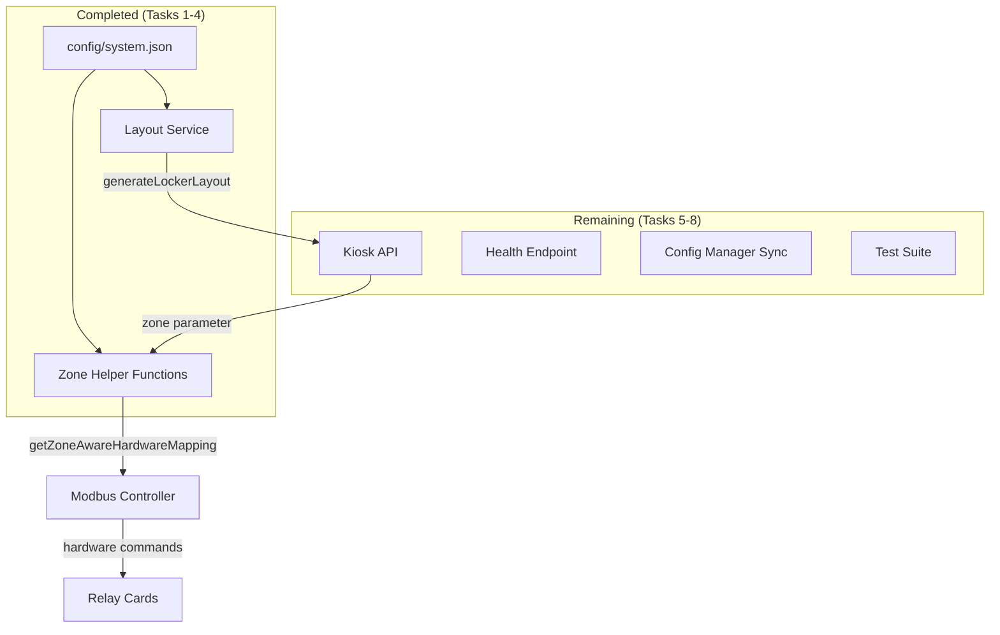
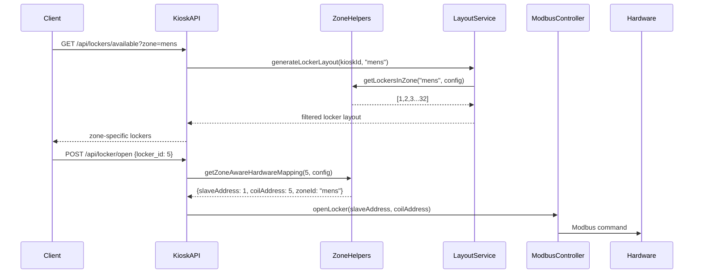

# Zone-Aware Locker Management - Design Document

## Overview

This design document outlines the completion of the zone-aware locker management system for the eForm Locker System. The foundation (Tasks 1-4) is already implemented with zone configuration, helper functions, hardware mapping, and layout service integration. This design covers the remaining tasks (5-8) to complete the full zone-aware system.

**Current Implementation Status:**
- ✅ Zone configuration with `features.zones_enabled` flag
- ✅ Zone helper functions (`getLockerPositionInZone`, `computeHardwareMappingFromPosition`, etc.)
- ✅ Hardware mapping with fallback to legacy system
- ✅ Layout service with optional `zoneId` parameter
- ⏳ Kiosk API zone integration (Task 5)
- ⏳ Hardware config automatic zone sync (Task 6)
- ⏳ Health and monitoring integration (Task 7)
- ⏳ Comprehensive testing (Task 8)

## Architecture

### Current Zone Architecture



### Zone Data Flow



## Components and Interfaces

### Task 5: Zone-Aware Kiosk API

#### Modified Endpoints

**GET /api/lockers/available**
```typescript
interface AvailableLockersRequest {
  kiosk_id: string;
  zone?: string; // NEW: Optional zone filter
}

interface AvailableLockersResponse {
  // Existing response structure unchanged
  lockers: LockerInfo[];
  total: number;
  // No new fields - maintains backward compatibility
}
```

**GET /api/lockers/all**
```typescript
interface AllLockersRequest {
  kiosk_id: string;
  zone?: string; // NEW: Optional zone filter
}

interface AllLockersResponse {
  // Existing response structure unchanged
  lockers: LockerInfo[];
  total: number;
}
```

**POST /api/locker/open**
```typescript
interface OpenLockerRequest {
  // Existing request structure unchanged
  locker_id: number;
  staff_user: string;
  reason: string;
}

interface OpenLockerResponse {
  // Existing response structure unchanged
  success: boolean;
  message: string;
  // NEW: Enhanced logging with zone info
}
```

#### Error Handling

```typescript
// HTTP 400 - Unknown Zone
{
  error: "UNKNOWN_ZONE",
  message: "Zone 'invalid' not found",
  trace_id: "req_123456789"
}

// HTTP 422 - Locker Outside Zones
{
  error: "LOCKER_OUT_OF_ZONE",
  message: "Locker 99 is not in any enabled zone",
  trace_id: "req_123456790"
}
```

### Task 6: Hardware Config Automatic Zone Sync

#### ConfigManager Enhancement

```typescript
interface ConfigManager {
  // Existing methods...
  
  // NEW: Called after triggerLockerSync when zones enabled
  syncZonesWithHardware(totalLockers: number): Promise<void>;
}

interface ZoneSyncResult {
  extended: boolean;
  affectedZone?: string;
  newRange?: [number, number];
  error?: string;
}
```

#### Zone Extension Logic

```typescript
class ZoneExtensionService {
  /**
   * Extend zones to cover new lockers when hardware is added
   */
  async extendZonesForNewLockers(
    currentConfig: CompleteSystemConfig,
    newTotalLockers: number
  ): Promise<ZoneSyncResult> {
    // 1. Check if zones are enabled
    // 2. Calculate covered max from enabled zones
    // 3. If coveredMax >= newTotal, return (no extension needed)
    // 4. Extend last enabled zone to cover gap
    // 5. Merge adjacent ranges
    // 6. Update relay_cards for affected zone
    // 7. Validate and save configuration
  }
}
```

### Task 7: Health and Heartbeat Integration

#### Enhanced Health Endpoint

```typescript
interface HealthResponse {
  // Existing fields...
  status: string;
  uptime: number;
  
  // NEW: Zone-aware fields
  zones_enabled: boolean;
  config_hash: string;
  total_lockers: number;
  zones?: {
    id: string;
    enabled: boolean;
    locker_count: number;
    relay_cards: number[];
  }[];
}
```

#### Heartbeat Stats Enhancement

```typescript
interface HeartbeatStats {
  // Existing fields...
  total_lockers: number;
  by_status: Record<string, number>;
  
  // NEW: Zone breakdown
  by_zone?: Record<string, {
    total: number;
    by_status: Record<string, number>;
  }>;
}
```

#### Enhanced Logging

```typescript
interface ZoneAwareLogEntry {
  timestamp: string;
  level: string;
  message: string;
  
  // NEW: Zone context
  zone_id?: string;
  locker_id?: number;
  slave_id?: number;
  coil_address?: number;
  trace_id?: string;
}
```

### Task 8: Comprehensive Testing

#### Test Structure

```
tests/
├── unit/
│   ├── zone-helpers.test.ts        # Pure function tests
│   ├── zone-validation.test.ts     # Configuration validation
│   └── hardware-mapping.test.ts    # Boundary condition tests
├── integration/
│   ├── zone-api.test.ts           # API endpoint tests
│   ├── zone-sync.test.ts          # Hardware sync tests
│   └── zone-health.test.ts        # Health endpoint tests
└── e2e/
    ├── zone-workflow.test.ts      # Complete zone workflows
    └── regression.test.ts         # Backward compatibility
```

#### Test Coverage Requirements

```typescript
interface TestCoverage {
  unit_tests: {
    zone_helpers: ["boundary_positions", "null_fallbacks", "validation"];
    hardware_mapping: ["positions_1_16_17_32", "overflow_conditions"];
    configuration: ["overlap_detection", "capacity_validation"];
  };
  
  integration_tests: {
    api_endpoints: ["zone_filtering", "error_handling", "backward_compatibility"];
    hardware_sync: ["card_addition", "zone_extension", "validation_failures"];
    health_monitoring: ["zone_stats", "trace_ids", "error_reporting"];
  };
  
  regression_tests: {
    existing_behavior: ["no_zone_param", "zones_disabled", "legacy_mapping"];
  };
}
```

## Data Models

### Zone Configuration (Existing)

```typescript
interface ZoneConfig {
  id: string;                    // Unique zone identifier
  ranges: [number, number][];    // Locker ranges [[start, end], ...]
  relay_cards: number[];         // Slave addresses for this zone
  enabled: boolean;              // Enable/disable flag
}
```

### Zone Hardware Mapping (Existing)

```typescript
interface LockerHardwareMapping {
  slaveAddress: number;    // Modbus slave address
  coilAddress: number;     // Coil address (1-based)
  position: number;        // Position within zone
  zoneId: string;          // Zone identifier
}
```

### New: Zone Sync Configuration

```typescript
interface ZoneSyncConfig {
  auto_extend_enabled: boolean;     // Enable automatic zone extension
  extension_policy: 'last_zone' | 'new_zone' | 'manual';
  merge_adjacent_ranges: boolean;   // Merge adjacent ranges automatically
  max_zone_size: number;           // Maximum lockers per zone
}
```

### New: Zone Statistics

```typescript
interface ZoneStatistics {
  zone_id: string;
  total_lockers: number;
  available_lockers: number;
  occupied_lockers: number;
  error_lockers: number;
  last_activity: Date;
  hardware_status: 'online' | 'offline' | 'error';
}
```

## Error Handling

### Zone-Specific Error Types

```typescript
enum ZoneErrorType {
  UNKNOWN_ZONE = 'UNKNOWN_ZONE',
  LOCKER_OUT_OF_ZONE = 'LOCKER_OUT_OF_ZONE',
  ZONE_DISABLED = 'ZONE_DISABLED',
  ZONE_CONFIG_INVALID = 'ZONE_CONFIG_INVALID',
  ZONE_SYNC_FAILED = 'ZONE_SYNC_FAILED',
  ZONE_MAPPING_FAILED = 'ZONE_MAPPING_FAILED'
}

interface ZoneError {
  type: ZoneErrorType;
  message: string;
  trace_id: string;
  zone_id?: string;
  locker_id?: number;
  details?: Record<string, any>;
}
```

### Error Response Patterns

```typescript
// HTTP 400 - Client Error
{
  error: "UNKNOWN_ZONE",
  message: "Zone 'invalid_zone' not found or disabled",
  trace_id: "req_1725789123456",
  available_zones: ["mens", "womens"]
}

// HTTP 422 - Validation Error
{
  error: "LOCKER_OUT_OF_ZONE",
  message: "Locker 99 is not assigned to any enabled zone",
  trace_id: "req_1725789123457",
  locker_id: 99,
  enabled_zones: ["mens", "womens"]
}

// HTTP 500 - Internal Error with Fallback
{
  error: "ZONE_MAPPING_FAILED",
  message: "Zone mapping failed, using legacy mapping",
  trace_id: "req_1725789123458",
  fallback_used: true
}
```

## Testing Strategy

### Unit Testing Approach

```typescript
describe('Zone Helper Functions', () => {
  describe('getLockerPositionInZone', () => {
    it('should return correct positions for boundary cases', () => {
      // Test positions 1, 16, 17, 32 for mens zone [1-32]
      expect(getLockerPositionInZone(1, config)).toBe(1);
      expect(getLockerPositionInZone(16, config)).toBe(16);
      expect(getLockerPositionInZone(17, config)).toBe(17);
      expect(getLockerPositionInZone(32, config)).toBe(32);
    });
    
    it('should return null when zones disabled', () => {
      const disabledConfig = { ...config, features: { zones_enabled: false } };
      expect(getLockerPositionInZone(5, disabledConfig)).toBeNull();
    });
  });
  
  describe('computeHardwareMappingFromPosition', () => {
    it('should map positions to correct hardware addresses', () => {
      const zone = { id: 'test', ranges: [[1, 32]], relay_cards: [1, 2], enabled: true };
      
      // Position 1 -> Card 1, Coil 1
      expect(computeHardwareMappingFromPosition(1, zone)).toEqual({
        slaveAddress: 1, coilAddress: 1, position: 1
      });
      
      // Position 17 -> Card 2, Coil 1
      expect(computeHardwareMappingFromPosition(17, zone)).toEqual({
        slaveAddress: 2, coilAddress: 1, position: 17
      });
    });
  });
});
```

### Integration Testing Approach

```typescript
describe('Zone API Integration', () => {
  it('should filter lockers by zone parameter', async () => {
    const response = await request(app)
      .get('/api/lockers/available?kiosk_id=test&zone=mens')
      .expect(200);
    
    // All returned lockers should be in mens zone (1-32)
    response.body.lockers.forEach(locker => {
      expect(locker.id).toBeGreaterThanOrEqual(1);
      expect(locker.id).toBeLessThanOrEqual(32);
    });
  });
  
  it('should return 400 for unknown zone', async () => {
    const response = await request(app)
      .get('/api/lockers/available?kiosk_id=test&zone=invalid')
      .expect(400);
    
    expect(response.body.error).toBe('UNKNOWN_ZONE');
    expect(response.body.trace_id).toBeDefined();
  });
});
```

### Regression Testing Approach

```typescript
describe('Backward Compatibility', () => {
  it('should maintain existing behavior without zone parameter', async () => {
    // Test that existing API calls work unchanged
    const oldResponse = await request(app)
      .get('/api/lockers/available?kiosk_id=test')
      .expect(200);
    
    // Response structure should be identical to pre-zone implementation
    expect(oldResponse.body).toHaveProperty('lockers');
    expect(oldResponse.body).toHaveProperty('total');
    expect(oldResponse.body.lockers.length).toBeGreaterThan(0);
  });
  
  it('should use legacy mapping when zones disabled', async () => {
    // Temporarily disable zones
    const originalConfig = await configManager.getConfig();
    await configManager.updateConfig({
      ...originalConfig,
      features: { zones_enabled: false }
    });
    
    // Test that hardware mapping falls back to legacy
    const mapping = getZoneAwareHardwareMapping(5, await configManager.getConfig());
    expect(mapping).toBeNull(); // Should return null, triggering legacy fallback
  });
});
```

## Implementation Plan

### Task 5: Zone-Aware Kiosk API

1. **Modify GET endpoints** to accept optional `zone` parameter
2. **Add zone validation** with appropriate error responses
3. **Integrate zone filtering** using existing `getLockersInZone` helper
4. **Enhance POST /api/locker/open** to use `getZoneAwareHardwareMapping`
5. **Add comprehensive logging** with zone context

### Task 6: Hardware Config Sync

1. **Create ZoneExtensionService** with zone extension logic
2. **Modify ConfigManager** to call `syncZonesWithHardware` after hardware changes
3. **Implement extension algorithm** following the specified policy
4. **Add validation** to prevent invalid configurations
5. **Create optional UI notification** for zone extensions

### Task 7: Health and Heartbeat Integration

1. **Enhance /health endpoint** with zone information
2. **Modify heartbeat stats** to include zone breakdowns
3. **Add zone context to logging** throughout the system
4. **Implement trace ID generation** for error tracking
5. **Create zone-specific monitoring** dashboards

### Task 8: Testing and Safeguards

1. **Create comprehensive unit tests** for all zone helpers
2. **Add integration tests** for API endpoints and sync functionality
3. **Implement regression tests** to ensure backward compatibility
4. **Add pre-commit hooks** with TypeScript compilation checks
5. **Create performance benchmarks** for zone operations

## Performance Considerations

### Zone Lookup Optimization

- **Cache zone configurations** in memory for fast lookups
- **Pre-compute locker-to-zone mappings** during configuration load
- **Use efficient data structures** for range checking

### API Response Optimization

- **Maintain response caching** for zone-filtered results
- **Minimize database queries** by leveraging in-memory zone data
- **Batch zone operations** when possible

### Hardware Mapping Performance

- **Cache hardware mappings** for frequently accessed lockers
- **Optimize position calculations** using pre-computed lookup tables
- **Minimize configuration file reads** during runtime operations

## Security Considerations

### Zone Access Control

- **Validate zone permissions** before filtering operations
- **Audit zone-based access** in security logs
- **Prevent zone enumeration** through error messages

### Configuration Security

- **Validate zone configurations** before applying changes
- **Backup configurations** before automatic zone extensions
- **Log all zone configuration changes** with user attribution

## Monitoring and Observability

### Zone-Specific Metrics

```typescript
interface ZoneMetrics {
  zone_operations_per_minute: Record<string, number>;
  zone_error_rates: Record<string, number>;
  zone_hardware_response_times: Record<string, number>;
  zone_locker_utilization: Record<string, number>;
}
```

### Health Check Enhancements

```typescript
interface ZoneHealthCheck {
  zones_configuration_valid: boolean;
  zones_hardware_mapping_valid: boolean;
  zones_sync_status: 'ok' | 'pending' | 'error';
  last_zone_operation: Date;
  zone_specific_errors: ZoneError[];
}
```

This design provides a comprehensive approach to completing the zone-aware locker management system while maintaining backward compatibility and ensuring robust error handling and testing coverage.