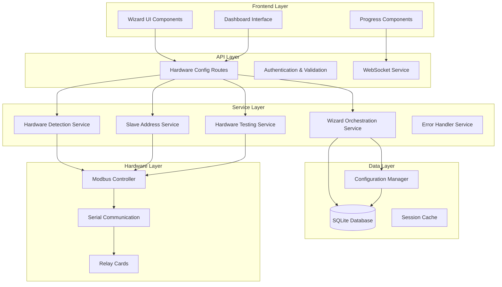

# Hardware Configuration Wizard - Developer Onboarding Guide

## Overview

This guide helps developers understand, extend, and contribute to the Hardware Configuration Wizard system. The wizard provides automated hardware detection, configuration, and testing capabilities for Modbus relay cards in the eForm Locker System.

## Architecture Overview

### System Components



### Key Design Principles

1. **Modular Architecture**: Each service has a single responsibility
2. **Error Resilience**: Comprehensive error handling and recovery
3. **Real-time Updates**: WebSocket integration for live progress
4. **Hardware Safety**: Emergency stops and validation at all levels
5. **Extensibility**: Plugin architecture for new device types
6. **Testing**: Comprehensive unit, integration, and E2E tests

## Development Environment Setup

### Prerequisites

```bash
# Node.js and npm
node --version  # >= 18.0.0
npm --version   # >= 8.0.0

# System dependencies (Linux/Raspberry Pi)
sudo apt update
sudo apt install build-essential python3-dev libudev-dev

# Windows dependencies
# Install Visual Studio Build Tools or Visual Studio Community
```

### Installation

```bash
# Clone repository
git clone <repository-url>
cd eform-locker-system

# Install dependencies
npm install

# Install shared dependencies
cd shared && npm install && cd ..

# Build services
npm run build:all

# Set up development database
npm run db:migrate
```

### Environment Configuration

Create `.env` file in project root:

```env
# Database
DATABASE_PATH=./data/eform.db

# Services
GATEWAY_PORT=3000
PANEL_PORT=3001
KIOSK_PORT=3002

# Hardware
SERIAL_PORT=/dev/ttyUSB0
MODBUS_TIMEOUT=5000
HARDWARE_DEBUG=true

# Development
NODE_ENV=development
LOG_LEVEL=debug
```

## Core Services Deep Dive

### 1. Hardware Detection Service

**Location**: `shared/services/hardware-detection-service.ts`

**Purpose**: Automatically discover and identify Modbus hardware devices

**Key Methods**:
```typescript
class HardwareDetectionService {
  // Serial port discovery
  async scanSerialPorts(): Promise<SerialPortInfo[]>
  async validateSerialPort(port: string): Promise<boolean>
  
  // Device discovery
  async scanModbusDevices(port: string, range: AddressRange): Promise<ModbusDevice[]>
  async identifyDeviceType(address: number): Promise<DeviceType>
  
  // New device detection
  async detectNewDevices(knownDevices: ModbusDevice[]): Promise<ModbusDevice[]>
}
```

**Extension Points**:
- Add new device type detection in `identifyDeviceType()`
- Extend serial port filtering in `scanSerialPorts()`
- Add custom device capabilities in `getDeviceCapabilities()`

**Example Extension**:
```typescript
// Add support for new relay card type
private async identifyCustomDevice(address: number): Promise<DeviceType> {
  try {
    // Read manufacturer-specific register
    const manufacturerId = await this.modbusController.readRegister(address, 0x5000);
    
    if (manufacturerId === 0x1234) {
      return {
        manufacturer: 'custom',
        model: 'CustomRelay32CH',
        channels: 32,
        features: ['custom_feature_1', 'custom_feature_2']
      };
    }
    
    return this.identifyWaveshareDevice(address);
  } catch (error) {
    console.warn(`Custom device identification failed for address ${address}:`, error);
    return this.identifyGenericDevice(address);
  }
}
```

### 2. Slave Address Service

**Location**: `shared/services/slave-address-service.ts`

**Purpose**: Automate slave address configuration using proven Waveshare solution

**Key Implementation Details**:
```typescript
class SlaveAddressService {
  // Based on proven dual relay card solution
  private calculateCRC16(data: Buffer): number {
    let crc = 0xFFFF;
    for (let i = 0; i < data.length; i++) {
      crc ^= data[i];
      for (let j = 0; j < 8; j++) {
        if (crc & 0x0001) {
          crc = (crc >> 1) ^ 0xA001;
        } else {
          crc = crc >> 1;
        }
      }
    }
    return crc;
  }
  
  // Proven broadcast configuration method
  async configureBroadcastAddress(newAddress: number): Promise<boolean> {
    const command = Buffer.alloc(8);
    command[0] = 0x00; // Broadcast address
    command[1] = 0x06; // Write Single Register
    command[2] = 0x40; // Register 0x4000 high byte
    command[3] = 0x00; // Register 0x4000 low byte
    command[4] = 0x00; // New address high byte
    command[5] = newAddress; // New address low byte
    
    const crc = this.calculateCRC16(command.subarray(0, 6));
    command[6] = crc & 0xFF;
    command[7] = (crc >> 8) & 0xFF;
    
    return this.modbusController.sendRawCommand(command);
  }
}
```

**Extension Points**:
- Add support for different address storage registers
- Implement custom CRC algorithms for specific devices
- Add bulk address configuration strategies

### 3. Hardware Testing Service

**Location**: `shared/services/hardware-testing-service.ts`

**Purpose**: Comprehensive testing and validation of hardware setup

**Test Types**:
1. **Communication Tests**: Basic Modbus connectivity
2. **Relay Activation Tests**: Physical relay operation
3. **Performance Tests**: Response time and reliability
4. **Integration Tests**: End-to-end system validation

**Example Test Implementation**:
```typescript
async testRelayActivation(address: number, relay: number): Promise<TestResult> {
  const startTime = Date.now();
  
  try {
    // Activate relay
    await this.modbusController.activateRelay(address, relay);
    
    // Wait for physical response
    await this.delay(500);
    
    // Deactivate relay
    await this.modbusController.deactivateRelay(address, relay);
    
    const duration = Date.now() - startTime;
    
    return {
      testName: `Relay ${relay} Activation Test`,
      success: true,
      duration,
      details: 'Relay activated successfully - please confirm physical click',
      timestamp: new Date()
    };
  } catch (error) {
    return {
      testName: `Relay ${relay} Activation Test`,
      success: false,
      duration: Date.now() - startTime,
      details: error instanceof Error ? error.message : 'Unknown error',
      error: error instanceof Error ? error.message : 'Test failed',
      timestamp: new Date()
    };
  }
}
```

### 4. Wizard Orchestration Service

**Location**: `shared/services/wizard-orchestration-service.ts`

**Purpose**: Coordinate multi-step wizard process and state management

**Wizard Steps**:
1. **Pre-Setup Checklist**: Safety and connection verification
2. **Device Detection**: Hardware discovery and identification
3. **Address Configuration**: Automatic slave address setup
4. **Testing and Validation**: Comprehensive hardware testing
5. **System Integration**: Configuration update and service restart

**State Management**:
```typescript
interface WizardSession {
  sessionId: string;
  currentStep: number;
  maxCompletedStep: number;
  cardData: NewCardData;
  testResults: TestResult[];
  errors: WizardError[];
  createdAt: Date;
  lastUpdated: Date;
}

class WizardOrchestrationService {
  private sessions = new Map<string, WizardSession>();
  
  async executeStep(sessionId: string, step: number): Promise<StepResult> {
    const session = this.sessions.get(sessionId);
    if (!session) {
      throw new Error('Session not found');
    }
    
    switch (step) {
      case 1: return this.executePreSetupChecklist(session);
      case 2: return this.executeDeviceDetection(session);
      case 3: return this.executeAddressConfiguration(session);
      case 4: return this.executeTestingValidation(session);
      case 5: return this.executeSystemIntegration(session);
      default: throw new Error(`Invalid step: ${step}`);
    }
  }
}
```

## Frontend Development

### Component Architecture

**Location**: `app/panel/src/components/wizard/`

**Key Components**:
- `WizardContainer.tsx`: Main wizard orchestration
- `PreSetupChecklist.tsx`: Step 1 - Safety checklist
- `DeviceDetection.tsx`: Step 2 - Hardware discovery
- `AddressConfiguration.tsx`: Step 3 - Address setup
- `TestingValidation.tsx`: Step 4 - Hardware testing
- `SystemIntegration.tsx`: Step 5 - Final integration

### React Component Example

```typescript
import React, { useState, useEffect } from 'react';
import { useWebSocket } from '../hooks/useWebSocket';

interface DeviceDetectionProps {
  sessionId: string;
  onStepComplete: (stepData: any) => void;
  onError: (error: string) => void;
}

export const DeviceDetection: React.FC<DeviceDetectionProps> = ({
  sessionId,
  onStepComplete,
  onError
}) => {
  const [scanning, setScanning] = useState(false);
  const [devices, setDevices] = useState<ModbusDevice[]>([]);
  const [progress, setProgress] = useState(0);
  
  const { connected, lastMessage } = useWebSocket('/ws/hardware-config');
  
  useEffect(() => {
    if (lastMessage?.type === 'scan_progress') {
      setProgress(lastMessage.data.progress_percent);
    }
  }, [lastMessage]);
  
  const startScan = async () => {
    setScanning(true);
    try {
      const response = await fetch('/api/hardware-config/scan-devices?port=/dev/ttyUSB0');
      const data = await response.json();
      
      if (data.success) {
        setDevices(data.devices);
        onStepComplete({ detectedDevices: data.devices });
      } else {
        onError(data.error);
      }
    } catch (error) {
      onError(error instanceof Error ? error.message : 'Scan failed');
    } finally {
      setScanning(false);
    }
  };
  
  return (
    <div className="device-detection">
      <h3>Device Detection</h3>
      <p>Scanning for Modbus relay cards...</p>
      
      {scanning && (
        <div className="progress-bar">
          <div 
            className="progress-fill" 
            style={{ width: `${progress}%` }}
          />
          <span>{progress}% Complete</span>
        </div>
      )}
      
      <button 
        onClick={startScan} 
        disabled={scanning}
        className="scan-button"
      >
        {scanning ? 'Scanning...' : 'Start Scan'}
      </button>
      
      {devices.length > 0 && (
        <div className="detected-devices">
          <h4>Detected Devices:</h4>
          {devices.map(device => (
            <div key={device.address} className="device-card">
              <span>Address: {device.address}</span>
              <span>Type: {device.type.model}</span>
              <span>Channels: {device.type.channels}</span>
              <span className={`status ${device.status}`}>
                {device.status}
              </span>
            </div>
          ))}
        </div>
      )}
    </div>
  );
};
```

### Styling Guidelines

**CSS Architecture**: BEM methodology with component-scoped styles

```css
/* Component: DeviceDetection */
.device-detection {
  padding: 20px;
  background: #f5f5f5;
  border-radius: 8px;
}

.device-detection__title {
  font-size: 1.5rem;
  margin-bottom: 16px;
  color: #333;
}

.device-detection__progress {
  width: 100%;
  height: 8px;
  background: #e0e0e0;
  border-radius: 4px;
  overflow: hidden;
  margin: 16px 0;
}

.device-detection__progress-fill {
  height: 100%;
  background: linear-gradient(90deg, #4CAF50, #45a049);
  transition: width 0.3s ease;
}

.device-detection__scan-button {
  background: #2196F3;
  color: white;
  border: none;
  padding: 12px 24px;
  border-radius: 4px;
  cursor: pointer;
  font-size: 1rem;
  transition: background 0.2s;
}

.device-detection__scan-button:hover:not(:disabled) {
  background: #1976D2;
}

.device-detection__scan-button:disabled {
  background: #ccc;
  cursor: not-allowed;
}

.device-detection__devices {
  margin-top: 20px;
}

.device-detection__device-card {
  display: flex;
  justify-content: space-between;
  align-items: center;
  padding: 12px;
  background: white;
  border: 1px solid #ddd;
  border-radius: 4px;
  margin-bottom: 8px;
}

.device-detection__device-card .status--responding {
  color: #4CAF50;
  font-weight: bold;
}

.device-detection__device-card .status--timeout {
  color: #FF9800;
  font-weight: bold;
}

.device-detection__device-card .status--error {
  color: #F44336;
  font-weight: bold;
}
```

## Testing Strategy

### Unit Tests

**Location**: `shared/services/__tests__/`

**Example Test**:
```typescript
import { HardwareDetectionService } from '../hardware-detection-service';
import { MockModbusController } from '../../__mocks__/modbus-controller';

describe('HardwareDetectionService', () => {
  let service: HardwareDetectionService;
  let mockModbus: MockModbusController;
  
  beforeEach(() => {
    mockModbus = new MockModbusController();
    service = new HardwareDetectionService(mockModbus);
  });
  
  describe('scanModbusDevices', () => {
    it('should detect responding devices', async () => {
      // Arrange
      mockModbus.setDeviceResponse(1, true);
      mockModbus.setDeviceResponse(2, false);
      mockModbus.setDeviceResponse(3, true);
      
      // Act
      const devices = await service.scanModbusDevices('/dev/ttyUSB0', { start: 1, end: 3 });
      
      // Assert
      expect(devices).toHaveLength(2);
      expect(devices[0].address).toBe(1);
      expect(devices[0].status).toBe('responding');
      expect(devices[1].address).toBe(3);
      expect(devices[1].status).toBe('responding');
    });
    
    it('should handle communication timeouts', async () => {
      // Arrange
      mockModbus.setDeviceTimeout(1, true);
      
      // Act
      const devices = await service.scanModbusDevices('/dev/ttyUSB0', { start: 1, end: 1 });
      
      // Assert
      expect(devices).toHaveLength(1);
      expect(devices[0].status).toBe('timeout');
    });
  });
});
```

### Integration Tests

**Location**: `tests/integration/hardware-wizard-api.test.ts`

**Example Test**:
```typescript
import { FastifyInstance } from 'fastify';
import { buildApp } from '../../app/panel/src/index';

describe('Hardware Wizard API Integration', () => {
  let app: FastifyInstance;
  
  beforeAll(async () => {
    app = buildApp();
    await app.ready();
  });
  
  afterAll(async () => {
    await app.close();
  });
  
  describe('POST /api/hardware-config/wizard/create-session', () => {
    it('should create new wizard session', async () => {
      const response = await app.inject({
        method: 'POST',
        url: '/api/hardware-config/wizard/create-session',
        payload: { wizard_type: 'add_card' }
      });
      
      expect(response.statusCode).toBe(200);
      const data = JSON.parse(response.payload);
      expect(data.success).toBe(true);
      expect(data.session.sessionId).toBeDefined();
      expect(data.session.currentStep).toBe(1);
    });
  });
  
  describe('GET /api/hardware-config/scan-ports', () => {
    it('should return available serial ports', async () => {
      const response = await app.inject({
        method: 'GET',
        url: '/api/hardware-config/scan-ports'
      });
      
      expect(response.statusCode).toBe(200);
      const data = JSON.parse(response.payload);
      expect(data.success).toBe(true);
      expect(Array.isArray(data.ports)).toBe(true);
    });
  });
});
```

### End-to-End Tests

**Location**: `tests/e2e/hardware-wizard-flow.test.ts`

**Example Test**:
```typescript
import { test, expect } from '@playwright/test';

test.describe('Hardware Configuration Wizard', () => {
  test('should complete full wizard flow', async ({ page }) => {
    // Navigate to wizard
    await page.goto('/panel/hardware-wizard');
    
    // Step 1: Pre-setup checklist
    await expect(page.locator('h2')).toContainText('Pre-Setup Checklist');
    await page.check('[data-testid="power-off-checkbox"]');
    await page.check('[data-testid="connections-checkbox"]');
    await page.check('[data-testid="safety-checkbox"]');
    await page.click('[data-testid="next-step-button"]');
    
    // Step 2: Device detection
    await expect(page.locator('h2')).toContainText('Device Detection');
    await page.click('[data-testid="start-scan-button"]');
    
    // Wait for scan completion
    await expect(page.locator('[data-testid="scan-progress"]')).toBeVisible();
    await expect(page.locator('[data-testid="detected-devices"]')).toBeVisible({ timeout: 30000 });
    await page.click('[data-testid="next-step-button"]');
    
    // Step 3: Address configuration
    await expect(page.locator('h2')).toContainText('Address Configuration');
    await page.click('[data-testid="auto-configure-button"]');
    await expect(page.locator('[data-testid="address-success"]')).toBeVisible({ timeout: 10000 });
    await page.click('[data-testid="next-step-button"]');
    
    // Step 4: Testing
    await expect(page.locator('h2')).toContainText('Testing and Validation');
    await page.click('[data-testid="start-tests-button"]');
    await expect(page.locator('[data-testid="test-results"]')).toBeVisible({ timeout: 15000 });
    await page.click('[data-testid="next-step-button"]');
    
    // Step 5: Integration
    await expect(page.locator('h2')).toContainText('System Integration');
    await page.click('[data-testid="finalize-button"]');
    await expect(page.locator('[data-testid="success-message"]')).toBeVisible({ timeout: 20000 });
  });
});
```

## Error Handling and Debugging

### Error Classification System

```typescript
enum ErrorSeverity {
  INFO = 'info',
  WARNING = 'warning',
  ERROR = 'error',
  CRITICAL = 'critical'
}

interface WizardError {
  code: string;
  severity: ErrorSeverity;
  message: string;
  details?: any;
  recoverable: boolean;
  suggestedAction?: string;
  timestamp: Date;
}

class ErrorHandler {
  private errorCodes = {
    'HARDWARE_001': 'Serial port not available',
    'HARDWARE_002': 'Modbus communication timeout',
    'HARDWARE_003': 'Address configuration failed',
    'HARDWARE_004': 'Test execution failed',
    'HARDWARE_005': 'Session not found or expired',
    'HARDWARE_006': 'Configuration validation failed',
    'HARDWARE_007': 'System integration failed'
  };
  
  classifyError(error: Error): WizardError {
    // Analyze error and return classified error object
    if (error.message.includes('ENOENT')) {
      return {
        code: 'HARDWARE_001',
        severity: ErrorSeverity.ERROR,
        message: 'Serial port not available',
        recoverable: true,
        suggestedAction: 'Check USB connections and permissions',
        timestamp: new Date()
      };
    }
    
    // Add more error classification logic
    return this.createGenericError(error);
  }
}
```

### Debug Logging

Enable comprehensive debug logging:

```typescript
class HardwareDetectionService {
  private debug = process.env.HARDWARE_DEBUG === 'true';
  
  private log(level: string, message: string, data?: any) {
    if (this.debug) {
      console.log(`[${level}] ${new Date().toISOString()} - ${message}`, data || '');
    }
  }
  
  async scanModbusDevices(port: string, range: AddressRange): Promise<ModbusDevice[]> {
    this.log('INFO', `Starting Modbus scan on ${port}`, range);
    
    const devices: ModbusDevice[] = [];
    
    for (let address = range.start; address <= range.end; address++) {
      this.log('DEBUG', `Probing address ${address}`);
      
      try {
        const response = await this.modbusController.testCommunication(address);
        this.log('DEBUG', `Address ${address} responded`, response);
        
        devices.push({
          address,
          status: 'responding',
          responseTime: response.duration,
          lastSeen: new Date()
        });
      } catch (error) {
        this.log('DEBUG', `Address ${address} failed`, error);
      }
    }
    
    this.log('INFO', `Scan completed: ${devices.length} devices found`);
    return devices;
  }
}
```

## Extension Guidelines

### Adding New Device Types

1. **Extend Device Type Interface**:
```typescript
interface DeviceType {
  manufacturer: 'waveshare' | 'custom' | 'generic' | 'unknown';
  model: string;
  channels: number;
  features: string[];
  customProperties?: Record<string, any>; // Add custom properties
}
```

2. **Implement Device Detection**:
```typescript
private async identifyCustomDevice(address: number): Promise<DeviceType> {
  // Read device-specific identification registers
  const deviceId = await this.modbusController.readRegister(address, 0x1000);
  const firmwareVersion = await this.modbusController.readRegister(address, 0x1001);
  
  return {
    manufacturer: 'custom',
    model: 'CustomDevice',
    channels: 32,
    features: ['custom_feature'],
    customProperties: {
      deviceId,
      firmwareVersion
    }
  };
}
```

3. **Add Device-Specific Testing**:
```typescript
private async testCustomDevice(address: number): Promise<TestResult[]> {
  const results: TestResult[] = [];
  
  // Custom device-specific tests
  results.push(await this.testCustomFeature(address));
  results.push(await this.testCustomReliability(address));
  
  return results;
}
```

### Adding New Wizard Steps

1. **Define Step Interface**:
```typescript
interface WizardStep {
  stepNumber: number;
  name: string;
  description: string;
  required: boolean;
  estimatedDuration: number;
  dependencies: number[];
}
```

2. **Implement Step Executor**:
```typescript
class CustomStepExecutor implements StepExecutor {
  async execute(session: WizardSession): Promise<StepResult> {
    // Custom step implementation
    return {
      success: true,
      data: { customData: 'value' },
      nextStep: session.currentStep + 1
    };
  }
  
  async validate(session: WizardSession): Promise<ValidationResult> {
    // Custom validation logic
    return { valid: true, errors: [] };
  }
}
```

3. **Register Step in Orchestrator**:
```typescript
class WizardOrchestrationService {
  private stepExecutors = new Map<number, StepExecutor>([
    [1, new PreSetupExecutor()],
    [2, new DeviceDetectionExecutor()],
    [3, new AddressConfigurationExecutor()],
    [4, new TestingValidationExecutor()],
    [5, new SystemIntegrationExecutor()],
    [6, new CustomStepExecutor()] // Add custom step
  ]);
}
```

### Adding New API Endpoints

1. **Define Route Handler**:
```typescript
// In hardware-config-routes.ts
fastify.post('/api/hardware-config/custom-operation', async (request, reply) => {
  return this.handleCustomOperation(request, reply);
});

private async handleCustomOperation(request: FastifyRequest, reply: FastifyReply) {
  try {
    const { parameter1, parameter2 } = request.body as any;
    
    // Validate input
    if (!parameter1) {
      reply.code(400);
      return { success: false, error: 'parameter1 is required' };
    }
    
    // Perform operation
    const result = await this.customService.performOperation(parameter1, parameter2);
    
    return {
      success: true,
      result,
      timestamp: new Date().toISOString()
    };
  } catch (error) {
    console.error('Custom operation failed:', error);
    reply.code(500);
    return {
      success: false,
      error: error instanceof Error ? error.message : 'Operation failed'
    };
  }
}
```

2. **Add Input Validation**:
```typescript
import Joi from 'joi';

const customOperationSchema = Joi.object({
  parameter1: Joi.string().required(),
  parameter2: Joi.number().min(1).max(255).optional()
});

// In route handler
const { error, value } = customOperationSchema.validate(request.body);
if (error) {
  reply.code(400);
  return { success: false, error: error.details[0].message };
}
```

3. **Add Tests**:
```typescript
describe('Custom Operation API', () => {
  it('should handle custom operation successfully', async () => {
    const response = await app.inject({
      method: 'POST',
      url: '/api/hardware-config/custom-operation',
      payload: { parameter1: 'test', parameter2: 5 }
    });
    
    expect(response.statusCode).toBe(200);
    const data = JSON.parse(response.payload);
    expect(data.success).toBe(true);
  });
});
```

## Performance Optimization

### Caching Strategies

```typescript
class CacheManager {
  private cache = new Map<string, { data: any; expires: number }>();
  
  set(key: string, data: any, ttlMs: number = 300000) { // 5 minutes default
    this.cache.set(key, {
      data,
      expires: Date.now() + ttlMs
    });
  }
  
  get(key: string): any | null {
    const entry = this.cache.get(key);
    if (!entry || Date.now() > entry.expires) {
      this.cache.delete(key);
      return null;
    }
    return entry.data;
  }
}

// Usage in service
class HardwareDetectionService {
  private cache = new CacheManager();
  
  async scanSerialPorts(): Promise<SerialPortInfo[]> {
    const cacheKey = 'serial_ports';
    const cached = this.cache.get(cacheKey);
    
    if (cached) {
      return cached;
    }
    
    const ports = await this.performSerialPortScan();
    this.cache.set(cacheKey, ports, 60000); // Cache for 1 minute
    
    return ports;
  }
}
```

### Connection Pooling

```typescript
class ModbusConnectionPool {
  private connections = new Map<string, ModbusConnection>();
  private maxConnections = 5;
  
  async getConnection(port: string): Promise<ModbusConnection> {
    let connection = this.connections.get(port);
    
    if (!connection || !connection.isConnected()) {
      if (this.connections.size >= this.maxConnections) {
        // Close oldest connection
        const oldestKey = this.connections.keys().next().value;
        const oldestConnection = this.connections.get(oldestKey);
        await oldestConnection?.close();
        this.connections.delete(oldestKey);
      }
      
      connection = new ModbusConnection(port);
      await connection.connect();
      this.connections.set(port, connection);
    }
    
    return connection;
  }
}
```

### Async Operations

```typescript
class BulkOperationManager {
  async performBulkAddressing(addresses: number[]): Promise<ConfigResult[]> {
    const concurrency = 3; // Limit concurrent operations
    const results: ConfigResult[] = [];
    
    for (let i = 0; i < addresses.length; i += concurrency) {
      const batch = addresses.slice(i, i + concurrency);
      const batchPromises = batch.map(address => 
        this.configureAddress(address).catch(error => ({
          address,
          success: false,
          error: error.message
        }))
      );
      
      const batchResults = await Promise.all(batchPromises);
      results.push(...batchResults);
      
      // Add delay between batches to prevent hardware overload
      if (i + concurrency < addresses.length) {
        await this.delay(1000);
      }
    }
    
    return results;
  }
  
  private delay(ms: number): Promise<void> {
    return new Promise(resolve => setTimeout(resolve, ms));
  }
}
```

## Security Considerations

### Input Validation

```typescript
import { body, param, query, validationResult } from 'express-validator';

// Validation middleware
const validateAddressConfiguration = [
  body('current_address').isInt({ min: 0, max: 255 }),
  body('new_address').isInt({ min: 1, max: 255 }),
  body('verify').optional().isBoolean(),
  (req: Request, res: Response, next: NextFunction) => {
    const errors = validationResult(req);
    if (!errors.isEmpty()) {
      return res.status(400).json({
        success: false,
        error: 'Validation failed',
        details: errors.array()
      });
    }
    next();
  }
];

// Usage in route
fastify.post('/set-slave-address', {
  preValidation: validateAddressConfiguration
}, async (request, reply) => {
  // Handler implementation
});
```

### Rate Limiting

```typescript
import rateLimit from '@fastify/rate-limit';

// Register rate limiting
await fastify.register(rateLimit, {
  max: 10, // 10 requests
  timeWindow: '1 minute',
  keyGenerator: (request) => {
    return request.ip + ':' + request.url;
  },
  errorResponseBuilder: (request, context) => {
    return {
      success: false,
      error: 'Rate limit exceeded',
      retryAfter: Math.round(context.ttl / 1000)
    };
  }
});
```

### Authentication and Authorization

```typescript
// Authentication middleware
const requireAuth = async (request: FastifyRequest, reply: FastifyReply) => {
  const session = request.session;
  
  if (!session?.user) {
    reply.code(401);
    return { success: false, error: 'Authentication required' };
  }
};

// Role-based authorization
const requireRole = (role: string) => {
  return async (request: FastifyRequest, reply: FastifyReply) => {
    const user = request.session?.user;
    
    if (!user || !user.roles.includes(role)) {
      reply.code(403);
      return { success: false, error: 'Insufficient permissions' };
    }
  };
};

// Usage
fastify.post('/api/hardware-config/emergency-stop', {
  preHandler: [requireAuth, requireRole('admin')]
}, async (request, reply) => {
  // Emergency stop handler
});
```

## Deployment and Production

### Build Process

```bash
# Development build
npm run build:dev

# Production build
npm run build:prod

# Build specific service
npm run build:panel
npm run build:kiosk
npm run build:gateway
```

### Environment Configuration

```typescript
// config/environment.ts
interface EnvironmentConfig {
  nodeEnv: 'development' | 'production' | 'test';
  database: {
    path: string;
    backupInterval: number;
  };
  hardware: {
    serialPort: string;
    timeout: number;
    retryAttempts: number;
  };
  logging: {
    level: 'debug' | 'info' | 'warn' | 'error';
    file: string;
  };
}

export const config: EnvironmentConfig = {
  nodeEnv: (process.env.NODE_ENV as any) || 'development',
  database: {
    path: process.env.DATABASE_PATH || './data/eform.db',
    backupInterval: parseInt(process.env.DB_BACKUP_INTERVAL || '3600000')
  },
  hardware: {
    serialPort: process.env.SERIAL_PORT || '/dev/ttyUSB0',
    timeout: parseInt(process.env.MODBUS_TIMEOUT || '5000'),
    retryAttempts: parseInt(process.env.RETRY_ATTEMPTS || '3')
  },
  logging: {
    level: (process.env.LOG_LEVEL as any) || 'info',
    file: process.env.LOG_FILE || './logs/hardware-wizard.log'
  }
};
```

### Monitoring and Health Checks

```typescript
class HealthCheckService {
  async checkSystemHealth(): Promise<HealthStatus> {
    const checks = await Promise.allSettled([
      this.checkDatabase(),
      this.checkSerialPort(),
      this.checkModbusConnectivity(),
      this.checkDiskSpace(),
      this.checkMemoryUsage()
    ]);
    
    const results = checks.map((check, index) => ({
      name: ['database', 'serial_port', 'modbus', 'disk_space', 'memory'][index],
      status: check.status === 'fulfilled' ? 'healthy' : 'unhealthy',
      details: check.status === 'fulfilled' ? check.value : check.reason
    }));
    
    const overallHealth = results.every(r => r.status === 'healthy') ? 'healthy' : 'unhealthy';
    
    return {
      status: overallHealth,
      timestamp: new Date().toISOString(),
      checks: results
    };
  }
}
```

## Contributing Guidelines

### Code Style

- **TypeScript**: Strict mode enabled, no `any` types
- **ESLint**: Airbnb configuration with custom rules
- **Prettier**: Automatic code formatting
- **Naming**: camelCase for variables, PascalCase for classes, kebab-case for files

### Git Workflow

```bash
# Create feature branch
git checkout -b feature/new-device-support

# Make changes and commit
git add .
git commit -m "feat(hardware): add support for CustomRelay32CH device"

# Push and create pull request
git push origin feature/new-device-support
```

### Pull Request Process

1. **Create Feature Branch**: Branch from `main` for new features
2. **Write Tests**: Ensure 80%+ code coverage for new code
3. **Update Documentation**: Update relevant documentation files
4. **Run Quality Checks**: `npm run lint && npm run test && npm run build`
5. **Create Pull Request**: Use provided PR template
6. **Code Review**: Address reviewer feedback
7. **Merge**: Squash and merge after approval

### Documentation Standards

- **API Documentation**: OpenAPI 3.0 specifications
- **Code Comments**: JSDoc format for public methods
- **README Files**: Include setup, usage, and examples
- **Architecture Decisions**: Document in `docs/adr/` directory

## Support and Resources

### Getting Help

1. **Documentation**: Check existing documentation first
2. **GitHub Issues**: Search existing issues before creating new ones
3. **Code Examples**: Review test files for usage examples
4. **Community**: Join developer discussions and forums

### Useful Resources

- **API Documentation**: `docs/hardware-wizard-api-documentation.md`
- **User Guide**: `docs/hardware-wizard-user-guide.md`
- **Troubleshooting**: `docs/hardware-wizard-troubleshooting.md`
- **Architecture Decisions**: `docs/adr/`
- **Test Examples**: `tests/` directory
- **Code Examples**: `examples/` directory

### Development Tools

- **VS Code Extensions**: ESLint, Prettier, TypeScript Hero
- **Debugging**: Node.js debugger configuration included
- **Testing**: Jest for unit tests, Playwright for E2E tests
- **API Testing**: Postman collection provided
- **Database Tools**: SQLite browser for database inspection

---

**Last Updated**: January 3, 2025  
**Guide Version**: 1.0  
**Target Audience**: Developers, Contributors, Maintainers